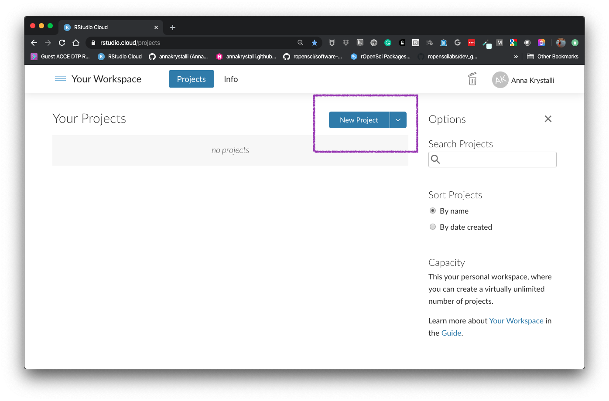
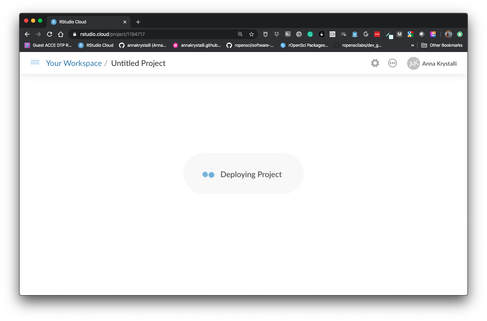
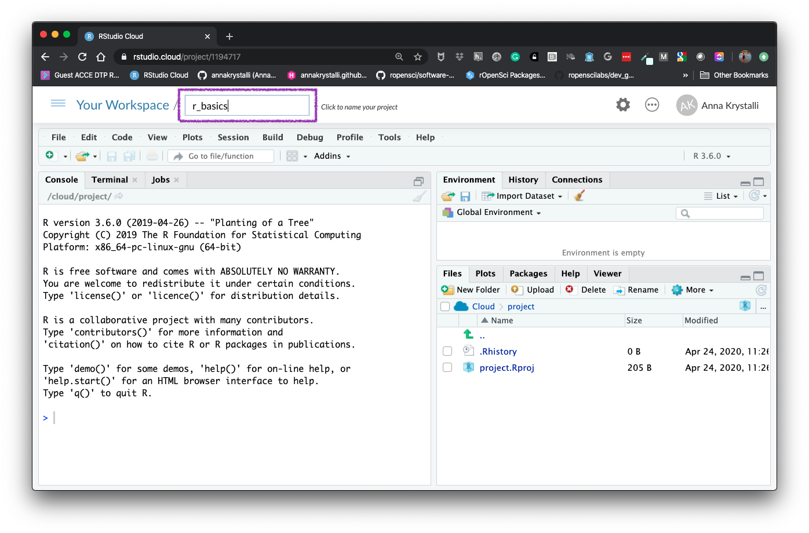
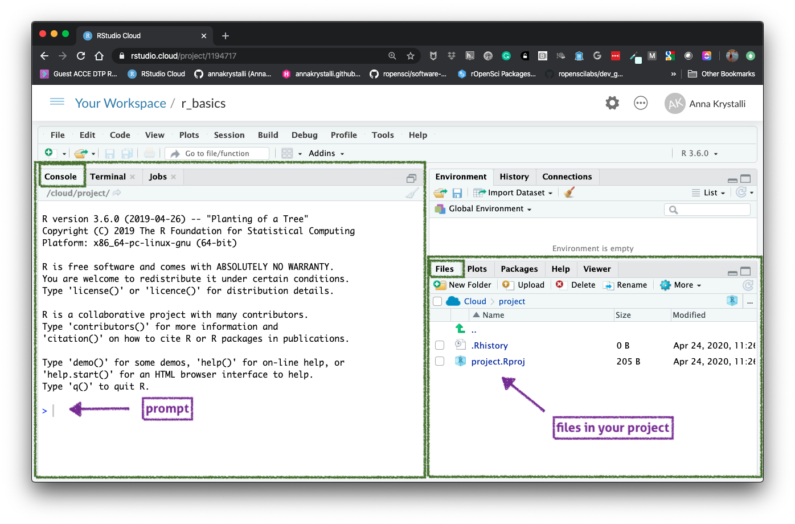

# (PART) Basics {#basics} 

# Intro to R & Rstudio {#rstudio-basics}

## R

> R is an open source language and environment for statistical computing and graphics. 

### Features

- Powerful analytical tools, well suited to scientific analyses and data science.
- Analyses are performed using scripted commands, making them easy to record, edit, rerun.
- Source code is open, ie available to access, inspect, modify remix and publish derivatives.
- Large, active creative communities around development and training.
- Ecosystem constantly under development with continuous improvements.

#### [Install R](https://cran.r-project.org/mirrors.html){target="_blank"}


### R Environment includes:

- an effective data handling and storage facility,
- a suite of operators for calculations on arrays,
- a large, coherent, integrated collection of intermediate tools for data analysis,
- graphical facilities for data analysis and display either on-screen or on hardcopy, 
- a well-developed, simple and effective programming language which includes conditionals, loops, user-defined functions and input and output facilities.

***

<br>

## Rstudio

> integrated development environment (IDE) for R

### Features

- console 
- syntax-highlighting editor that supports direct code execution, as well as 
- tools for:
  - plotting
  - debugging 
  - workspace management

```{r, echo = FALSE}
knitr::include_url("assets/cheatsheets/rstudio-ide.pdf")
```

[**Find out more**](https://rstudio.com/products/rstudio/features/){target="_blank"}

***

<br>


## Working with R in Rstudio cloud

We will be working online in [**RStudio Cloud**](https://rstudio.cloud/) throughout the course so we can all work in the same computational environment. This will save a lot of time by avoiding having to debug individual installation problems. 

To start working in R and Rstudio, we need to **log in to Rstudio cloud**:

##### [Launch Rstudio Cloud](https://rstudio.cloud/project/){target="_blank"}

This will normally end up with logging you into your account workspace. To start working in R, we need to create a new project. Click on **New Project**

```{r, echo = FALSE}

```

This creates and deploys a new untitled Rstudio cloud project in your Workspace. 

```{r, echo = FALSE}

```

Edit the project names by clicking on **Untitled**. Name it something like **r_basics**

```{r, echo = FALSE}

```

We are now in Rstudio, running in the cloud and can start running R code!

```{r, echo = FALSE}

```
