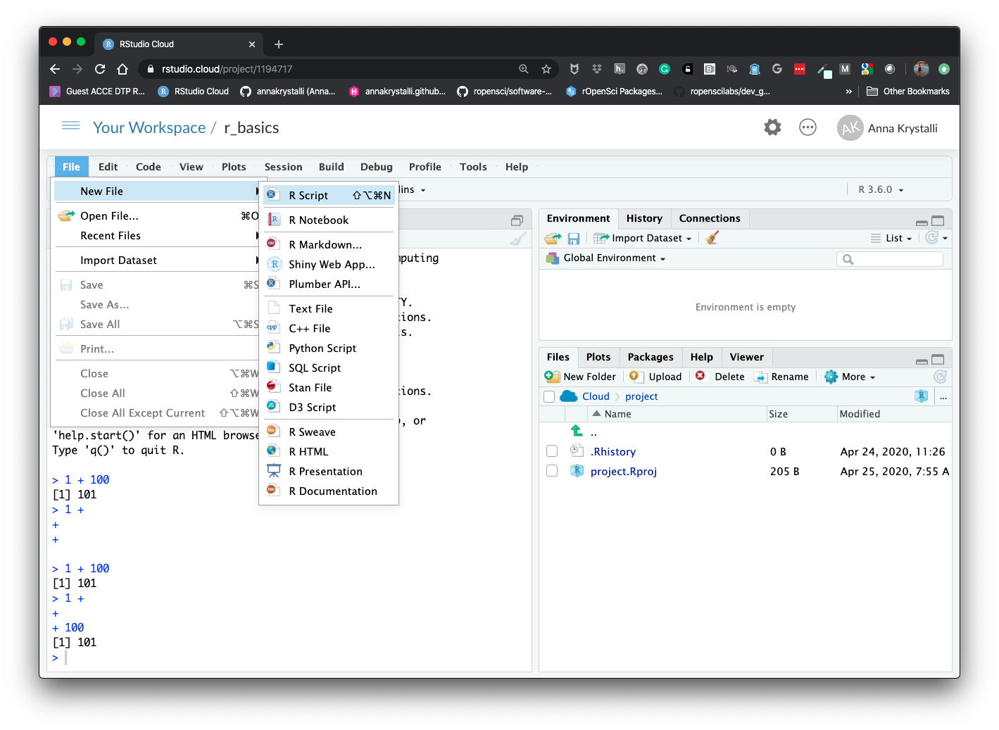

# R Basics {#r-basics}

```{r, echo=FALSE}
knitr::include_graphics("assets/cheatsheets/r-cheat-sheet-3.pdf")
```

## Using R in the console

> The  most basic way to interact with R is to type code directly in the console
> 
> - type expression to evaluate
- hit return
- output of the evaluation of the expression is printed to the console below 

The simplest thing you could do with R is do arithmetic.

```{r}
1 + 100
```

If you type in an incomplete command, R will wait for you to
complete it:
```{r, eval=FALSE}
1 +
```

```
+
```

Any time you hit return and the R session shows a `+` instead of a `>`, it
means it's waiting for you to complete the command. If you want to cancel
a command you can hit `Esc` and RStudio will give you back the `>` prompt.


## Working in scripts

> To make code and workflow reproducible and easy to re-run, it's better to **save code in a script** and use the script editor to edit it. This way, there is a complete record of te analysis.

### Creating a new script

Click on **File > New File > R Script**. Click on the save icon or (like any other file) using keyboard shortcut `CTRL / CMD + S`

```{r, echo=FALSE}

```

```{r, echo=FALSE}

```

```{r, echo=FALSE}
knitr::include_graphics("assets/script_new_open.png")
```


### Executing commands from scripts

RStudio allows you to execute commands directly from the script editor by using `Ctrl` + `Enter` shortcut (on Macs, `Cmd` +
`Return` will work, too). 

When you execute command from a script, the line of code in the script indicated by the cursor or all of the commands in the currently highlighted will be sent to the console. You can find other keyboard shortcuts in **Tools > Keyboard Shortcuts Help** or in the [RStudio IDE cheatsheet](https://github.com/rstudio/cheatsheets/raw/master/rstudio-ide.pdf).

```{r, echo=FALSE, fig.cap="Running full lines of code"}

```


```{r, echo=FALSE, fig.cap="Running selected parts of code"}

```

### Comments

You can add comments to your code by using a hash symbol `#`. Any text on a line of code following `#` is ignored by R when it executes code.

```{r}
1 + 10 # this text does nothing
```


## Using R as a calculator

When using R as a calculator, the order of operations is the same as you
would have learned back in school.

From highest to lowest precedence:

 * Parentheses: `(`, `)`
 * Exponents: `^` or `**`
 * Multiply: `*`
 * Divide: `/`
 * Add: `+`
 * Subtract: `-`

```{r}
3 + 5 * 2
```

Use parentheses to group operations in order to force the order of
evaluation if it differs from the default, or to make clear what you
intend.

```{r}
(3 + 5) * 2
```


Really small or large numbers get a scientific notation:

```{r}
2/10000
```

Which is shorthand for "multiplied by `10^XX`". So `2e-4`
is shorthand for `2 * 10^(-4)`.

You can write numbers in scientific notation too:

```{r}
5e3  # Note the lack of minus here
```


## Mathematical functions

R has many built in mathematical functions. To call a function,
we can type its name, followed by open and closing parentheses.
Anything we type inside the parentheses is called the function's
arguments:

```{r}
sin(1)  # trigonometry functions
```

```{r}
log(1)  # natural logarithm
```

```{r}
log10(10) # base-10 logarithm
```

```{r}
exp(0.5) # e^(1/2)
```

Don't worry about trying to remember every function in R. You
can look them up on Google, or if you can remember the
start of the function's name, use the tab completion in RStudio.

This is one advantage that RStudio has over R on its own, it
has auto-completion abilities that allow you to more easily
look up functions, their arguments, and the values that they
take.

Typing a `?` before the name of a command will open the help page
for that command. As well as providing a detailed description of
the command and how it works, scrolling to the bottom of the
help page will usually show a collection of code examples which
illustrate command usage. We'll go through an example later.


## Variables and assignment

We can store values in variables using the assignment operator `<-`, like this:

```{r}
x <- 1/40
```

Notice that assignment does not print a value. Instead, we stored it for later
in something called a **variable**. `x` now contains the **value** `0.025`:

```{r}
x
```

Look for the `Environment` tab in one of the panes of RStudio, and you will see that `x` and its value have appeared. Our variable `x` can be used in place of a number in any calculation that expects a number:

```{r}
log(x)
```

Notice also that variables can be reassigned:

```{r}
x <- 100
```

`x` used to contain the value 0.025 and now it has the value 100.

Assignment values can contain the variable being assigned to:

```{r}
x <- x + 1 #notice how RStudio updates its description of x on the top right tab
y <- x * 2
```

- The right hand side of the assignment can be any valid R expression.
- The right hand side is *fully evaluated* before the assignment occurs.


It is also possible to use the `=` operator for assignment:

```{r}
x = 1/40
```

But this is much less common among R users.  The most important thing is to
**be consistent** with the operator you use. There are occasionally places
where it is less confusing to use `<-` than `=`, and it is the most common
symbol used in the community. So the recommendation is to use `<-`.


### On variable names

Variable names can contain **letters, numbers, underscores and periods**. They
cannot start with a number nor contain spaces at all. 

Different people use
different conventions for long variable names, these include

  * periods.between.words
  * camelCaseToSeparateWords
  * **snake_case: underscores\_between_words**


While I suggest you use snake_case, ultimately what you use is up to you, but **be consistent**.


## Comparing things

We can also do comparison in R:


```{r}
x <- 1
```


```{r}
x < 2  # less than
```

```{r}
x <= 1  # less than or equal to
```

```{r}
x > 0  # greater than
```

```{r}
x >= -9 # greater than or equal to
```

```{r}
x == 1  # equality (note two equals signs, read as "is equal to")
```

```{r}
1 != 2  # inequality (read as "is not equal to")
```

```{r}
x %in% c(1, 5) # membership (read as "is member of")
```


_A word of warning about comparing numbers: you should
never use `==` to compare two numbers unless they are
integers (a data type which can specifically represent
only whole numbers)._

### Controlling flow using logical statements

Comparing a single value results in `TRUE` or `FALSE`. This feature allows us to build conditional statements to control execution flow.

```{r}
if(x > 5){
  print("x is greater than 5")
}else{
  print("x is less than 5")
}
```
