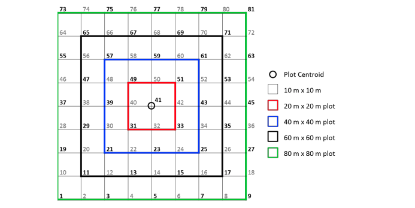

# Combining tables

Let's say we want to geolocate every individual in our analytic data. 

As we've discussed, the various tables we downloaded hold different information collected during the various survey events.

- plot level metadata
- individual level tagging metadata
- individual level repeated measurement data (although we only have a single measurement event per individual in our data set).

Currently, only the plot is geolocated, the data being contained in `vst_perplotperyear.csv` columns `decimalLatitude` and `decimalLongitude`. 

The location of each individual stem is defined in `vst_mappingandtagging.csv`. 

A number of variables are involved, including `pointID` which identifies a point on a 10m cell grid centred around `decimalLatitude` and `decimalLongitude`, and `stemDistance` and `stemAzimuth` which define the location of a stem, relative to the location of `pointID`. The full method used to locate individual stems is detailed in `methods/NEON_vegStructure_userGuide_vA.pdf`. 


```{r, echo = FALSE}

```

So to geolocate our individuals, we need to join information from `vst_perplotperyear.csv` and `vst_mappingandtagging.csv` into our `individuals` tibble.

We use the family of `*_join` function in `dplyr` to merge columns from different tibbles.

```{r, echo=FALSE}
knitr::include_url("assets/cheatsheets/data-transformation.pdf")
```


## Join Basics

There are a number of joins we can perform with `dplyr`.

Let's have a look at a few of them with a simple example using some `dplyr` in-built data:
```{r}
band_members
band_instruments
```

The only variable shared between the two tables is `name` so this is the only variable we can perform joins over. By default, any `*_join` function will try to merge on the values of any matched columns in the tables being merged.

```{r}
band_members %>% inner_join(band_instruments)
```

`inner_join` has merged all three unique columns across the two tables into a single tibble.
It has only kept the rows in which `name` values had a match in both tables. In this case only data about `John` and `Paul` was contained in both tables.

```{r}
band_members %>% left_join(band_instruments)
```

`left_join` joins on the `names` in the left hand table and appends any rows from the right hand table in which `name` match. In this case, there is no data for `Keith` in `band_members` so he is ignored completely. There is also no match for `Mick` in `band_instruments` so `NA` is returned for `plays` instead.

```{r}
band_members %>% right_join(band_instruments)
```

`right_join` on the other hand joins on the `name` in the right hand table. In this case, `Mick` is dropped completely `Keith` gets `NA` for band.
```{r}
band_members %>% full_join(band_instruments)
```

Finally, a `full_join` joins on all unique values of `name` found across the two tables, returning `NA` where there are no matches between the two tables.

## Joining our tables with `dplyr`

### Join `vst_mappingandtagging.csv` data

Let's start by merging data from `vst_mappingandtagging.csv`. Let's read the data in.

```{r, message=FALSE}
maptag <- readr::read_csv(fs::path(raw_data_path, "vst_mappingandtagging.csv"))
```

This data set contains taxonomic and within-plot location metadata on individuals collected during mapping and tagging. There is one row per individual in the data set.  

```{r}
names(maptag)
```

Let's see how many matches in column names we have between the two datasets

##### Challenge: Finding column name matches in two tables

Given the two tables we are trying to join, can you write some code that checks which column names in `individual` have matches in `maptag` column names?

_Hint: This is the correct answer._

```{r, echo = FALSE}
names(individual)[names(individual) %in% names(maptag)]
```


###### [Solution](#csol-col-matches){#chlg-col-matches}

#### Default `left_join`

Because we want to match the rest of the tables to our individual data, we use `left_join()` and supply `individual` as the first argument and `maptag` as the second.

```{r}
individual %>%
  dplyr::left_join(maptag) 
```

Great we have a merge! 

Looks successful right? How do we really know nothing has gone wrong though? Remember, to successfully merge the tables, the data in the columns the tables are being joined on need to have corresponding values across all columns to be linked successfully, otherwise it will return `NA`s. So, although our code ran successfully, it may well not have found any matching rows in `maptag` to merge into `individual`. 

To check whether things have worked, we can start with inspecting the output for the columns of interest, in this case the `maptag` columns we are trying to join into `individual`.

When working interactively and testing out pipes, you can pipe objects into `View()` for quick inspection. If you provide a character string as an argument, it is used as a name for the data view tab it launches

```{r, eval=FALSE}
individual %>%
  dplyr::left_join(maptag) %>%
  View("default")
```

```{r, echo=FALSE}
knitr::include_graphics("assets/view_default_join.png")
```


Clearly this has not worked! We need to start digging into why but we don't want to have to keep manually checking whether it worked or not. Enter **DEFENSIVE PROGRAMMING**.


#### Defensive programming with data

As I mentioned in the Data Management Basics slides, [`assertr`](https://github.com/ropensci/assertr) is a useful package for including validation checks in our data pipelines. 

In our case, we can use `assertr` function `assert` to check that certain columns of interest (`stemDistance`, `stemAzimuth`, `pointID`) are joined successfully (i.e. there re no `NA` values). Note that this only works because I know for a fact that there is data avaliable for all individuals. 

There may be situations in which `NA`s are valid missing data, in which case this would not be an appropriate test.

```{r, error=TRUE}
individual %>%
  dplyr::left_join(maptag) %>%
  assertr::assert(assertr::not_na,  stemDistance, stemAzimuth, pointID)
```

By including this check, I don't have to guess or manually check whether the merge has been successful. The code will just error if it hasn't `r emo::ji("raised_hands")`. 


#### Debugging hidden mismatches:

I've shown the most minimal implementation in which `dplyr` does a lot of the guessing for us and tries to join on all matched columns. But often, that can generate table mismatches 

We know that the only column we are interested in matching on is `individualID`. We want to get the mapping associated with each individual, regardless of when the mapping was collected. We can be specific about which variables we want to join on through argument `by`.


```{r}
individual %>%
  dplyr::left_join(maptag, 
                   by = "individualID") %>%
  assertr::assert(assertr::not_na, stemDistance, stemAzimuth, pointID)

```


Excellent! Our code runs and our resulting merged tibble contains data for all the variables we are interested in!

However, on closer inspection, we've ended up with some odd new columns, `uid.x` and `uid.y` and `eventID.x` and `eventID.y`!

That's because those columns are also present in both our tables but we are not explicitly joining them. They are retained and each suffixed with `.x` & `.y` by default, to make them unique. 

So, what about these duplicate columns. Do we need them?

With respect to `eventID`, we're not really interested in the mapping `eventID`s so we can just drop that column from  `maptag`.

```{r}
maptag <- select(maptag, -eventID)

individual %>%
  dplyr::left_join(maptag, 
                   by = "individualID") %>%
  assertr::assert(assertr::not_na, stemDistance, stemAzimuth, pointID)

```

On the other hand, `"uid` contains unique identifiers for each observation in their respective table and could be useful metadata to store, enabling us to trace the provenance of individual values to the original data. So rather than remove them, let's retain both `uid`, one for each table.

We can give more informative suffixes using argument `suffix`. In our case, I want the `individual` column to stay as `uid` and the `maptag` column to get the suffix `_map`.

```{r}
individual %>%
  dplyr::left_join(maptag, 
                   by = "individualID",
                   suffix = c("", "_map")) %>%
  assertr::assert(assertr::not_na, stemDistance, stemAzimuth, pointID)
```

Nice!


#### Join `vst_perplotperyear.csv`

Now let's carry on and join the perplot data. First let's read it in. 


```{r, message=FALSE}
perplot <- readr::read_csv(fs::path(raw_data_path, "vst_perplotperyear.csv"))
names(perplot)
```

Similarly to `maptag`, we want to exclude `eventID` and suffix the `uid` column. This time, however, we will be joining by `plotID`

Let's also move our validation test to the end and add the new columns we want to check to it, i.e. `stemDistance`, `stemAzimuth`, `pointID`.

```{r}
perplot <- perplot %>% select(-eventID)

individual %>%
  dplyr::left_join(maptag, 
                   by = "individualID",
                   suffix = c("", "_map")) %>%
  dplyr::left_join(perplot, by = c("plotID"), 
                   suffix = c("", "_ppl")) %>%
  assertr::assert(assertr::not_na,  decimalLatitude,
                  decimalLongitude, plotID, stemDistance, stemAzimuth, pointID)
```

Awesome!! It's worked!

Now that we are happy with our data we can use a new operator, the **assignment pipe (`%<>%`)**.

This allows us to both pipe an object forward into an expression and also update it with the resulting value.

```{r}
individual %<>%
  dplyr::left_join(maptag, 
                   by = "individualID",
                   suffix = c("", "_map")) %>%
  dplyr::left_join(perplot, by = c("plotID"), 
                   suffix = c("", "_ppl")) %>%
  assertr::assert(assertr::not_na,  decimalLatitude,
                  decimalLongitude, plotID, stemDistance, stemAzimuth, pointID)
```

We can now move on to geolocate our individuals!