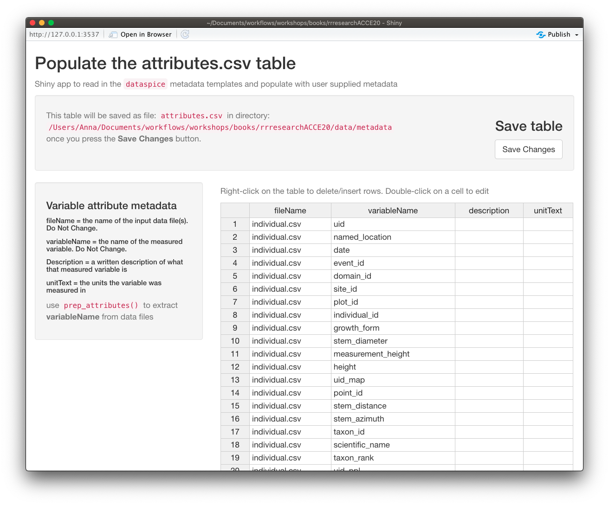

# Creating metadata with `dataspice` {#dataspice}


The goal of this section is to provide a **practical exercise in creating metadata** for an **example field collected data product** using package `dataspice`. 

- Understand basic metadata and why it is important.

- Understand where and how to store them.

- Understand how they can feed into more complex metadata objects.

## `dataspice` workflow


```{r, out.width="100%", echo=FALSE}
knitr::include_graphics("https://raw.githubusercontent.com/ropenscilabs/dataspice/main/man/figures/dataspice_workflow.png")
```


_see [introductory slides](#metadata)_


Let's load our library and start creating some metadata!

```{r}
library(dataspice)
```


## Create the metadata folder

We'll **start by creating the basic metadata `.csv` files** in which to collect metadata related to our example dataset using function **`dataspice::create_spice()`**.

```{r, eval=FALSE}
create_spice()
```

This **creates a `metadata` folder** in your project's `data` folder (although you can specify a different directory if required) containing **4 `.csv` files** in which to record your metadata.


```{r, out.width="100%", echo=FALSE}
knitr::include_graphics("assets/dataspice_files.png")
```


- **access.csv**: record details about where your data can be accessed.
- **attributes.csv**: record details about the variables in your data.
- **biblio.csv**: record dataset level metadata like title, description, licence and spatial and temoral coverage.
- **creators.csv**: record creator details.

## Record metadata
### `creators.csv`

> The `creators.csv` contains details of the **dataset creators**.

Let's start with a quick and easy file to complete, the **creators**. We can **open and edit** the file using in an **interactive shiny app** using **`dataspice::edit_creators()`**. 

***Although we did not collect this data, just complete with your own details for the purposes of this tutorial.***


```{r, eval=FALSE}
edit_creators()
```


```{r, out.width="100%", echo=FALSE}
knitr::include_graphics("assets/edit_creators.png")
```


Remember to click on **Save** when you're done editing.

<br>

### `access.csv`

> The `access.csv` contains details about **where the data can be accessed**.

Before manually completing any details in the `access.csv`,  we can use `dataspice`'s  dedicated function **`prep_access()` to extract relevant information** from the data files themselves.

```{r, eval=FALSE}
prep_access()
```

Next, we can **use function `edit_access()`** to view `access`.  The final details required, namely **the URL at which each dataset can be downloaded from** cannot be completed now so just leave that blank for now.

Eventually it should link to a permanent identifier from which the published. data set can be downloaded from.

We can also edit details such as the `name` field to something more informative if required.


```{r, eval=FALSE}
edit_access()
```
Remember to click on **Save** when you're done editing.

<br>

###  `biblio.csv`

> The `biblio.csv` contains dataset level metadata like **title**, **description**, **licence** and **spatial** and **temporal coverage**.

Before we start filling this table in, we can use some base R functions to extract some of the information we require. In particular we can **use function `range()` to extract the temporal and spatial extents of our data from the columns containing temporal and spatial data.**

```{r, echo = FALSE, message=FALSE}
individual <- readr::read_csv(here::here("data", "individual.csv"))
```


#### get **temporal extent**

Although dates are stored as a text string, **because they are in ISO format (YYYY-MM-DD), sorting them results in correct chronological ordering**. If your temporal data is not in ISO format, consider converting them (see package `lubridate`)

```{r}
range(individual$date) 
```

#### get **geographical extent**

The lat/lon coordinates are in decimal degrees which again are easy to sort or calculate the range in each dimension. 

##### South/North boundaries

```{r}
range(individual$decimal_latitude)
```

##### West/East boundaries

```{r}
range(individual$decimal_longitude)
```

_NB: you can also supply the geographic boundaries of your data as a single [well-known text string](https://en.wikipedia.org/wiki/Well-known_text) in field `wktString` instead of supplying the four boundary coordinates._

##### Geographic description

We'll also need a geographic textual description.

Let's check the unique values in `domain_id` and use those to create a geographic description.

```{r}
unique(individual$domain_id)
```
 We could use `NEON Domain areas D01:D09` for our geographic description.


Now that we've got the values for our temporal and spatial extents and decided on the geographic description, we can **complete the rest of the fields in the `biblio.csv` file using function `dataspice::edit_biblio()`**. 

```{r, eval=FALSE}

edit_biblio()
```


```{r, out.width="100%", echo=FALSE}
knitr::include_graphics("assets/edit_biblio.png")
```


<div class="alert alert-success">

#### `r emo::ji("mag")` metadata hunt

##### Complete the rest of the fields in `biblio.csv`

Additional information required to complete these fields can be found on the [**NEON data portal page for this dataset**](http://data.neonscience.org/data-product-view?dpCode=DP1.10098.001) and the **`data-raw/wood-survey-data-master` [README.md](data-raw/wood-survey-data-master/README.md)**


**Citation:**
_National Ecological Observatory Network. 2020. Data Products: DP1.10098.001.  Provisional data downloaded from http://data.neonscience.org on 2020-01-15. Battelle, Boulder, CO, USA_

Here's [an example to get you started](data/metadata/biblio-half.csv)

</div>

Remember to click on **Save** when you're done editing.


<br>

### `attributes.csv`

> The `attributes.csv` contains details about the **variables** in your data.

Again, `dataspice` provides functionality to **populate the `attributes.csv` by extracting the variable names from our data file** using function **`dataspice::prep_attributes()`**.

The functions is vectorised and maps over each `.csv` file in our `data/` folder.


```{r, eval=FALSE}
prep_attributes()
```


```{r, out.width="100%", echo=FALSE}

```
All column names in `individual.csv` have been successfully extracted into the `variableName` column.

Now, we could manually complete the `description` and `unitText` fields,... or we can use a secret weapon, 
`NEON_vst_variables.csv` in our raw data!

Let's read it in and have a look:

```{r}
variables <- readr::read_csv(here::here("data-raw", "wood-survey-data-master", 
                                        "NEON_vst_variables.csv"))

variables
```


All original data variable names are contained in `fieldName`. 

```{r}
variables$fieldName
```

Notice anything inconsistent with `variableName` in attributes? _hint: a hump_

Yes you guessed it, the original `fieldName`s are still in camelCase. 

But! It also contains `description` and `units` columns! Just what we need!

<div class="alert alert-success">

### Mega-Challenge!!

#### Your challenge is to successfully merge the relevant contents of `variables` into our `attributes.csv` 

You will need to save your merged table to `data/metadata/attributes.csv`.

Have a look at `janitor::make_clean_names()` and see if you can combine it with any other functions you've learned to mutate the values of columns to get round the camelCase names in `variables`.

Once you've completed your merge and saved it, use `dataspice::edit_attributes()` to fill in the final details for the few variables we created.

###### [Solution](#csol-mega){#chlg-mega}

## Create metadata json-ld file

Now that all our metadata files are complete, we can **compile it all into a structured `dataspice.json` file** in our `data/metadata/` folder. 

```{r, eval=FALSE}
write_spice()
```

```{r, eval=FALSE}
install.packages(c("jsonlite", "listviewer"))
```


```{r}
jsonlite::read_json(here::here("data", "metadata", "dataspice.json")) %>% 
    listviewer::jsonedit()

```


**Publishing this file on the web means it will be indexed by Google Datasets search!** `r emo::ji("smiley")` `r emo::ji("+1")` 

<br>

***

## Build README site

Finally, we can **use the `dataspice.json` file** we just created to **produce an informative README web page** to include with our dataset for humans to enjoy! `r emo::ji("star_struck")`

We use function **`dataspice::build_site()`** which **creates file `index.html`** in the `docs/` folder of your project (which it creates if it doesn't already exist).


```{r, eval=FALSE}
build_site()
```

<br> 

### View the resulting file [here](dataspice/index.html)

<br>

Here's a screen shot!


```{r, out.width="100%", echo=FALSE}
knitr::include_graphics("assets/index_webshot.png")
```


### Example completed metadata files

- [`access.csv`](https://github.com/annakrystalli/rrresearchACCE20/blob/master/data/metadata/access.csv)
- [`attributes.csv`](https://github.com/annakrystalli/rrresearchACCE20/blob/master/data/metadata/attributes.csv)
- [`biblio.csv`](https://github.com/annakrystalli/rrresearchACCE20/blob/master/data/metadata/biblio.csv)
- [`creators.csv`](https://github.com/annakrystalli/rrresearchACCE20/blob/master/data/data/metadata/creators.csv)

***

 _back to the [outro slides](slides/04_metadata.html#30)_
