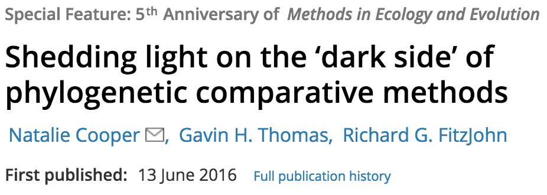
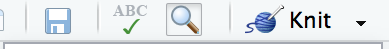
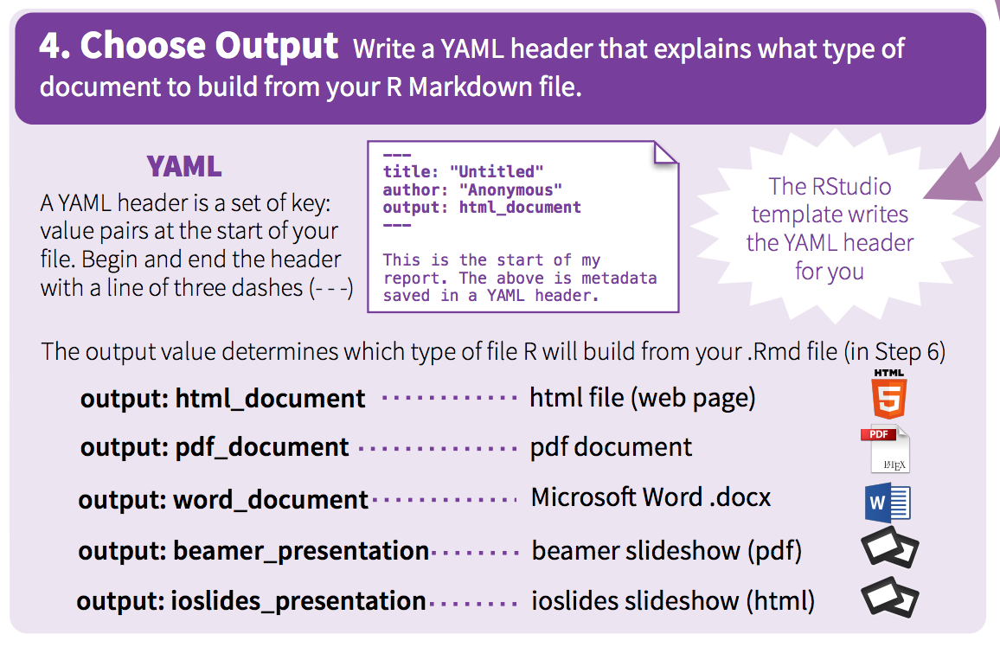
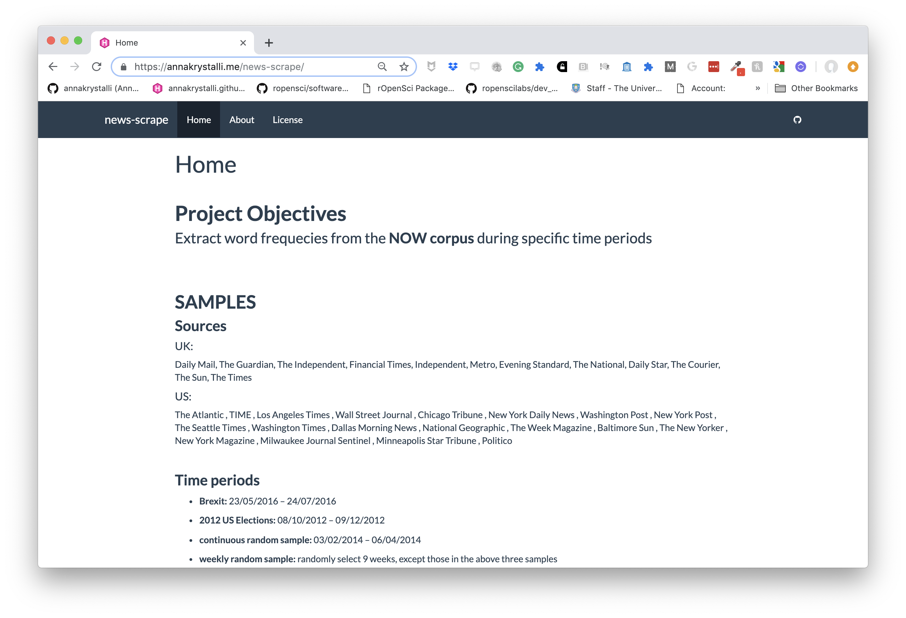

# (PART) Analysing and presenting analyses {#analysing} 

# Literate programming in rmarkdown


```{r echo= FALSE}
library(tidyverse)
```


Programming paradigm first introduced by **Donald E. Knuth**. 

> Treat program as a literature understandable to human beings

- move away from writing programs in the manner and order imposed by the computer

- focus instead on the logic and flow of human thought and understanding

- single document to integrate data analysis (executable code) with textual documentation, **linking data, code, and text**


<br>


## Why is this important in science:

### **Calls for reproducibility**

>  Reproducibility has the potential to serve as a minimum standard for judging scientific claims when full independent replication of a study is not possible.

 

- **Fully scripted analyses pipelines**
    + from raw data to published tables and figures
- **Publication of code and data**


<br>


## **Calls for open science**



> ... highlight problems with users jumping straight into software implementations of methods (e.g. in r) that may lack documentation on biases and assumptions that are mentioned in the original papers.

> <small> To help solve these problems, we make a number of suggestions including **providing blog posts** or **videos** to explain new methods in less technical terms, **encouraging reproducibility and code sharing**, making **wiki-style pages** summarising the literature on popular methods, more careful consideration and testing of whether a method is appropriate for a given question/data set, increased collaboration, and a shift from publishing purely novel methods to publishing improvements to existing methods and ways of detecting biases or testing model fit. Many of these points are applicable across methods in ecology and evolution, not just phylogenetic comparative methods.</small>


## tl;dr

- Modern open source technologies have given us great power
- With great power comes great responsibility
- You can share some of that burden by using these tools to open your work up to feedback and contribution by others. The more eyes the better.
- Use them to provide and context around your work. Help more humans understand


### **Literate programming in R**

**rmarkdown (`.Rmd`) integrates:**

–  a **documentantion** language (`.md`)


–  a **programming** language (`R`)


Combine **tools, processes** and **outputs** into interactive **evidence streams** that are easily shareable, particularly through the web.


<br>


## **Rmarkdown overview**

### Features

Rstudio features fly through

<iframe src="https://player.vimeo.com/video/178485416?color=428bca&title=0&byline=0&portrait=0" width="640" height="400" frameborder="0" webkitallowfullscreen mozallowfullscreen allowfullscreen></iframe>
<p><a href="https://vimeo.com/178485416">What is R Markdown?</a> from <a href="https://vimeo.com/rstudioinc">RStudio, Inc.</a> on <a href="https://vimeo.com">Vimeo</a>.</p>

<br>


### The researchers perspective

#### a reproducible workflow in action

<iframe width="560" height="315" src="https://www.youtube.com/embed/s3JldKoA0zw" frameborder="0" allowfullscreen></iframe>

<br>


## elements of R markdown


## **markdown {`.md`}**

#### stripped down **`html`**. User can focus on communicating & disseminating

<br>

-  intended to be as **easy-to-read** and **easy-to-write** as possible.

-  most powerful as a **format for writing to the web.**

-  **syntax is very small**, corresponding only to a very small subset of HTML tags. 

-  clean and legible **across platforms (even mobile) and outputs.**

-  **formatting handled automatically** 

-  html **markup language also handled**.


## **code {r,** python, SQL, ... **}**

- **Code chunks defined through special notation. Executed in sequence**. Exceution of individual chunks controllable

- **Analysis self-contained and reproducible**
    - Run in a fresh R session every time document is knit.
    
- A number of [Language Engines](https://rmarkdown.rstudio.com/authoring_knitr_engines.html) are supported by `knitr`
    - **R** (default)
    - Python
    - SQL
    - Bash
    - Rcpp
    - Stan
    - JavaScript
    - CSS
    
- Can read appropriately annotated `.R` scripts in and call them within an `.Rmd`


## **outputs**

**Knit together through package `knitr` to **


Many great packages and applications build on rmarkdown.

All this makes it incredibly versatile. Check out the [gallery](https://rmarkdown.rstudio.com/gallery.html).

<br>

**Superpower: Simple interface to powerful modern web technologies and libraries**


## Publish to the web for free!

#### **RPubs**: Publish rendered rmarkdown documents on the web with the click of a button <http://rpubs.com/>


#### **GitHub**: Host your site through [`gh-pages`](https://pages.github.com/) on GitHub. Can host entire websites, like this course material <https://github.com/>


<br>


## Applications in research

### `Rmd` documents

Can be useful for a number of research related materials

- [**Vignettes**](http://r-pkgs.had.co.nz/vignettes.html): long form documentation.
    - Analyses
    - Documentation (code & data)
    - Supplementary materials
- Reports
- Papers

Useful features:
- [bibliographies and citations](https://rmarkdown.rstudio.com/authoring_bibliographies_and_citations.html)


## `r emo::ji("computer")` Exercise Part 1

Throughout this workshop, we'll be working with the gapminder dataset to produce **a reproducible Rmarkdown vignette** of our work. We'll also be working in a project and setting our analysis report up to be shared online!


### install the packages we'll need

```{r, eval=FALSE}
install.packages(c("skimr", "ggplot2",  "dplyr", "plotly", "DT", "tibble"))
```


### Create new project `gapminder-analysis`


<div class="alert alert-info"><strong>File > New Project... > New Directory > New Project > gapminder-analysis </strong></div>


### Create your first `.Rmd`!

<div class="alert alert-info"><strong>File > New File > RMarkdown... > Document </strong></div>


#### Save as `index.Rmd`

- Before knitting, the document needs to be saved. Give it a useful name, e.g. `index.Rmd`


### Render it

- Render the document by clicking on the **knit** button.



You can also render `.Rmd` documents to html using `rmarkdown` function `render()`

```{r, eval = F}
rmarkdown::render(input = "index.Rmd")
```


### Publish your .Rmd

- Register an account on [RPubs](https://rpubs.com/)

- Publish your rendered document (don't worry, you can delete or overwrite it later)


### open the cheatsheet


[](https://www.rstudio.com/wp-content/uploads/2015/02/rmarkdown-cheatsheet.pdf)


<br>
<br>

## `r emo::ji("vertical_traffic_light")` **YAML header**

https://bookdown.org/yihui/rmarkdown/markdown-syntax.html

The yaml header contains metadata about the document, most importantly the output. Different seetings can be set within different outputs. Here we'll be focusing on on the [`html_document` output](https://bookdown.org/yihui/rmarkdown/html-document.html#table-of-contents).

It is contained between these separators at the top of the file.

```


```

Markdown was originally designed for HTML output, so it may not be surprising that the HTML format has the richest features among all output formats. 

## define outputs

To create an HTML document from R Markdown, you specify the `html_document` output format in the YAML metadata of your document:




### basic **`html_document`**

```

title: "Untitled"
author: "Anna Krystalli"
date: "3/23/2018"
output: html_document


```


## define a floating table of contents

You can add a table of contents (TOC) using the `toc` option and specify a floating toc using the `toc_float` option. For example:

```
---
title: "Untitled"
author: "Anna Krystalli"
date: "3/23/2018"
output:
  html_document:
    toc: true
    toc_float: true
---
```


## choose a theme

There are several options that control the appearance of HTML documents:

- `theme` specifies the Bootstrap theme to use for the page (themes are drawn from the [Bootswatch](https://bootswatch.com/3/) theme library). Valid themes include `r knitr::combine_words(rmarkdown:::themes(), before='\x60')`.


```
---
title: "Untitled"
author: "Anna Krystalli"
date: "3/23/2018"
output:
  html_document:
    toc: true
    toc_float: true
    theme: cosmo
---
```


## choose code highlights

`highlight` specifies the syntax highlighting style. Supported styles include `r knitr::combine_words(rmarkdown:::html_highlighters(), before='\x60')`.

```
---
title: "Untitled"
author: "Anna Krystalli"
date: "3/23/2018"
output:
  html_document:
    toc: true
    toc_float: true
    theme: cosmo
    highlight: zenburn
---
```


## `r emo::ji("computer")` Exercise Part 2


- Clear everything **BELOW THE YAML header**. You should be left with just this:

    ```
    ---
    title: "Gapminder Analysis"
    author: "Anna Krystalli"
    date: "3/23/2018"
    output: html_document
    ---
    ```

- add a floating table of contents

- set a theme of your choice (see avalable themes [here](https://rmarkdown.rstudio.com/html_document_format.html#appearance_and_style) and the associated bootstrap styles [here](http://bootswatch.com/))


<br>


## `r emo::ji("vertical_traffic_light")`  **Markdown basics**

The text in an [R Markdown document is written with the Markdown syntax](https://bookdown.org/yihui/rmarkdown/markdown-syntax.html). Precisely speaking, it is Pandoc’s Markdown.

<br>


## **text**

        normal text
normal text

        *italic text*
*italic text*

        **bold text**
**bold text**

        ***bold italic text***
***bold italic text***


        superscript^2^

superscript^2^

        ~~strikethrough~~
~~strikethrough~~ 

<br>


## **headers**

**rmarkdown**

```
# Header 1
## Header 2
### Header 3
#### Header 4
##### Header 5
###### Header 6
```
**rendered html**


## **unordered lists**


**rmarkdown**
```
- first item in the list
- second item in list
- third item in list
```

**rendered html**

- first item in the list
- second item in list
- third item in list


## **ordered lists**

**rmarkdown**
```
1. first item in the list
1. second item in list
1. third item in list
```
**rendered html**

1. first item in the list
1. second item in list
1. third item in list


## **quotes**

**rmarkdown**

    > this text will be quoted
   
**rendered html** 

 > **this text will be quoted**
 


## **code**
### annotate code inline

**rmarkdown**

    `this text will appear as code` inline

**rendered html**

`this text will appear as code` inline

<br>


### evaluate r code inline

```{r}
a <- 10
```


```{r, echo = F}
a <- "`r a`"
```

**rmarkdown**

```
the value of parameter *a* is `r a`

```
```{r, echo = F}
a <- 10
```

**rendered html**

the value of parameter *a* is `r a`

<br>


## **images**

Provide either a path to a local image file or the URL of an image.

**rmarkdown**

``` 


```

**rendered html** 


### **resize images**

**html in rmarkdown**

```

```

**rendered html** 


## **basic tables in markdown**

**rmarkdown**

```

    Table Header  | Second Header
    - | -
    Cell 1        | Cell 2
    Cell 3        | Cell 4 
```

**rendered html** 

Table Header  | Second Header
- | -
Cell 1        | Cell 2
Cell 3        | Cell 4 

Check out handy [**online .md table converter**](http://www.tablesgenerator.com/markdown_tables)

<br>


## **links**

**rmarkdown**

    [Download R](http://www.r-project.org/)    
    [RStudio](http://www.rstudio.com/)
    
**rendered html** 

[Download R](http://www.r-project.org/)    

[RStudio](http://www.rstudio.com/)

<br>


## mathematical expressions

Supports mathematical notations through [MathJax](http://www.onemathematicalcat.org/MathJaxDocumentation/TeXSyntax.htm).

You can write LaTeX math expressions inside a pair of dollar signs, e.g. `$\alpha+\beta$` renders $\alpha+\beta$. You can use the display style with double dollar signs:

```
$$\bar{X}=\frac{1}{n}\sum_{i=1}^nX_i$$
```

$$\bar{X}=\frac{1}{n}\sum_{i=1}^nX_i$$


## `r emo::ji("computer")` Exercise: Part 3

#### Get more info on gapminder: 

Do some quick online research on **Gapminder**. A good places to start:
<https://www.gapminder.org/>


#### Create a `"Background"` section using headers

#### Write a short description

Write a short description of the Gapminder project (feel free to copy, paste and edit information). Have a look at the gapminder [site](https://www.gapminder.org/) and especially the [about](https://www.gapminder.org/about-gapminder/) page.

Make use of markdown annotation to:

+ *highlight* **important** ***information***
+ include links to sources or further information.

#### Add an image

Add an **image related to Gapminder**.

+ have a look online for an image. 
+ include the source URL underneath for attribution.
+ see if you can resize it.
    
    


## `r emo::ji("vertical_traffic_light")` Chunks & Inline R code

## **inserting new chunks**

You can quickly insert an [R code chunk](https://bookdown.org/yihui/rmarkdown/r-code.html) with:

- the keyboard shortcut **`Ctrl + Alt + I`** (**OS X: `Cmd + Option + I`**)
- the Add Chunk  command in the RStudio toolbar
- by typing the chunk delimiters ` ```{r} and ``` `.

## chunk uses

There are a lot of things you can do in a code chunk: 

- you can produce text output, tables, or graphics. 
- You have fine control over all these output via chunk options, which can be provided inside the curly braces (between ```` ```{r```` and `}`). 
  + For example, you can choose hide text output via the chunk option `results = 'hide'`, or set the figure height to 4 inches via `fig.height = 4`. 
- Chunk options are separated by commas, e.g.,

````markdown
`r ''````{r, chunk-label, results='hide', fig.height=4}
````


**R code chunks execute code.**

They can be used as a means to render R output into documents or to simply display code for illustration (eg with option `eval=FALSE`).


## **chunk notation**

**chunk notation in `.rmd`**

    `r ''````{r chunk-name}
    print('hello world!')
    ```
**rendered html code and output**

```{r chunk-name}
print('hello world!')
```

Chunks can be labelled with chunk names, names must be unique.


## **chunk options**


for more details see <http://yihui.name/knitr/>


## uses

- controlling whether code is displayed inline (`echo` setting)
- controlling whether code is evaluated (`eval` setting)
- controlling how figures are displayed (`fig.width` and  `fig.height` settings)
- suppressing warnings and messages  (`warning` and  `message` settings)
- cacheing computations  (`cache` setting)
- controlling whether code is extracted when using purl (`purl` settings)


### controlling code display with `echo`

**chunk notation in `.rmd`**

    `r ''````{r hide-code, echo=FALSE}
    print('hello world!')
    ```
**rendered html code and output**

```{r hide-code, echo=FALSE}
print('hello world!')
```


### controlling code evaluation with `eval`

**chunk notation in `.rmd`**

    `r ''````{r dont-eval, eval=FALSE}
    print('hello world!')
    ```
**rendered html code and output**

```{r dont-eval, eval=FALSE}
print('hello world!')
```


### setting document level default options

```{r, eval=F}
knitr::opts_chunk$set(echo = TRUE, warning = F, message = F)
```


## `r emo::ji("computer")` Exercise Part 4

For this exercise we'll be accessing the gapminder data through the **`gapminder` R package.**

### Create an "`Installation`" section using headers

### Write installation instruction

Write brief instructions (including code) for others to access the dataset in R. Have a look at the [package documentation on GitHub](https://github.com/jennybc/gapminder) for inspiration.

In R we often need to describe a setup proceedure that involves specifying the installation of required packages. However, **installation of packages in not handled in `.Rmd`!** (For the moment, install packages through the console). 

In our case, we'll want to **include the code for installing the `gapminder` package** but **not evaluate it** in the `.Rmd`. We also want to include the rest of the packages we want to use: **"ggplot2", "DT", "skimr"**

<br>


## `r emo::ji("vertical_traffic_light")` Displaying data

There are many ways you can display data and data properties in an `.Rmd`.

### printing `data.frame`s

```{r}
data(airquality)
head(airquality)
```


### printing `tibble`s

One nice feature of using `tibble`s over `data.frame`s is the tidy printing behaviour:
```{r}
library(tibble)
as_tibble(airquality)
```


### **`Displaying knitr::kable()` tables**

We can use other packages to create html tables from our data.

The simplest is to use the `knitr::kable()` function.

```{r, warning=FALSE, message=FALSE}
library(knitr)
data(airquality)
kable(head(airquality), caption = "New York Air Quality Measurements")
```


### **Displaying interactive `DT::datatable()` tables**

You can display interactive html tables using function `DT::datatable()`:
```{r, warning=FALSE, message=FALSE}
library(DT)
data(airquality)
datatable(airquality, caption = "New York Air Quality Measurements")
```


### **Summarising data with `skimr::skim()`**

Fuction `skimr::skim()` provides a simple approach to displaying **summary statistics** that can be quickly skimmed quickly to understand data.

```{r}
skimr::skim(airquality)
```


## `r emo::ji("computer")` Exercise Part 5

#### Start a new section called **`"Dataset"`**

#### Display an example of the dataset

Make the gapminder data available by loading the gapminder package

```{r}
library(gapminder)
```


#### Write a short description of the dataset

+ What size is the data? (How many variables? How many rows of data points. See if you can extract and include such info **inline**)
+ what type of object is it? (see `?class`)
+ Use some of the functions you've learnt to extract such information (eg `?dim`, `?ncol` etc).


#### Summarise the data

(e.g. `?summary`, `?skimr`)

<br>


## `r emo::ji("vertical_traffic_light")` plots


By default, figures produced by R code will be placed immediately after the code chunk they were generated from. 

Let's use `ggplot2` to have a look to the relationship between a couple of variables. 
```{r}
p <- ggplot(gapminder, 
            aes(x = gdpPercap, y = lifeExp, color = continent)) + 
  geom_point()
```

```{r}
p
```


### **interactive plots with [plotly](https://plot.ly/)**

Wraps nicely around plotting library **`ggplot2`**

```{r, warning=FALSE, message=FALSE}
library(plotly)

ggplotly(p)

```


## `r emo::ji("computer")` Exercise Part 6a


- Replicate the plot above in your own `index.Rmd` but **hide the code that generates them**.

- Add a caption

- Experiment with controlling figure output width

- OPTIONAL Can you adapt the plotting code to use log10 transformed data?
    + hint: explore  the `scale_...` functions in `ggplot2` ([cheatsheet](https://www.rstudio.com/wp-content/uploads/2015/03/ggplot2-cheatsheet.pdf))


Details on [chunk arguments related to plotting](https://bookdown.org/yihui/rmarkdown/r-code.html#figures)


## Exercise Part 6b


<div class="alert alert-info"> Publish your report on <a href="https://rpubs.com/">Rpubs</a></strong></div>


- Add you link to our [hackmd](https://hackmd.io/mp12anoNS_O4UonAR5jcbg?both)


## `r emo::ji("vertical_traffic_light")` Advanced `.Rmd`


## **reading chunks of code** 
### `R` -> `Rmd`

You can read in chunks of code from an annotated `.R` (or any other language) script using `knitr::read_chunks()`

Chunks are defined by the following notation. Names must be unique.

```
# - descriptive-chunk-name1 -
code("you want to run as a chunk")

# - descriptive-chunk-name2 -
code("you want to run as a chunk")
```


### code in `.R` script **`hello-world.R`**


**`hello-world.R`**

```{r echo=FALSE, message=TRUE, comment=""}
message(readr::read_file(here::here("demos","hello-world.R")))

```

<br>


### read chunks from `hello-world.R`


```{r}
knitr::read_chunk(here::here("demos","hello-world.R"))
```


```{r echo=FALSE}
demo_chunk <- knitr:::knit_code$get()

demo_chunk <- demo_chunk[names(demo_chunk) == "demo-read_chunk"]

```


<br>


### call chunk by name

**rmarkdown r chunk notation**

    `r ''````{r demo-read_chunk}
    
    ```

**rendered html code and output**

```{r demo-read_chunk}
    
```

<br>


### Check chunks in the current session

```{r, eval=FALSE}
knitr:::knit_code$get()  
```


```{r echo=F}
demo_chunk
```


## **Extracting code from an `.Rmd`** 
#### `Rmd` -> `R`

You can use `knitr::purl()` to *tangle* code out of an `Rmd` into an `.R` script. **`purl`** takes many of the same arguments as `knit()`. The most important additional argument is:

- **`documentation`:** an integer specifying the level of documentation to go the tangled script: 
    + **0** means pure code (discard all text chunks)
    + **1** (default) means add the chunk headers to code
    + **2** means add all text chunks to code as roxygen comments

```{r eval=F}
purl("file-to-extract-code-from.Rmd", documentation = 0)
```


### extract using `purl`

Here i'm running a loop to **extract the code in `demo-rmd.Rmd`** for each documentation level

```{r, results='hide', eval=FALSE}

file <- here::here("demos","demo-rmd.Rmd")
for(docu in 0:2){
knitr::purl(file, output = paste0(gsub(".Rmd", "", file), "_", docu, ".R"),
            documentation = docu, quiet = T)
}

```


#### **`demo-rmd_0.R`**

```{r echo=FALSE, message=TRUE, comment=""}

message(readr::read_file(here::here("demos","demo-rmd_0.R")))

```


#### **`demo-rmd_1.R`**

```{r echo=FALSE, message=TRUE, comment=""}

message(readr::read_file(here::here("demos","demo-rmd_1.R")))

```


#### **`demo-rmd_2.R`**

```{r echo=FALSE, message=TRUE, comment=""}

message(readr::read_file(here::here("demos","demo-rmd_2.R")))

```


## `r emo::ji("computer")` Exercise: Part 7*

### read in a chunk

- Open an `.R` script
- Cut the code from one or more of your chunks and paste it into the `.R` script
- Annotate the code up as named chunk(s)
- Read the chunk(s) in your `.R` script into your `.Rmd` (`?read_chunk()`)
- Include the code in your `.Rmd` workflow by labelling an empty chunk with 
your chunk(s) name(s)

## purl your document

Once your document is ready, try and extract the contents of your `.Rmd` into an `.R` script.

`?purl`


## `r emo::ji("vertical_traffic_light")` html in rmarkdown

### marking up with html tags

**This text marked up in html**

```
<strong>Bold text</strong>

```

**renders to this**

<strong>Bold text</strong>

<br>

**This text marked up with [**Bootstrap alert css classes**](https://www.w3schools.com/bootstrap/bootstrap_alerts.asp)

```
<div class="alert alert-warning"><small>this a is warning message</small></div>

```

**renders to**

<div class="alert alert-warning"><small>this a is warning message</small></div>


<br>

```
<div class="alert alert-success"><small>this a is success message</small></div>

```

**renders to**

<div class="alert alert-success"><small>this a is success message</small></div>


### embedding tweets

**This snipped copied from twitter in the embed format**

```
<blockquote class="twitter-tweet" data-lang="en"><p lang="en" dir="ltr">How cool does this tweet look embedded in <a href="https://twitter.com/hashtag/rmarkdown?src=hash&amp;ref_src=twsrc%5Etfw">#rmarkdown</a>! 😎</p>&mdash; annakrystalli (@annakrystalli) <a href="https://twitter.com/annakrystalli/status/977209749958791168?ref_src=twsrc%5Etfw">March 23, 2018</a></blockquote>
<script async src="https://platform.twitter.com/widgets.js" charset="utf-8"></script>

```

**renders to this**

<blockquote class="twitter-tweet" data-lang="en"><p lang="en" dir="ltr">How cool does this tweet look embedded in <a href="https://twitter.com/hashtag/rmarkdown?src=hash&amp;ref_src=twsrc%5Etfw">#rmarkdown</a>! 😎</p>&mdash; annakrystalli (@annakrystalli) <a href="https://twitter.com/annakrystalli/status/977209749958791168?ref_src=twsrc%5Etfw">March 23, 2018</a></blockquote>
<script async src="https://platform.twitter.com/widgets.js" charset="utf-8"></script>

Embbed gifs, videos, widgets in this way


## Parting words


## Getting help with markdown

**To get help, you need a reproducible example**

- github issues
- stackoverflow
- slack channels
- discussion boards


### `reprex`

```{r, eval=FALSE}
install.packages("reprex")
```


Use function **`reprex::reprex()`** to produce a reproducible example in a custom markdown format for the `venue` of your choice

- **`"gh"`** for GitHub (default)
- **`"so"`** for StackOverflow, 
- **`"r"`** or **`"R"`** for a runnable R script, with commented output interleaved.


### using reprex

1. Copy the code you want to run. 
    <div class="alert alert-warning"><small>all required variables must be defined and libraries loaded</small></div>
  
2. In the console, call the `reprex` function
    ```{r, eval=F} 
   reprex::reprex()
   
    ```
    + <small>the code is executed in a fresh environment and "code + commented output" is returned invisibly on the clipboard.</small>

1. Paste the result in the venue of your choice.
    + <small>Once published it will be rendered to html.</small>


### [`bookdown`](https://bookdown.org/yihui/bookdown/)

Authoring with R Markdown. Offers:

- cross-references, 
- citations, 
- HTML widgets and Shiny apps,
- tables of content and section numbering

The publication can be exported to HTML, PDF, and e-books (e.g. EPUB)
Can even be used to write thesis!


### [pkgdown](http://pkgdown.r-lib.org/articles/pkgdown.html)

#### For buidling package documentation

- Can use it to document any functional code you produce and demonstrate it's us ethrough vignettes 


### [workflowr](https://jdblischak.github.io/workflowr/) pkg

#### Build analyses websites and organise your project

The workflowr R package makes it easier for researchers to organize their projects and share their results with colleagues.



]


### [blogdown](https://bookdown.org/yihui/blogdown/)

#### For creating and mantaining blogs.

Check out <https://awesome-blogdown.com/>, **a curated list of awesome #rstats blogs in blogdown** for inspiration!


### [bookdown](https://bookdown.org/yihui/bookdown/)

#### For creating and mantaining online books

- [rOpenSci Software Review policies](https://ropensci.github.io/dev_guide/)
- [Geocomputation in R](https://geocompr.robinlovelace.net/)

##### [Thesisdown](https://github.com/ismayc/thesisdown)

An updated R Markdown thesis template using the bookdown package


## **Resources**

- [R Markdown: The Definitive guide](https://bookdown.org/yihui/rmarkdown/)

- [Rmarkdown documentation](http://rmarkdown.rstudio.com/)

- [Rmarkdown `html_document` format documentation](https://rmarkdown.rstudio.com/html_document_format.html)

- [Rstudio Rmarkdown cheatsheet](https://www.rstudio.com/wp-content/uploads/2015/02/rmarkdown-cheatsheet.pdf)


- [Reproducible Research](https://www.coursera.org/learn/reproducible-research) coursera MOOC

- [Producing html documents from `.R` scripts using `knitr::spin`](http://deanattali.com/2015/03/24/knitrs-best-hidden-gem-spin/)


## Solutions: My example

- [`gapminder-analysis` Rendered html](index-demo-pre.html)


- [`gapminder-analysis` Rmd](https://github.com/annakrystalli/rrresearch/blob/master/demos/index-pre.Rmd)
