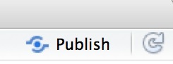
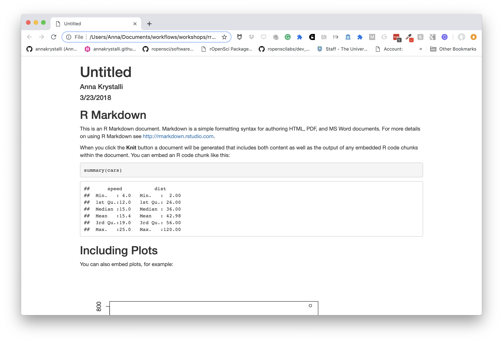
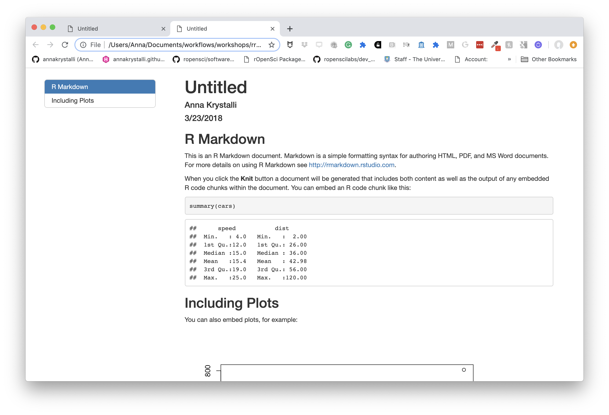
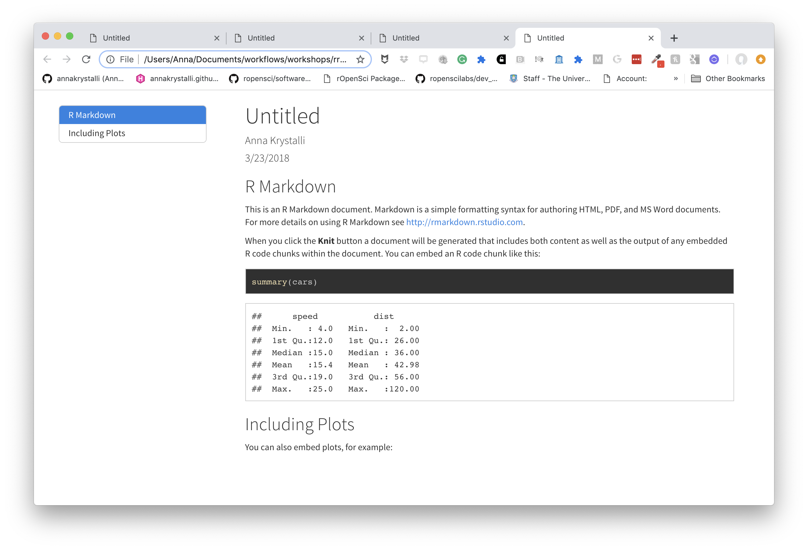
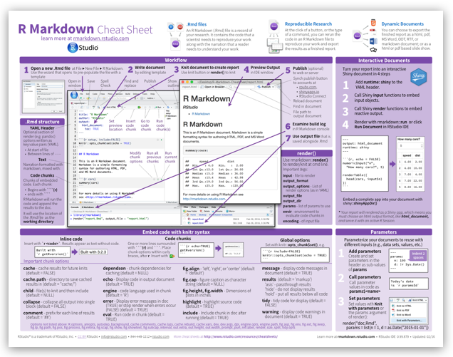
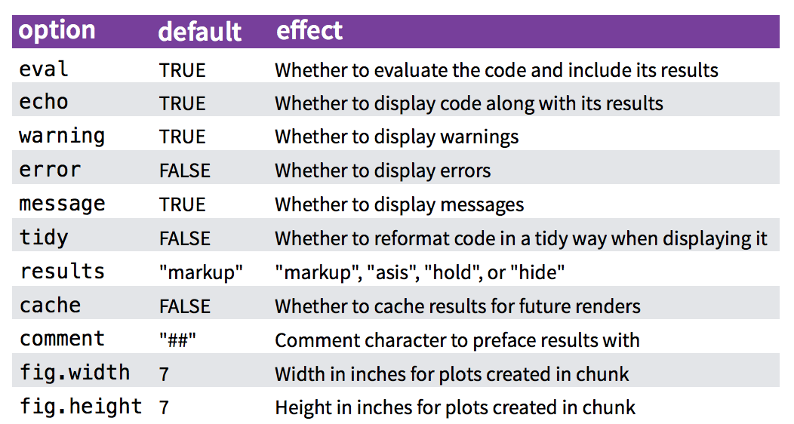

# Literate programming in rmarkdown

## Literate programming

Literate programming is a programming paradigm first introduced by **Donald E. Knuth**. 

> **Treat program as literature meant to be understandable to human beings**
> 
> - move away from writing programs in the manner and order imposed by the computer
> - focus instead on the logic and flow of human thought and understanding
> - single document to integrate data analysis (executable code) with textual documentation, **linking data, code, and text**


### Why is this important in science:

#### **Enables reproducibility**
 
 Enables reproducibility through packaging code, text and output into a single executable document.

#### **Enables open science**

Literate programming allows us to record and publish information and discussions about code and analyses in more readable formats.

```{r, out.width="60%", echo=FALSE}
knitr::include_graphics("assets/pgls.png")
```


> ... highlight problems with users jumping straight into software implementations of methods (e.g. in r) that may lack documentation on biases and assumptions that are mentioned in the original papers.

> <small> To help solve these problems, we make a number of suggestions including **providing blog posts** or **videos** to explain new methods in less technical terms, **encouraging reproducibility and code sharing**, making **wiki-style pages** summarising the literature on popular methods, more careful consideration and testing of whether a method is appropriate for a given question/data set, increased collaboration, and a shift from publishing purely novel methods to publishing improvements to existing methods and ways of detecting biases or testing model fit. Many of these points are applicable across methods in ecology and evolution, not just phylogenetic comparative methods.</small>


## **Literate programming in R**

### Rmarkdown (`Rmd`) Overview

**Rmarkdown integrates:**

–  a **documentantion** language (`.md`)


–  a **programming** language (`R`)


Allows us to combine **tools, processes** and **outputs** into interactive **evidence streams** that are easily shareable, particularly through the web.

```{r, echo=FALSE}
knitr::include_url("assets/cheatsheets/rmarkdown-2.0.pdf")
```


#### A researchers perspective on Rmarkdown

A reproducible workflow in action:

<iframe width="560" height="315" src="https://www.youtube.com/embed/s3JldKoA0zw" frameborder="0" allowfullscreen></iframe>

<br>


### Elements of R markdown


#### **markdown {`.md`}**

Simplified version of the **`html`** markup language. User can focus on communicating & disseminating


-  intended to be as **easy-to-read** and **easy-to-write** as possible.

-  most powerful as a **format for writing to the web.**

-  **syntax is very small**, corresponding only to a very small subset of HTML tags. 

-  clean and legible **across platforms (even mobile) and outputs.**

-  **formatting handled automatically** 

-  html **markup language also handled**.


#### **code {r,** python, SQL, ... **}**

- **Code chunks defined through special notation. Executed in sequence**. Exceution of individual chunks controllable

- **Analysis self-contained and reproducible**
    - Run in a fresh R session every time document is knit.
    
- A number of [Language Engines](https://rmarkdown.rstudio.com/authoring_knitr_engines.html) are supported by `knitr`
    - **R** (default)
    - Python
    - SQL
    - Bash
    - Rcpp
    - Stan
    - JavaScript
    - CSS
    
- Can read appropriately annotated `.R` scripts in and call them within an `.Rmd`


#### **outputs**

**Knit together through package `knitr` to a variety of useful formats**
```{r, out.width="60%", echo=FALSE}
knitr::include_graphics("assets/RMarkdownOutputFormats.png")
```

Many great packages and applications build on rmarkdown.

All this makes it incredibly versatile. Check out the [Rmarkdown gallery](https://rmarkdown.rstudio.com/gallery.html).

**Superpower: Simple interface to powerful modern web technologies and libraries**


```{r, out.width="60%", echo=FALSE}
knitr::include_graphics("assets/html-featured-image.jpg")
```


#### Publish to the web for free!

##### **RPubs**: 

Publish rendered rmarkdown documents on the web with the click of a button <http://rpubs.com/>


```{r, out.width="20%", echo=FALSE}

```

```{r, out.width="60%", echo=FALSE}
knitr::include_graphics("assets/rpubs_ui.jpg")
```


##### **GitHub**: 

Host your site through [`gh-pages`](https://pages.github.com/) on GitHub. Can host entire websites, like this course material <https://github.com/>


## Applications of Rmd in research

`Rmd` documents can be useful for a number of research related materials

- [**Vignettes**](http://r-pkgs.had.co.nz/vignettes.html): long form documentation.
    - Analyses
    - Documentation (code & data)
    - Supplementary materials
- Reports
- Papers
- Personal research websites and blogs
- Theses!

Useful features through `bookdown`: [bibliographies and citations](https://rmarkdown.rstudio.com/authoring_bibliographies_and_citations.html)


## `Rmd` in Practice

```{r, echo=FALSE}
knitr::include_url("assets/cheatsheets/rmarkdown-2.0.pdf")
```


<div class="alert alert-success">

### Exercise Part 1

We will use `Rmarkdown` to create a reproducible presentation document for our analysis, combining our code and it's output with text in the form of markdown!

Later, once we start working with git and GitHub, we'll also publish it online.


### Create your first `.Rmd`!

<div class="alert alert-info"><strong>File > New File > RMarkdown... > Document </strong></div>


```{r, out.width="80%", echo=FALSE}
knitr::include_graphics("assets/newmd.gif")
```


#### Save as `index.Rmd`

Before knitting, the document needs to be saved. Give it a useful name, e.g. `index.Rmd`. Index has a special meaning for websites indicating the landing page of a given url.


#### Render `index.Rmd`

Render the document by clicking on the **knit** button.


```{r, out.width="30%", echo=FALSE}
knitr::include_graphics("assets/knit.png")
```


You can also render `.Rmd` documents to html using `rmarkdown` function `render()`

```{r, eval = F}
rmarkdown::render(input = "index.Rmd")
```


#### Publish your .Rmd

- Register an account on [RPubs](https://rpubs.com/)

- Publish your rendered document (don't worry, you can delete or overwrite it later)


</div>

###  **Complete YAML header**


The **yaml** header contains metadata about the document. 

It is contained between the `---` separators at the top of the file and is encoded as [YAML](https://yaml.org/), _a human friendly data serialization standard for all programming languages_.

The key thing to know about YAML is that **indentation is extremely important!**. So make sure you copy any example YAML code exactly, ensuring correct indentation. If you get errors, check your indentation.

```
---
title: "Untitled"
author: "Anna Krystalli"
date: "3/23/2018"
output: html_document
---
```


#### Define outputs

There are many output formats available in `.Rmd`. 

```{r, out.width="60%", echo=FALSE}
knitr::include_graphics("assets/outputs.png")
```

The output format is defined in the YAML header through parameter `output`.

##### basic **`html_document`**

Markdown was originally designed for HTML output, so it may not be surprising that the HTML format has the richest features among all output formats. Here we'll be focusing on on the [`html_document` output](https://bookdown.org/yihui/rmarkdown/html-document.html#table-of-contents).

This is the default output when creating a new blank `.Rmd`.

```

title: "Untitled"
author: "Anna Krystalli"
date: "3/23/2018"
output: html_document


```
```{r, out.width="90%", echo=FALSE}

```


#### Add a floating table of contents

We can add a table of contents (TOC) using the `toc` option and specify a floating toc using the `toc_float` option. For example:

```
---
title: "Untitled"
author: "Anna Krystalli"
date: "3/23/2018"
output:
  html_document:
    toc: true
    toc_float: true
---
```
```{r, out.width="90%", echo=FALSE}

```


#### Choose a theme

There are several options that control the appearance of HTML documents:

- `theme` specifies the Bootstrap theme to use for the page (themes are drawn from the [Bootswatch](https://bootswatch.com/3/) theme library). Valid themes include `r knitr::combine_words(rmarkdown:::themes(), before='\x60')`.


```
---
title: "Untitled"
author: "Anna Krystalli"
date: "3/23/2018"
output:
  html_document:
    toc: true
    toc_float: true
    theme: cosmo
---
```

```{r, out.width="90%", echo=FALSE}
knitr::include_graphics("assets/demo-2.png")
```


#### Choose code highlights

`highlight` specifies the syntax highlighting style. Supported styles include `r knitr::combine_words(rmarkdown:::html_highlighters(), before='\x60')`.

```
---
title: "Untitled"
author: "Anna Krystalli"
date: "3/23/2018"
output:
  html_document:
    toc: true
    toc_float: true
    theme: cosmo
    highlight: zenburn
---
```
```{r, out.width="90%", echo=FALSE}

```

<div class="alert alert-success">

### Exercise Part 2
#### Customise your own `Rmd`

- Add a title.
- Add your name.
- Add a floating table of contents.
- Set a theme of your choice (see avalable themes [here](https://rmarkdown.rstudio.com/html_document_format.html#appearance_and_style) and the associated bootstrap styles [here](http://bootswatch.com/)).
- Clear everything **BELOW THE YAML header**. You should be left with just this:

    ```
    ---
    title: "Analysis of NEON Woody plant vegetation structure data""
    author: "Anna Krystalli"
    date: "3/23/2018"
    output:
      html_document:
        toc: true
        toc_float: true
        theme: cosmo
        highlight: zenburn
    ---
    ```
</div>

### **Markdown basics**

The text in an [R Markdown document is written with the Markdown syntax](https://bookdown.org/yihui/rmarkdown/markdown-syntax.html). Precisely speaking, it is Pandoc’s Markdown.


We use a small number of notations to **markup** our text with some common html tags

<br>


#### **text**

        normal text
normal text

        *italic text*
*italic text*

        **bold text**
**bold text**

        ***bold italic text***
***bold italic text***


        superscript^2^

superscript^2^

        ~~strikethrough~~
~~strikethrough~~ 

<br>


#### **headers**

**rmarkdown**

```
# Header 1
## Header 2
### Header 3
#### Header 4
##### Header 5
###### Header 6
```
**rendered html**


```{r, out.width="80%", echo=FALSE}
knitr::include_graphics("assets/headers.png")
```


#### **unordered lists**


**rmarkdown**
```
- first item in the list
- second item in list
- third item in list
```

**rendered html**

- first item in the list
- second item in list
- third item in list


#### **ordered lists**

**rmarkdown**
```
1. first item in the list
1. second item in list
1. third item in list
```
**rendered html**

1. first item in the list
1. second item in list
1. third item in list


#### **quotes**

**rmarkdown**

    > this text will be quoted
   
**rendered html** 

 > **this text will be quoted**
 


#### **code**
##### annotate code inline

**rmarkdown**

    `this text will appear as code` inline

**rendered html**

`this text will appear as code` inline

<br>


##### Evaluate r code inline

```{r}
a <- 10
```


```{r, echo = F}
a <- "`r a`"
```

**rmarkdown**

```
the value of parameter *a* is `r a`

```
```{r, echo = F}
a <- 10
```

**rendered html**

the value of parameter *a* is `r a`


#### **Images**

Provide either a path to a local image file or the URL of an image.

**rmarkdown**

``` 


```

**rendered html** 


##### **resize images with html**

**html in rmarkdown**

```

```

**rendered html** 


#### **Basic tables in markdown**

**rmarkdown**

```

    Table Header  | Second Header
    - | -
    Cell 1        | Cell 2
    Cell 3        | Cell 4 
```

**rendered html** 

Table Header  | Second Header
- | -
Cell 1        | Cell 2
Cell 3        | Cell 4 

Check out handy [**online .md table converter**](http://www.tablesgenerator.com/markdown_tables)

<br>


#### **Links**

**rmarkdown**

    [Download R](http://www.r-project.org/)    
    [RStudio](http://www.rstudio.com/)
    
**rendered html** 

[Download R](http://www.r-project.org/)    

[RStudio](http://www.rstudio.com/)

<br>


#### Mathematical expressions

Supports mathematical notations through [MathJax](http://www.onemathematicalcat.org/MathJaxDocumentation/TeXSyntax.htm).

You can write LaTeX math expressions inside a pair of dollar signs, e.g. `$\alpha+\beta$` renders $\alpha+\beta$. You can use the display style with double dollar signs:

```
$$\bar{X}=\frac{1}{n}\sum_{i=1}^nX_i$$
```

$$\bar{X}=\frac{1}{n}\sum_{i=1}^nX_i$$

<div class="alert alert-success">

#### `r emo::ji("computer")` Exercise: Part 3

##### Create a `"Background"` section using headers

###### Write a short description of the data set and analysis

Write a short description of the NEON Woody plant vegetation structure dataset and the objective of the analysis.

Have a look at the page on the [NEON data portal](https://data.neonscience.org/data-products/DP1.10098.001) for inspiration.

Make use of markdown annotation to:

+ *highlight* **important** ***information***
+ include links to sources or further information.

##### Add an image

Add an **image related to the data**.

+ perhaps a logo or a relevant image to the organisms in question
+ have a look online, especially on sites like [unsplash](https://unsplash.com/) that offer free to use images. 
+ include the source URL underneath for attribution.
+ see if you can resize it.
    
</div>

### Chunks & Inline R code

> **R code chunks execute code.**

They can be used as a means to perform computations, render R output like text, tables, or graphics into documents or to simply display code for illustration without evaluating it.

```{r, out.width="90%", echo=FALSE}
knitr::include_graphics("assets/markdownChunk.png")
```


#### **Inserting new chunks**

You can quickly insert an [R code chunk](https://bookdown.org/yihui/rmarkdown/r-code.html) with:

- the keyboard shortcut **`Ctrl + Alt + I`** (**OS X: `Cmd + Option + I`**)
- the Add Chunk  command in the RStudio toolbar
- by typing the chunk delimiters ` ```{r} and ``` `.


#### **Chunk notation**

**chunk notation in `.rmd`**

    `r ''````{r chunk-name}
    print('hello world!')
    ```
**rendered html code and output**

```{r chunk-name}
print('hello world!')
```

Chunks can be labelled with chunk names, names must be unique.


````markdown
`r ''````{r chunk-label}
````


#### **Chunk options**

Chunk options control how code and outputs are evaluated and presented. 

- You have fine control over all these output via chunk options, which can be provided inside the curly braces (between ```` ```{r```` and `}`). 
- Chunk options are separated by commas, e.g.:

  ````markdown
  `r ''````{r, results='hide', fig.height=4}
  ````


```{r, out.width="80%", echo=FALSE}

```


for more details see <http://yihui.name/knitr/>


##### controlling code display with `echo`

**chunk notation in `.rmd`**

    `r ''````{r hide-code, echo=FALSE}
    print('hello world!')
    ```
**rendered html code and output**

```{r hide-code, echo=FALSE}
print('hello world!')
```


#### controlling code evaluation with `eval`

**chunk notation in `.rmd`**

    `r ''````{r dont-eval, eval=FALSE}
    print('hello world!')
    ```
**rendered html code and output**

```{r dont-eval, eval=FALSE}
print('hello world!')
```


#### setting document level default options

```{r, eval=F}
knitr::opts_chunk$set(echo = TRUE, warning = F, message = F)
```


#### **reading chunks of code from an `R` script** 


<div class="alert alert-info">

> `R` -> `Rmd`

We can also read in chunks of code from an annotated `.R` (or any other language) script using `knitr::read_chunks()`

This is extremely powerful beacuse it means we can recycle code and more importantly, present an analysis while maintaining a single copy of the source code in a separate script.

</div>


##### Marking up chunks in a script

Chunks are defined by the **following notation in scripts `## @knitr`**. **Names must be unique** and there must be **no empty code lines or other comments in between**.

```
## @knitr descriptive-chunk-name1
code("you want to run as a chunk")

## @knitr descriptive-chunk-name2 -
code("you want to run as a chunk")
```

Chunks are read in using:

```{r, eval=FALSE}
knitr::read_chunk("path/to/Rscript")
```


##### Call chunk by name

Once the script is read in with `knitr::read_chunk()`, we can **call** individual chunks using their name.


**rmarkdown r chunk notation**

    `r ''````{r descriptive-chunk-name1}
    
    ```


##### `read_chunk` example

###### code in `.R` script **`hello-world.R`**


**`hello-world.R`**

```{r echo=FALSE, message=TRUE, comment=""}
message(readr::read_file(here::here("demos","hello-world.R")))

```


###### Read chunks from `hello-world.R`

```{r}
knitr::read_chunk(here::here("demos","hello-world.R"))
```


```{r echo=FALSE}
demo_chunk <- knitr:::knit_code$get()

demo_chunk <- demo_chunk[names(demo_chunk) == "demo-read_chunk"]

```


###### Call chunk by name

**rmarkdown r chunk notation**

    `r ''````{r demo-read_chunk}
    
    ```

**rendered html code and output**

```{r demo-read_chunk}
    
```


###### Check chunks in the current session

```{r, eval=FALSE}
knitr:::knit_code$get()  
```

<div class="alert alert-success">

#### `r emo::ji("computer")` Exercise Part 4

For this exercise we'll create a **Data** section, load our data in and present some summaries. We'll use code contained in our analysis script.

#### Annotate chunks in `analysis.R` script

- Annotate each chunk with the special comment `## @knitr` followed by a space and the unique code chunk name.
- When finished, your script should look like:
  ```{r code=readLines("analysis.R"), eval=FALSE}
  ```

### Create a **Data** section and 
- Create a **Data** section using headers.
- In a hiden chunk of code, read in the chunks from `analysis.R` using `knitr::read_chunk()`.
- Load the data by creating a new chunk invoking the `analysis-setup` chunk.
- Create some additional chunks and present statistical summaries (eg using `summary()`).
- Add some simple markdown notes about what the code has been doing. 
- See if you can include the number of `rows` and `columns` in an inline description of the dataset (hint: use `nrow()` & `ncol()`.


</div>

### Displaying data

There are many ways you can display data and data properties in an `.Rmd`.

##### printing `tibbles`s
```{r}
tibble::as_tibble(airquality)
```


##### **`Displaying knitr::kable()` tables**

We can use other packages to create html tables from our data.

The simplest is to use the `knitr::kable()` function.

```{r, warning=FALSE, message=FALSE}
knitr::kable(head(airquality), caption = "New York Air Quality Measurements")
```


#### **Displaying interactive `DT::datatable()` tables**

You can display interactive html tables using function `DT::datatable()`:
```{r, warning=FALSE, message=FALSE}

DT::datatable(airquality, caption = "New York Air Quality Measurements")
```


<div class="alert alert-success">


#### `r emo::ji("computer")` Exercise Part 5

##### Display the data

Choose any method you prefer and create a new chunk to display the data in the **Data** section.

</div>

<div class="alert alert-success">

#### `r emo::ji("computer")` Exercise Part 6

##### Write the analysis section

- Create a new section called **Analysis**.
- Create chunks and invoke the rest of the steps in our analysis.
- Use lower level headers to break down the workflow and include some minimal explanatory text.
- Add a caption to each figure.
- Experiment with controlling figure output width or height using chunk options `fig.width` or `fig.height`.

Details on [chunk arguments related to plotting](https://bookdown.org/yihui/rmarkdown/r-code.html#figures)

#### End the document with a **Session Info** Section

- Create a new section called **Session Info**
- Create a new chunk and use function `sessionInfo()` to print session information about your analysis environment


</div>


My final `index.Rmd` looks like this:


```{r, echo=FALSE, message=FALSE}
knitr::include_url("demos/index.Rmd")
```

and renders to:

```{r, echo=FALSE, message=FALSE}
knitr::include_url(here::here("demos/index.html"))
```

<div class="alert alert-success">

#### Exercise Part 7 Publish your work

##### Publish your report on [Rpubs](https://rpubs.com/)

- Add the link to your published document to our [collaborative notepad](https://bit.ly/acce20-notepad)

</div>

##  Advanced `.Rmd`


### **Extracting code from an `.Rmd`** 

>  `Rmd` -> `R`

You can use `knitr::purl()` to *tangle* code out of an `Rmd` into an `.R` script. **`purl`** takes many of the same arguments as `knit()`. The most important additional argument is:

- **`documentation`:** an integer specifying the level of documentation to go the tangled script: 
    + **0** means pure code (discard all text chunks)
    + **1** (default) means add the chunk headers to code
    + **2** means add all text chunks to code as roxygen comments

```{r eval=F}
purl("file-to-extract-code-from.Rmd", documentation = 0)
```


#### extract using `purl`

Here i'm running a loop to **extract the code in `demo-rmd.Rmd`** for each documentation level

```{r, results='hide', eval=FALSE}

file <- here::here("demos","demo-rmd.Rmd")
for(docu in 0:2){
knitr::purl(file, output = paste0(gsub(".Rmd", "", file), "_", docu, ".R"),
            documentation = docu, quiet = T)
}

```


##### **`demo-rmd_0.R`**

```{r echo=FALSE, message=TRUE, comment=""}

message(readr::read_file(here::here("demos","demo-rmd_0.R")))

```


##### **`demo-rmd_1.R`**

```{r echo=FALSE, message=TRUE, comment=""}

message(readr::read_file(here::here("demos","demo-rmd_1.R")))

```


##### **`demo-rmd_2.R`**

```{r echo=FALSE, message=TRUE, comment=""}

message(readr::read_file(here::here("demos","demo-rmd_2.R")))

```


<div class="alert alert-success">

#### `r emo::ji("computer")` Exercise: Part 8*


##### purl your document

Once your document is ready, try and extract the contents of your `.Rmd` into another `.R` script.

`?purl`

</div>


### html in rmarkdown

#### marking up with html tags

**This text marked up in html**

```
<strong>Bold text</strong>

```

**renders to this**

<strong>Bold text</strong>

<br>

**This text marked up with [**Bootstrap alert css classes**](https://www.w3schools.com/bootstrap/bootstrap_alerts.asp)

```
<div class="alert alert-warning"><small>this a is warning message</small></div>

```

**renders to**

<div class="alert alert-warning"><small>this a is warning message</small></div>


<br>

```
<div class="alert alert-success"><small>this a is success message</small></div>

```

**renders to**

<div class="alert alert-success"><small>this a is success message</small></div>


#### embedding tweets

**This snipped copied from twitter in the embed format**

```
<blockquote class="twitter-tweet" data-lang="en"><p lang="en" dir="ltr">How cool does this tweet look embedded in <a href="https://twitter.com/hashtag/rmarkdown?src=hash&amp;ref_src=twsrc%5Etfw">#rmarkdown</a>! 😎</p>&mdash; annakrystalli (@annakrystalli) <a href="https://twitter.com/annakrystalli/status/977209749958791168?ref_src=twsrc%5Etfw">March 23, 2018</a></blockquote>
<script async src="https://platform.twitter.com/widgets.js" charset="utf-8"></script>

```

**renders to this**

<blockquote class="twitter-tweet" data-lang="en"><p lang="en" dir="ltr">How cool does this tweet look embedded in <a href="https://twitter.com/hashtag/rmarkdown?src=hash&amp;ref_src=twsrc%5Etfw">#rmarkdown</a>! 😎</p>&mdash; annakrystalli (@annakrystalli) <a href="https://twitter.com/annakrystalli/status/977209749958791168?ref_src=twsrc%5Etfw">March 23, 2018</a></blockquote>
<script async src="https://platform.twitter.com/widgets.js" charset="utf-8"></script>

Embbed gifs, videos, widgets in this way


## Parting words


## Getting help with markdown

**To get help, you need a reproducible example**

- github issues
- stackoverflow
- slack channels
- discussion boards


### `reprex`

```{r, eval=FALSE}
install.packages("reprex")
```


Use function **`reprex::reprex()`** to produce a reproducible example in a custom markdown format for the `venue` of your choice

- **`"gh"`** for GitHub (default)
- **`"so"`** for StackOverflow, 
- **`"r"`** or **`"R"`** for a runnable R script, with commented output interleaved.


### using reprex

1. Copy the code you want to run. 
    <div class="alert alert-warning"><small>all required variables must be defined and libraries loaded</small></div>
  
2. In the console, call the `reprex` function
    ```{r, eval=F} 
   reprex::reprex()
   
    ```
    + <small>the code is executed in a fresh environment and "code + commented output" is returned invisibly on the clipboard.</small>

1. Paste the result in the venue of your choice.
    + <small>Once published it will be rendered to html.</small>


### [`bookdown`](https://bookdown.org/yihui/bookdown/)

Authoring with R Markdown. Offers:

- cross-references, 
- citations, 
- HTML widgets and Shiny apps,
- tables of content and section numbering

The publication can be exported to HTML, PDF, and e-books (e.g. EPUB)
Can even be used to write thesis!


### [pkgdown](http://pkgdown.r-lib.org/articles/pkgdown.html)

#### For buidling package documentation

- Can use it to document any functional code you produce and demonstrate it's us ethrough vignettes 


### [workflowr](https://jdblischak.github.io/workflowr/) pkg

#### Build analyses websites and organise your project

The workflowr R package makes it easier for researchers to organize their projects and share their results with colleagues.


]


### [blogdown](https://bookdown.org/yihui/blogdown/)

#### For creating and mantaining blogs.

Check out <https://awesome-blogdown.com/>, **a curated list of awesome #rstats blogs in blogdown** for inspiration!


### [bookdown](https://bookdown.org/yihui/bookdown/)

#### For creating and mantaining online books

- [rOpenSci Software Review policies](https://ropensci.github.io/dev_guide/)
- [Geocomputation in R](https://geocompr.robinlovelace.net/)

##### [Thesisdown](https://github.com/ismayc/thesisdown)

An updated R Markdown thesis template using the bookdown package


## **Resources**

- [R Markdown: The Definitive guide](https://bookdown.org/yihui/rmarkdown/)

- [Rmarkdown documentation](http://rmarkdown.rstudio.com/)

- [Rmarkdown `html_document` format documentation](https://rmarkdown.rstudio.com/html_document_format.html)

- [Rstudio Rmarkdown cheatsheet](https://www.rstudio.com/wp-content/uploads/2015/02/rmarkdown-cheatsheet.pdf)


- [Reproducible Research](https://www.coursera.org/learn/reproducible-research) coursera MOOC

- [Producing html documents from `.R` scripts using `knitr::spin`](http://deanattali.com/2015/03/24/knitrs-best-hidden-gem-spin/)

