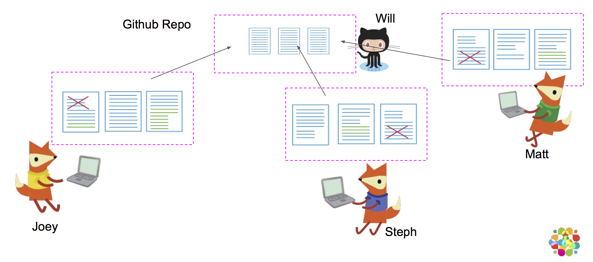
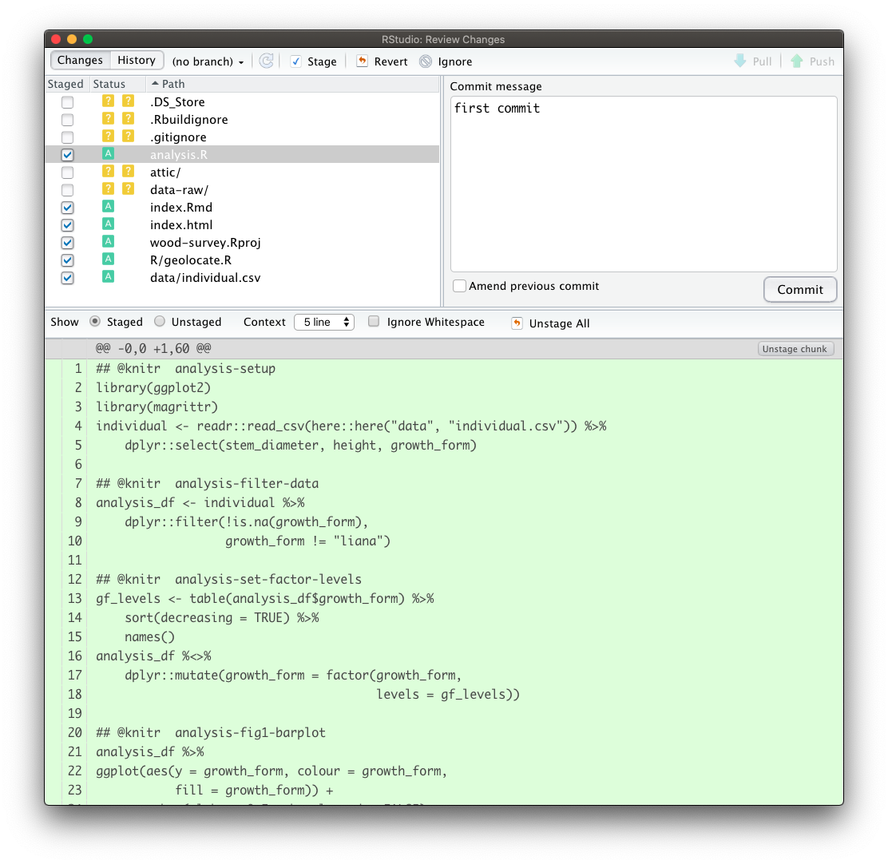
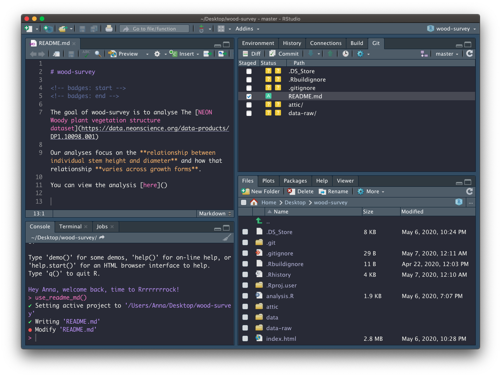
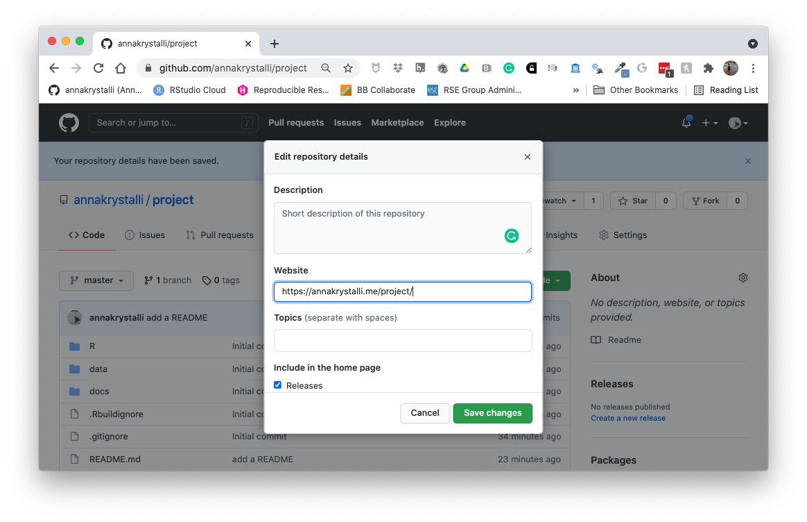
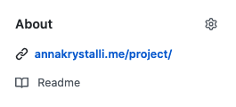
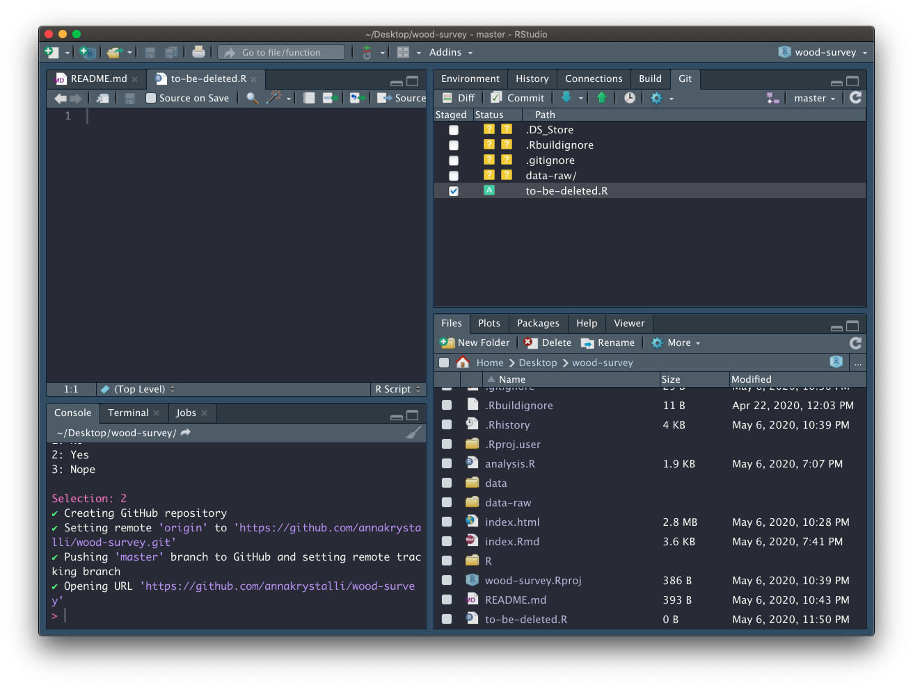
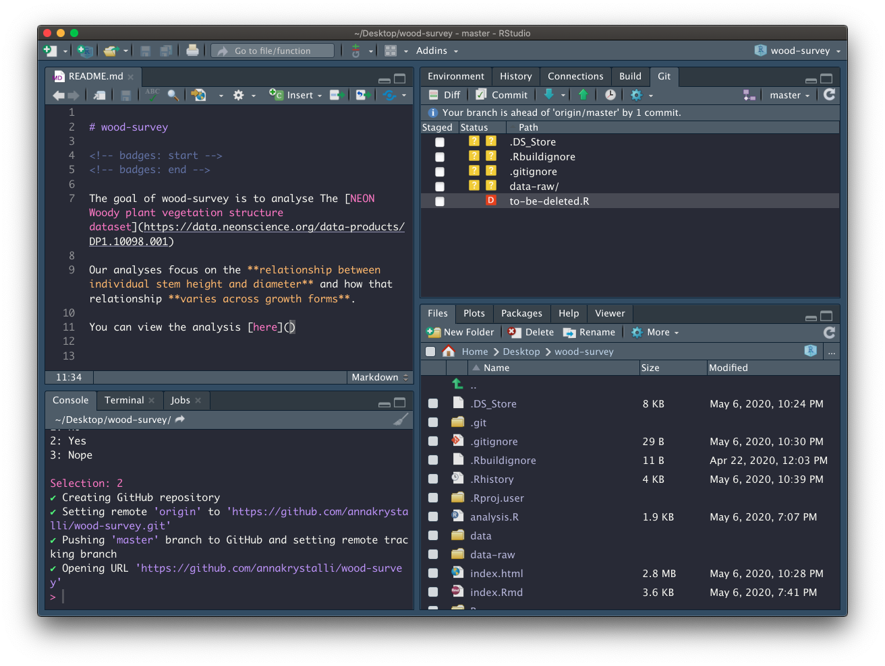
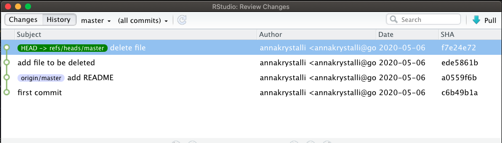

# (PART) Version Control {#version-control} 

# Version Control with Git


  Hands up - _who has heard of version control software?_  
  _What do you think it does?_

<br>

## What is Version control? `r emo::ji("thinking")`

The **management of changes** to documents, computer programs, large web sites, and other collections of information.

**Examples:**

- Numbering of book editions
- Wikipedia's Page history

<br>

### Where did it come from?

 The need for a logical way to organize and control revisions has existed for almost as long as writing has existed,  but **revision control became much more important, and complicated when the era of computing began**

### Elements of a Version Control system

- Changes are usually identified by a number or letter code, termed the "revision number"

- Each revision is associated with a timestamp and the person making the change. 

- Only changes to a file are recorded rather than saving a whole new copy.

- Revisions can be compared, restored, and with some types of files, merged.

<br>


## What is git? `r emo::ji("thinking")`

Open source (free to use) Version control software. Usually accessed via the command line, or a client program.


```{r, out.width="40%", echo=FALSE}
knitr::include_graphics("https://git-scm.com/images/logos/downloads/Git-Logo-2Color.png")
```


### Where did it come from?

Git development began in 2006 after many developers of the Linux kernel gave up access to [BitKeeper](http://www.bitkeeper.org/) (at the time the best but proprietary)

Linus Torvalds on the name **`git`**: 

> "I'm an egotistical bastard, and I name all my projects after myself. First 'Linux', now 'git'

<small>More on the name in the source code original [readme](https://github.com/git/git/tree/e83c5163316f89bfbde7d9ab23ca2e25604af290) file</small>


### Why use it in research? 

#### Exhibit A


```{r, out.width="50%", echo=FALSE, fig.cap="Image: xkcd CC BY-NC 2.5"}
knitr::include_graphics("http://smutch.github.io/VersionControlTutorial/_images/vc-xkcd.jpg")
```


## What is GitHub `r emo::ji("thinking")`


```{r, out.width="50%", echo=FALSE}
knitr::include_graphics("assets/github_logo.jpg")
```


A **website** that allows you to **store your Git repositories online** and makes it easy to collaborate with others. They also provide other services like issue (bug) tracking and wikis. Similar services are [GitLab](https://gitlab.com) and [BitBucket](https://bitbucket.org/).

### Why use it in research:

To enable collaboration and track contributions



_images: Mozilla Science Lab_ CC-BY 4.0

<br>

- Acts as a remote back-up
- Facilitates transparency
- Facilitates project management
- Facilitates sharing and collaboration
- Super-charges innovation by Open Sourcing Science
  + [Mozilla & Working Open](https://www.youtube.com/watch?v=quKdaqlR_9w)
  + [Open Source Basics](https://www.youtube.com/watch?v=Tyd0FO0tko8)
  + [Reinventing Discovery](https://www.amazon.co.uk/Reinventing-Discovery-New-Networked-Science/dp/0691160198/ref=sr_1_1?ie=UTF8&qid=1544031907&sr=8-1&keywords=reinventing+discovery)
  + [Macroecological and macroevolutionary patterns emerge in the universe of GNU/Linux operating systems](https://onlinelibrary.wiley.com/doi/10.1111/ecog.03424)


### Anatomy of GitHub Repo

- **Readme files**. Create a `README.md` file to explain what your project is, and how to install and use it. `README.md` is the file that is automatically displayed when you open a GitHub repo.

- **License**. Without some sort of licence, the contents of the repository are technically closed. Some allow users of the code to do anything they like with their code - these are known as permissive licences. Examples are the [MIT Licence](https://tldrlegal.com/license/mit-license) or [Apache](https://tldrlegal.com/license/apache-license-2.0-(apache-2.0)).
    + [https://choosealicense.com/](https://choosealicense.com/) - does what it says on the tin and helps you choose a licence. Here are some resources to help you choose:
    + [https://tldrlegal.com/](https://tldrlegal.com/) - plain english explanations of licences in bullet form.
    
- **Contributing guide** - make a file called `CONTRIBUTING.md` and guidelines for contributors so they know what they should do if they want to help you out.

- **Code of Conduct** - good projects have codes of conduct to make sure that people are treated well. Github has an [Code of Conduct wizard](https://help.github.com/articles/adding-a-code-of-conduct-to-your-project/) to make it easy to add one.

- **Issues** - use GitHub issues to record and discuss tasks.

<br>

## Git, Github & Rstudio

### Before: git only through the terminal

```{r, out.width="90%", echo=FALSE}
knitr::include_graphics("assets/git_status.png")
```


### Rstudio & `usethis` to the rescue!

#### Rstudio + `usethis` `r emo::ji("package")` == heavenly `Git` & `GitHub`

- Initialise **Rstudio project** with Git by **just checking a box!**
    - Forgot to? use `usethis::use_git()`

- visual panel to easily see the status of all your files

- interactive navigation through file version history


## Demo

## How does `Git` work?

When a local directory becomes ***initialised with git***, a **hidden `.git` folder is added** to it.

> it's now called a **repository**


- New copies of files you tell git to track will be **added** to that `.git` folder.


- After adding, git will track any modifications to those files


### first commit - whole file added

Any file unknown to git will have a **yellow ?** box next to it.


```{r, out.width="60%", echo=FALSE}
knitr::include_graphics("assets/git-unadded.png")
```


The first time you commit a file you are **adding** it to `.git`, effectively telling it to start tracking the file

```{r, out.width="90%", echo=FALSE}
knitr::include_graphics("assets/commit1.png")
```


### second commit - only difference highlighted

The first time you commit a file, only the changes are shown and any file that has uncommited modifications is shown with a **blue M**

```{r, out.width="90%", echo=FALSE}
knitr::include_graphics("assets/commit2.png")
```


When all changes have been committed, the git panel is clear.

```{r, out.width="90%", echo=FALSE}
knitr::include_graphics("assets/commit2-file.png")
```


Enough theory, how about in practice!


## Configure git & GitHub

### Configure git

First, `git` needs to know who you are so your commits can be attributed to you. **`usethis`** to the rescue again!

**Check your configuration**

```{r, eval=FALSE}
usethis::git_sitrep()
```


**Set your configuration**

Use your github username and and the email you used to sign-up on GitHub

```{r, eval=FALSE}
usethis::use_git_config(
    user.name = "Jane",
    user.email = "jane@example.org")
```


###  Set up GITHUB PAT


To authenticate with GitHub, you'll also need a Personal Authorisation Token (PAT). Password-based authentication for Git is deprecated, i.e. you really should _not_ be sending your username and password every time you push or pull.
Here, I'm referring to the username and password you would use to login to GitHub in the browser.

What should you do instead?

Get a **personal access token** (PAT) and use that as your credential for HTTPS operations.
(The PAT will actually be sent as the password and the username is somewhat artificial, consulted only for credential lookup.)

#### How to get a PAT?

GitHub offers instructions for [creating a personal access token](https://docs.github.com/en/free-pro-team@latest/github/authenticating-to-github/creating-a-personal-access-token).

The usethis package has a helper function that takes you to the web form to create a PAT, with the added benefit that it pre-selects the recommended scopes:

```{r, eval=F}
usethis::create_github_token()
```

```
● Call `gitcreds::gitcreds_set()` to register this token in the local Git credential store
  It is also a great idea to store this token in any password-management software that you use
✓ Opening URL 'https://github.com/settings/tokens/new?scopes=repo,user,gist,workflow&description=R:GITHUB_PAT'
```
will open up the GitHub panel to generate your PAT. 


Once you are happy with the selected scopes, click "Generate token".
As the page says, you must **store this token somewhere**, because you'll never be able to see it again, once you leave that page or close the window.

Do not ever hard-wire your PAT into your code!
A PAT should always be retrieved implicitly, for example, from the Git credential store or from an environment variable.

#### Store your credential

Below, we will add your PAT to our `.Renviron` file as well as the Git credential store as a semi-persistent convenience, sort of like “remember me” on a website. But, just like logging into websites, it is entirely possible that your PAT will somehow be forgotten from the credential store and you will need to re-enter it.

If you goof this up, i.e. generate a PAT but fail to capture it on your system, you’ll have to generate another one. This is not the end of the world, but you should delete the “lost” PAT on GitHub. If you aren’t disciplined about labelling PATs and deleting lost PATs, you will find yourself in an unsettling situation where you can’t be sure which PAT(s) are in use. When logged into your GitHub account, you can manage your PATs here:

##### Store in `.Renviron`

Copy it and paste it into your `.Renviron` file as system variable `GITHUB_PAT`.

```{r, eval=F}
usethis::edit_r_environ()
```

Use `edit_r_environ()` to open and edit your `.Renviron` file

```{r, out.width="90%", echo=FALSE}
knitr::include_graphics("assets/GITHUB_PAT.png")
```

Add to the file and save.

##### Cache with `gitcreds` package

As of November 2020, there are two R packages for accessing the Git credential store:

  * [gitcreds](https://r-lib.github.io/gitcreds/)
  * [credentials](https://docs.ropensci.org/credentials/)
    
It is likely that these packages will eventually combine into one and, even now, they are largely interoperable.
You don't need to follow the instructions for both packages -- pick one!

We will use the `gitcreds` package here.

If you don't have gitcreds installed, install via `install.packages("gitcreds")`.

Then call `gitcreds::gitcreds_set()`:

```{r eval = FALSE}
gitcreds::gitcreds_set()
```

`gitcreds::gitcreds_set()` is a very handy function, since it reports any current credential, allows you to see it, allows you to keep or replace an existing credential, and can also store a credential for the first time.

Respond to the prompt with your personal access token (PAT).

You can check that you've stored a credential with `gitcreds_get()`:

```{r eval = FALSE}
gitcreds::gitcreds_get()
#> <gitcreds>
#>   protocol: https
#>   host    : github.com
#>   username: PersonalAccessToken
#>   password: <-- hidden -->
```

##### TODO store your PAT with a password manager

**Treat this PAT like a password!** Currently, we've only store a copyable form of the PAT in our `.Renviron` file. If you use a password management app, such as 1Password or LastPass (which you should), it is highly recommended to add this PAT to your entry for GitHub.

## Version Controlling projects

### Turn our project into a repository

If you didn't initialise git at the beginning of your project, you can do so now with `usethis::use_git()`:

<div class="alert alert-warning">

This will try to **commit everything in the repo so far in one go!** Override that behaviour by selecting a negative response when asked.

</div>

```{r, eval = F}
usethis::use_git()
```

```r
✔ Initialising Git repo
✔ Adding '.Rhistory', '.RData' to '.gitignore'
There are 10 uncommitted files:
* '.DS_Store'
* '.gitignore'
* '.Rbuildignore'
* 'analysis.R'
* 'data-raw/'
* 'data/'
* 'index.html'
* 'index.Rmd'
* 'R/'
* 'wood-survey.Rproj'
Is it ok to commit them?

1: Negative
2: Nope
3: I agree

Selection: 
```

Next allow Rstudio to restart when asked:

```r
● A restart of RStudio is required to activate the Git pane
Restart now?

1: Absolutely
2: Absolutely not
3: Negative
```

### Committing files

In our project, let's have a look at the Rstudio **Git** tab. It shows all the files currently in the folder. The **yellow ?** indicates none of the files have been added to git yet.

```{r, out.width="80%", echo=FALSE}
knitr::include_graphics("assets/git-view.png")
```


#### Add files

To commit changes in a file just select it in the git pane. When changes to a file are commited for the first time, the whole file is indicated as Added (green A).

Let's focus on the files and analytical data we created so far. For now ignore the `data-raw` folder and all the other files we didn't create:

```{r, out.width="90%", echo=FALSE}
knitr::include_graphics("assets/git-add.png")
```


#### Commit changes

Click on commit and write an appropriate commit message:
```{r, out.width="90%", echo=FALSE}

```


### Create a README

Our repository also needs a `README`. We only need a simple plain markdown (`.md`) file for our README. 

We can create a template using `usethis::use_readme_md()`

```{r, eval=FALSE}
usethis::use_readme_md()
```


#### Edit README

Adapt the template, adding a short description about your project.

Add and commit your new README
```{r, out.width="90%", echo=FALSE}

```


##  Create repository on GitHub

Now that we have set up a `GITHUP_PAT`, we can use function `usethis::use_github()` to create a GitHub repository for our project:

```{r, eval=FALSE}
usethis::use_github(protocol = "https")
```

```r
✔ Checking that current branch is 'master'
● Check title and description
  Name:        wood-survey
  Description: 
Are title and description ok?

1: No
2: Yes
3: Nope
```
Answer affirmatively for the process to continue. Once the repo is created and any commmited files pushed, the repo is launched in the browser:

```{r, out.width="90%", echo=FALSE}
knitr::include_graphics("assets/use-github.png")
```


## Host html content on GitHub


Let's head to the repo and have a look at what we've shared. To host our html content on GitHub, we need to **enable `gh-pages`** in our repository.

### Go to repo **Settings**

```{r, out.width="90%", echo=FALSE}
knitr::include_graphics("assets/gh-settings.png")
```


## Enable `gh-pages`

```{r, out.width="90%", echo=FALSE}
knitr::include_graphics("assets/gh-set.png")
```


Review setup

```{r, out.width="90%", echo=FALSE}
knitr::include_graphics("assets/gh-setup.png")
```

Ensure the _Enforce HTTPS_ option is selected.

Click on the link displayed and go check out your work!

Copy the link. In the main repo page, edit the page details at the top and paste copied the url in the **website** field.

```{r, out.width="90%", echo=FALSE}

```


Once added it provides easy access to the rendered content:

```{r, out.width="90%", echo=FALSE}

```

##  Tracking changes 

###  Making a change to our  `index.Rmd`

Let's add the link to the rendered content to our place holder in `index.Rmd`

Let's add and commit our changes

### Pushing changes to GitHub

Click on the `r emo::ji("up_arrow")` button on the Git tab to push our changes up to the repository

Let's go have a look at the history `r emo::ji("clock3")`

> You might need to reconfigure your GITHUB_PAT credentials after a break
> Use `usethis::edit_r_environ()` to get your GITHUB_PAT and then `gitcreds::gitcreds_set()` to set them again.


### Deleting files

- Create a new file, any type of file.

```{r, out.width="90%", echo=FALSE}

```

- Add and Commit it.

- Delete it
```{r, out.width="90%", echo=FALSE}

```

- Commit the deletion

- Look back through the history

```{r, out.width="90%", echo=FALSE}

```


## Ignoring files through `.gitignore`

There may be files that you don't want to commit to git, e.g. 

- data files that are too large

- documents with sensitive information (eg authorisation tokens etc)

- intermediate files that you don't need to save copies of.

> Tell git to ingnore them by adding them to the `.gitignore` file.

When we open `.gitgnore` we see there are a number of files already added. Let's the rest of the files we want to ignore.

```
.Rproj.user
.Rhistory
.RData
.Rbuildignore
.DS_Store

```


### `gitignore` regex

You can use `regex` (regular expressions) in `.gitignore` files to ignore files according to a pattern.

- `directoryname/*` will ignore all files in a directory.

- `*.html` will ignore any file ending in  `.html` 

- prefix "!" which negates the pattern


So let's use regex to ignore all files in `attic/` and all files in `data-raw/` apart from `individual.R`. Add the following to the bottom of `.gitignore`

```
attic/*
data-raw/*
!data-raw/individual.R
```


### Commit `.gitignore`

Now that we've determined which files we want to ignore, let's commit `.gitignore` so we can have a record of it and track any changes.

## `Git` tips

- commit early, commit often
- commit logical bits of work together
- write meaninful messages


## Further Resources

- [Git-it](http://jlord.us/git-it/)
- [Happy with Git](http://happygitwithr.com/)
- [Oh Shit Git](http://ohshitgit.com/)


### Never forget


