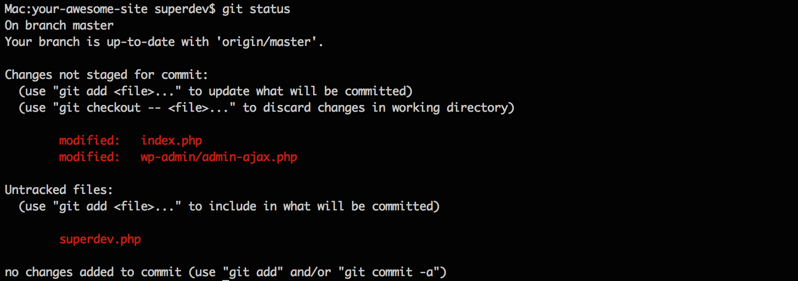
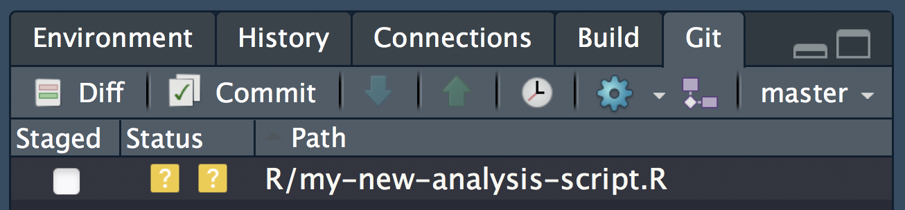
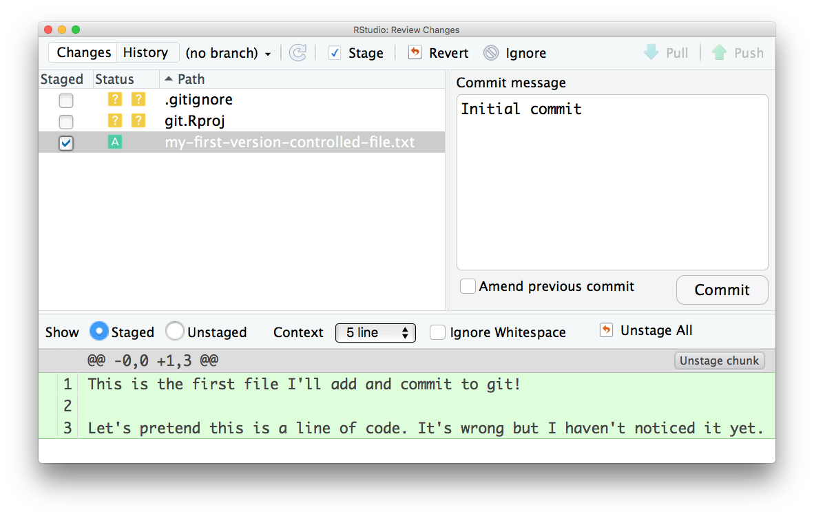
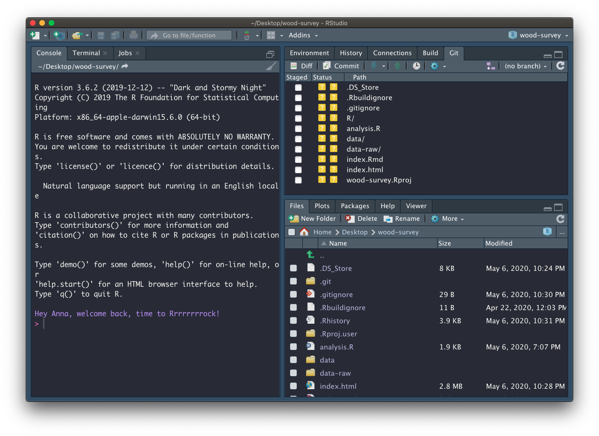
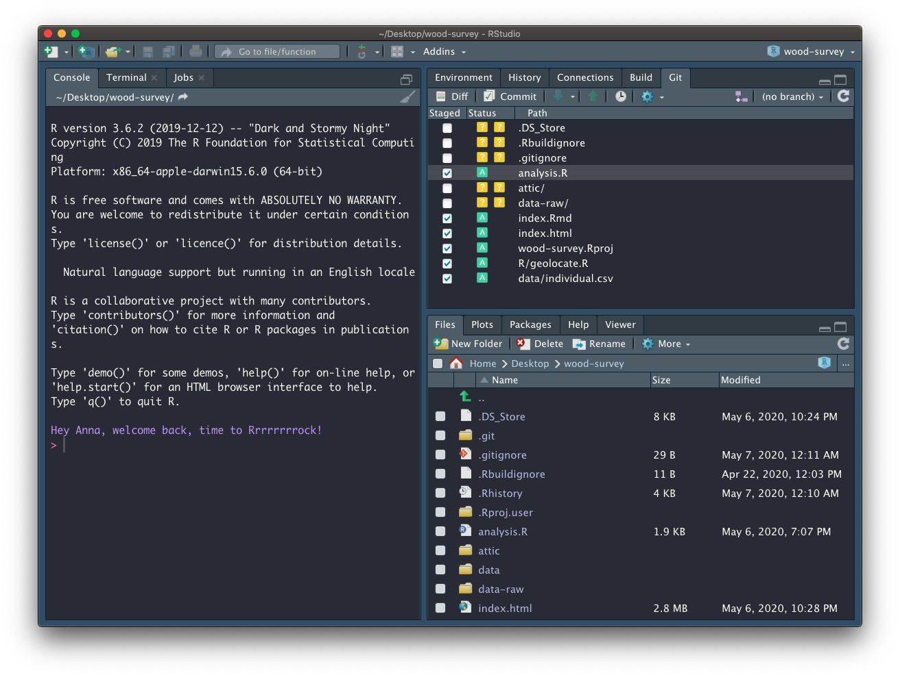
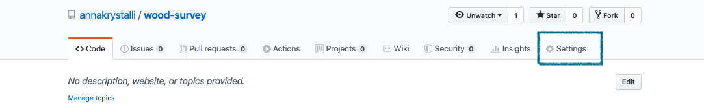
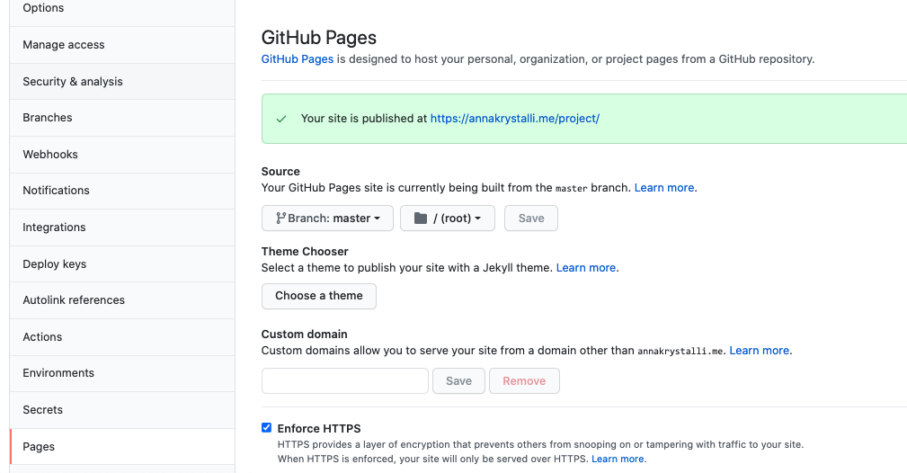

# (PART) Version Control {#version-control} 

# Version Control with Git


  Hands up - _who has heard of version control software?_  
  _What do you think it does?_

<br>

## What is Version control? `r emo::ji("thinking")`

The **management of changes** to documents, computer programs, large web sites, and other collections of information.

**Examples:**

- Numbering of book editions
- Wikipedia's Page history

<br>

### Where did it come from?

 The need for a logical way to organize and control revisions has existed for almost as long as writing has existed,  but **revision control became much more important, and complicated when the era of computing began**

### Elements of a Version Control system

- Changes are usually identified by a number or letter code, termed the "revision number"

- Each revision is associated with a timestamp and the person making the change. 

- Only changes to a file are recorded rather than saving a whole new copy.

- Revisions can be compared, restored, and with some types of files, merged.

<br>


## What is git? `r emo::ji("thinking")`

Open source (free to use) Version control software. Usually accessed via the command line, or a client program.


### Where did it come from?

Git development began in 2006 after many developers of the Linux kernel gave up access to [BitKeeper](http://www.bitkeeper.org/) (at the time the best but proprietary)

Linus Torvalds on the name **`git`**: 

> "I'm an egotistical bastard, and I name all my projects after myself. First 'Linux', now 'git'

<small>More on the name in the source code original [readme](https://github.com/git/git/tree/e83c5163316f89bfbde7d9ab23ca2e25604af290) file</small>


### Why use it in research? 

#### Exhibit A

<figure>

<figcaption> Image: xkcd CC BY-NC 2.5 </figcaption></figure>


## What is GitHub `r emo::ji("thinking")`


A **website** that allows you to **store your Git repositories online** and makes it easy to collaborate with others. They also provide other services like issue (bug) tracking and wikis. Similar services are [GitLab](https://gitlab.com) and [BitBucket](https://bitbucket.org/).

### Why use it in research:

To enable collaboration and track contributions


_images: Mozilla Science Lab_ CC-BY 4.0

<br>

- Acts as a remote back-up
- Facilitates transparency
- Facilitates project management
- Facilitates sharing and collaboration
- Super-charges innovation by Open Sourcing Science
  + [Mozilla & Working Open](https://www.youtube.com/watch?v=quKdaqlR_9w)
  + [Open Source Basics](https://www.youtube.com/watch?v=Tyd0FO0tko8)
  + [Reinventing Discovery](https://www.amazon.co.uk/Reinventing-Discovery-New-Networked-Science/dp/0691160198/ref=sr_1_1?ie=UTF8&qid=1544031907&sr=8-1&keywords=reinventing+discovery)
  + [Macroecological and macroevolutionary patterns emerge in the universe of GNU/Linux operating systems](https://onlinelibrary.wiley.com/doi/10.1111/ecog.03424)


### Anatomy of GitHub Repo

- **Readme files**. Create a `README.md` file to explain what your project is, and how to install and use it. `README.md` is the file that is automatically displayed when you open a GitHub repo.

- **License**. Without some sort of licence, the contents of the repository are technically closed. Some allow users of the code to do anything they like with their code - these are known as permissive licences. Examples are the [MIT Licence](https://tldrlegal.com/license/mit-license) or [Apache](https://tldrlegal.com/license/apache-license-2.0-(apache-2.0)).
    + [https://choosealicense.com/](https://choosealicense.com/) - does what it says on the tin and helps you choose a licence. Here are some resources to help you choose:
    + [https://tldrlegal.com/](https://tldrlegal.com/) - plain english explanations of licences in bullet form.
    
- **Contributing guide** - make a file called `CONTRIBUTING.md` and guidelines for contributors so they know what they should do if they want to help you out.

- **Code of Conduct** - good projects have codes of conduct to make sure that people are treated well. Github has an [Code of Conduct wizard](https://help.github.com/articles/adding-a-code-of-conduct-to-your-project/) to make it easy to add one.

- **Issues** - use GitHub issues to record and discuss tasks.

## Git, Github & Rstudio

### Before: git only through the terminal




### Rstudio & `usethis` to the rescue!

#### Rstudio + `usethis` `r emo::ji("package")` == heavenly `Git` & `GitHub`

- Initialise **Rstudio project** with Git by **just checking a box!**
    - Forgot to? use `usethis::use_git()`

- visual panel to easily see the status of all your files

- interactive navigation through file version history


## Demo

## How does `Git` work?

When a local directory becomes ***initialised with git***, a **hidden `.git` folder is added** to it.

> it's now called a **repository**


- New copies of files you tell git to track will be **added** to that `.git` folder.


- After adding, git will track any modifications to those files


### first commit - whole file added

- Any file unknown to git will have a yellow ? box next to it.



- The first time you commit a file you are **adding** it to `.git`, effectively telling it to start tracking the file




### second commit - only difference highlighted


All changes have been committed so the git panel is clear


Enough theory, how about in practice!


## `r emo::ji("computer")` Configure git & GitHub

### Configure git

First, `git` needs to know who you are so your commits can be attributed to you. **`usethis`** to the rescue again!

**Check your configuration**

```{r, eval=FALSE}
usethis::use_git_config()
```


**Set your configuration**

Use your github username and and the email you used to sign-up on GitHub

```{r, eval=FALSE}
usethis::use_git_config(
    user.name = "Jane",
    user.email = "jane@example.org")
```


###  Set up GITHUB PAT


To authenticate with GitHub, you'll also need a Personal Authorisation Token (PAT).

```{r, eval=F}
usethis::browse_github_pat()
```

will open up the GitHub panel to generate your PAT. 


Copy it and paste it into your `.Renviron` file as system variable `GITHUB_PAT`.

```{r, eval=F}
usethis::edit_r_environ()
```

Use `edit_r_environ()` to open and edit your `.Renviron` file


## Version Controlling projects

### Turn our project into a repository

If you didn't initialise git at the beginning of your project, you can do so now with `usethis::use_git()`:

<div class="alert alert-warning">

This will try to **commit everything in the repo so far in one go!** Override that behaviour by selecting a negative response when asked.

</div>

```{r, eval = F}
usethis::use_git()
```

```r
✔ Initialising Git repo
✔ Adding '.Rhistory', '.RData' to '.gitignore'
There are 10 uncommitted files:
* '.DS_Store'
* '.gitignore'
* '.Rbuildignore'
* 'analysis.R'
* 'data-raw/'
* 'data/'
* 'index.html'
* 'index.Rmd'
* 'R/'
* 'wood-survey.Rproj'
Is it ok to commit them?

1: Negative
2: Nope
3: I agree

Selection: 
```

Next allow Rstudio to restart when asked:

```r
● A restart of RStudio is required to activate the Git pane
Restart now?

1: Absolutely
2: Absolutely not
3: Negative
```

### Committing files

In our project, let's have a look at the Rstudio **Git** tab. It shows all the files currently in the folder. The **yellow ?** indicates none of the files have been added to git yet.

```{r, out.width="80%", echo=FALSE}

```


#### Add files

To commit changes in a file just select it in the git pane. When changes to a file are commited for the first time, the whole file is indicated as Added (green A).

Let's focus on the files and analytical data we created so far. For now ignore the `data-raw` folder and all the other files we didn't create



#### Commit changes

Click on commit and write an appropriate commit message:


## Create a README

Our repository also needs a `README`. We only need a simple plain markdown (`.md`) file for our README. 

We can create a template using `usethis::use_readme_md()`

```{r, eval=FALSE}
usethis::use_readme_md()
```


## Edit README

Adapt the template, adding a short description about your project.

Add and commit your new README


## `r emo::ji("vertical_traffic_light")` Create repository on GitHub

## Create repository

Now that we have set up a `GITHUP_PAT`, we can use function `usethis::use_github()` to create a GitHub repository for our project:

```{r, eval=FALSE}
usethis::use_github(protocol = "https")
```

```r
✔ Checking that current branch is 'master'
● Check title and description
  Name:        wood-survey
  Description: 
Are title and description ok?

1: No
2: Yes
3: Nope
```
Answer affirmatively for the process to continue. Once the repo is created and any commmited files pushed, the repo is launched in the browser:


### Host content on GitHub


Let's head to the repo and have a look at what we've shared. To host our html content on GitHub, we need to **enable `gh-pages`** in our repository.

## Go to repo **Settings**



## Enable `gh-pages`


Review setup



Ensure the _Enforce HTTPS_ option is selected.

Click on the link displayed and go check out your work!

Copy the link. In the main repo page, edit the page details at the top and paste copied the url in the **website** field.


Once added it provides easy access to the rendered content:


## pushing files

Click on the `r emo::ji("up_arrow")` button on the Git tab to push our changes up to our newly minted repository

Let's go have a look at the history `r emo::ji("clock3")`


###  Tracking changes 

####  Making a change to our  `index.Rmd`


## Commit your changes

On the commit window:

- Have a look at the differences

- Have a look at the history


## `r emo::ji("vertical_traffic_light")` Deleting files

- Create a new file, any type of file.


- Commit it.

- Delete it


- Commit the deletion

- Look back through the history


## `.gitignore`

There may be files that you don't want to commit to git, e.g. 

- data files that are too large

- documents with sensitive information (eg authorisation tokens etc)

- intermediate files that you don't need to save copies of.

> Tell git to ingnore them by adding them to the `.gitignore` file.


### `gitignore` regex

You can use `regex` in `.gitignore` files to ignore files according to a pattern. 

- `*.html` will ignore any file ending in  `.html` 

- prefix "!" which negates the pattern

    ```
    data-raw/*
    !data-raw/individual.R
    ```


### `Git` tips

- commit early, commit often
- commit logical bits of work together
- write meaninful messages


## Further Resources

- [Git-it](http://jlord.us/git-it/)
- [Happy with Git](http://happygitwithr.com/)
- [Oh Shit Git](http://ohshitgit.com/)


### Never forget


