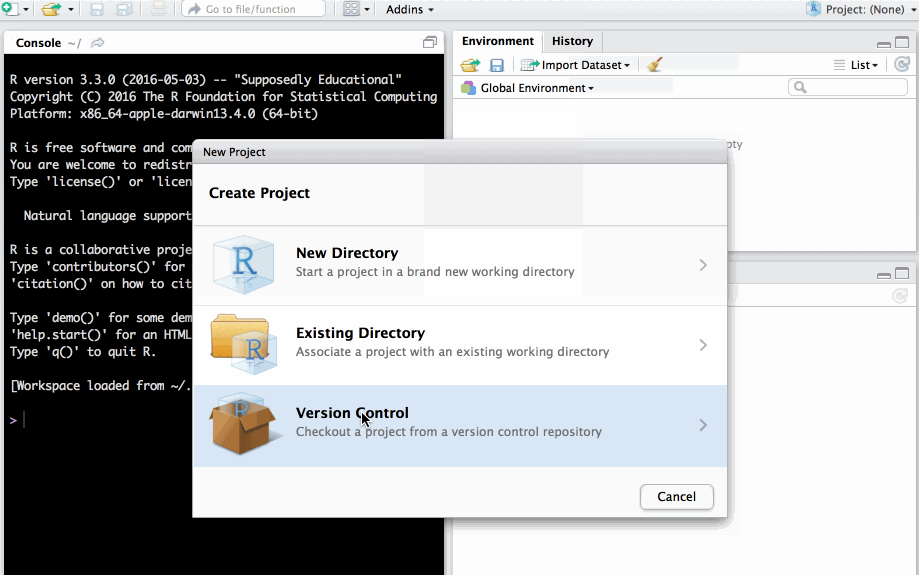
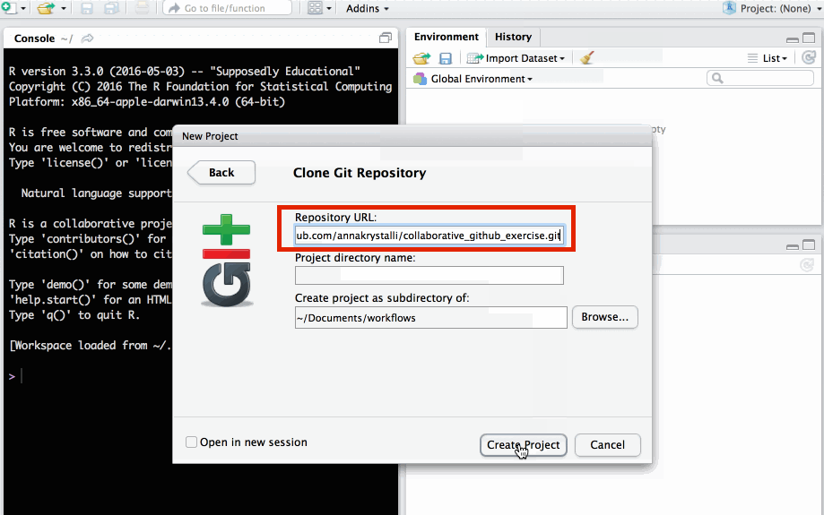
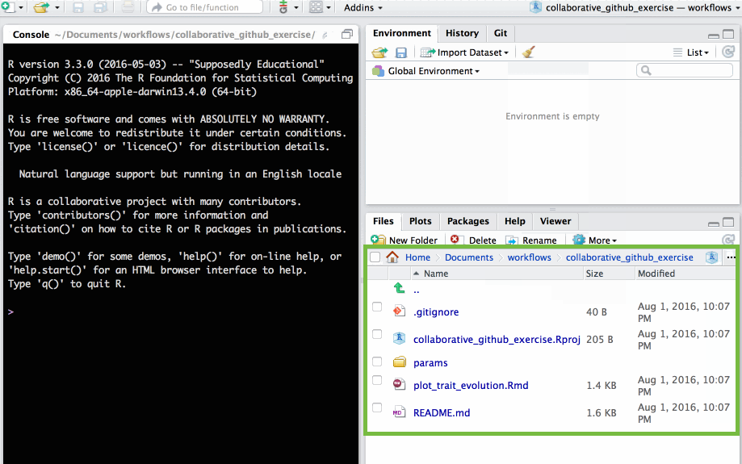
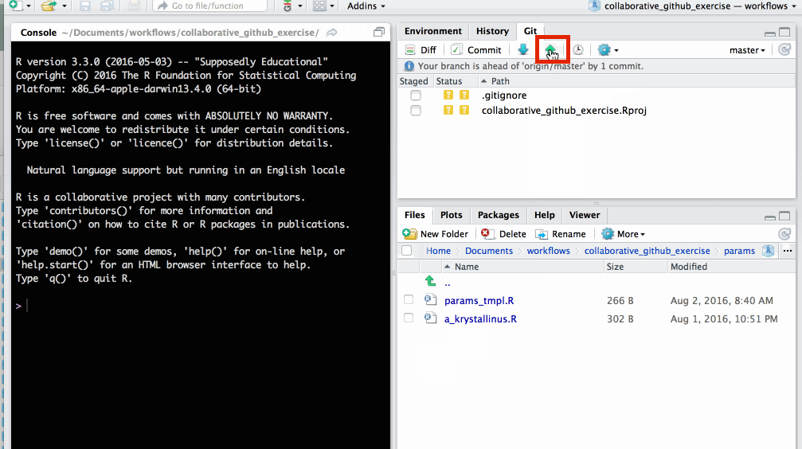
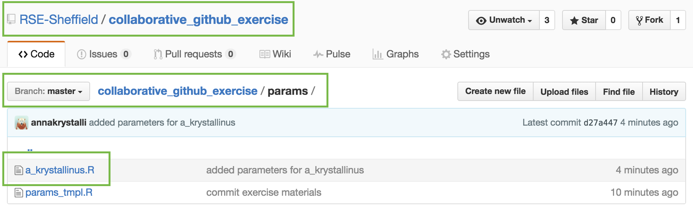

# Practical: `GitHub` & `Rstudio` for collaborative coding

## **EvoLottery**

### **Welcome to the evolutionary lottery of skull and beak morphology**


*** 
<br>

##### **Beak and skull shapes in birds of prey (“raptors”) are strongly coupled and largely controlled by size.** 

- In this exercise, each participant will **fork a GitHub repo**, and **contribute a file** required to simulate the *evolutionary trajectory of an imaginary species' body size*.

- We'll use **GitHub to collate all species files** and **plot** them all up together at the end! We'll also **discover the skull and beak shapes** associated with each simulated species size.


#####  Start!


## Clone Github repo

###  Start with GitHub repo

<https://GitHub.com/RSE-Sheffield/collaborative_GitHub_exercise>


```{r, echo=FALSE, out.width="90%"}
knitr::include_graphics("assets/repo.png")
```

### **Fork  it** 

make your **own copy of the repository** on GitHub. Fork are linked and traceable


```{r, echo=FALSE, out.width="90%"}
knitr::include_graphics("assets/fork-1.png")
```

GitHub makes a **copy into your account**


 
```{r, echo=FALSE, out.width="90%"}
knitr::include_graphics("assets/fork-2.png")
```
 
<br>


### `r emo::ji("vertical_traffic_light")` **Clone repo** 

**copy repo link** to create a new Rstudio project from the repository.
    

```{r, echo=FALSE, out.width="90%"}
knitr::include_graphics("assets/fork-3.png")
```
 

### **Create new project in Rstudio**


```{r, echo=FALSE, out.width="90%"}
knitr::include_graphics("assets/newproj-1.png")
```
 

Checkout from **version control repository**


```{r, echo=FALSE, out.width="90%"}

```
 

Clone project from a **git** repository


```{r, echo=FALSE, out.width="90%"}
knitr::include_graphics("assets/newproj-3.png")
```
 

Paste **repo link copied from GitHub** into **Repository URL** field. Click **`Create Project`**. 

```{r, echo=FALSE, out.width="90%"}

```
 


Rstudio project now **contains all files from the GitHub repo.**

```{r, echo=FALSE, out.width="90%"}

```
 


## **Make a change to the repo**

### make a copy of `params_tmpl.R`

open **`params/params_tmpl.R`**


```{r, echo=FALSE, out.width="90%"}
knitr::include_graphics("assets/edit-1.png")
```
 


<div class="inverse"><strong>SAVE AS NEW <code>.R</code> script in <code>params/</code> folder</strong></div> 

Use species name of your choice to name new file. 

<div class="alert alert-warning">Please ***DO NOT OVERWRITE*** **`params/params_tmpl.R`**.</div>


```{r, echo=FALSE, out.width="90%"}
knitr::include_graphics("assets/edit-2.png")
```
 


### Edit file

Edit file with parameters of your choice and save.

```{r, echo=FALSE, out.width="90%"}
knitr::include_graphics("assets/edit-3.png")
```
 


#### The parameters each participants need to supply are:

- **`sig2`:** A numeric value greater than 0 but smaller than 5

- **`species.name`:** a character string e.g. `"anas_krystallinus"`. Try to create a species name out of your name!

- **`color`:**  a character string e.g. `"red"`, `"#FFFFFF"` (Check out list of [**colours in R**](http://www.stat.columbia.edu/~tzheng/files/Rcolor.pdf))


**NB: remember to save the changes to your file**


## Commit changes locally to git

In the *git* tab, select the **new file** you created and click **`Commit`**.

<div class="alert alert-warning">Please **ONLY COMMIT YOUR NEW FILE**</div>

```{r, echo=FALSE, out.width="90%"}
knitr::include_graphics("assets/commit-1.png")
```
 

Write an informative commit message and click **`Commit`**  

```{r, echo=FALSE, out.width="90%"}
knitr::include_graphics("assets/commit-2.png")
```

your new file has now been commited  

```{r, echo=FALSE, out.width="90%"}
knitr::include_graphics("assets/commit-3.png")
```

## Push changes to GitHub

on the *git* tab click ⇧  to **push changes to GitHub**

```{r, echo=FALSE, out.width="90%"}

```

changes have now been updated in the **GitHub repo**

```{r, echo=FALSE, out.width="90%"}

```


##  Create pull request

In your repository, create **`new pull request`** 
to merge fork to master repo (ie the original repo you forked)

```{r, echo=FALSE, out.width="90%"}
knitr::include_graphics("assets/merge-1.png")
```


GitHub checks whether your requested merge creates any coflicts. 
If all is good, click on **`Create pull request`**


```{r, echo=FALSE, out.width="90%"}
knitr::include_graphics("assets/merge-2.png")
```


Write an informative message explaining your changes to the master repo administrators. Click on **`Create pull request`**


```{r, echo=FALSE, out.width="90%"}

```


The repository owner will then review your PR and either merge it in or respond with some guidance if they spot a problem.

Check original repo to see **your merged changes**


```{r, echo=FALSE, out.width="90%"}

```


We'll merge all contributions and [plot them together at the end!](https://rse.shef.ac.uk/collaborative_github_exercise/plot_trait_evolution.html) 

Now that everyone has contributed to the [**RSE-Sheffield** repository](https://github.com/RSE-Sheffield/collaborative_github_exercise) (the **upstream** repository), the `params/` folder contains a number of files, one for each successful pull request.

However your local copy of the repository only contains the template and your own file. 

> Q: How can I merge changes from the **upstream** repository to my **local** repository?

## Add upstream remote

### Check current remotes

We can check the urls of remotes currently linked to our local repo using `usethis::git_remotes()`.

``` r
usethis::git_remotes()
```
```
$origin
[1] "https://github.com/annakrystalli/collaborative_github_exercise.git"
```
We see that only my form is currently listed as a remote under the name `origin`. 

### Add the RSE-Sheffield repo as upstream

To add a new remote we need the https url of the upstream repo (the equivalent of the one we used to create our project from our fork through version control) which in this case is `https://github.com/RSE-Sheffield/collaborative_github_exercise.git`. 

We can then use `usethis::use_git_remote()` to set the upstream repository:

```r
usethis::use_git_remote(
    name = "upstream", 
    url = "https://github.com/RSE-Sheffield/collaborative_github_exercise.git")
```

We can check that everything was set correctly with `usethis::git_remotes()`

``` r
usethis::git_remotes()
```
```
$origin
[1] "https://github.com/annakrystalli/collaborative_github_exercise.git"

$upstream
[1] "https://github.com/RSE-Sheffield/collaborative_github_exercise.git"
```

### Synch with upstream

Finally, to synch with the upstream repository we can now use function `usethis::pr_pull_upstream()`. This fetches the master branch from the upstream repository and merges it into our own local master branch.

```r
usethis::pr_pull_upstream()
```
```
✓ Pulling changes from GitHub source repo 'upstream/master'
```

You should now have all participant files in the `params/` folder and will be able to generate all bird skulls if you run `plot_trait_evolution.Rmd` locally.

## Synch origin

To also synch your origin remote repository you can simply push the merged upstream changes up to GitHub.
