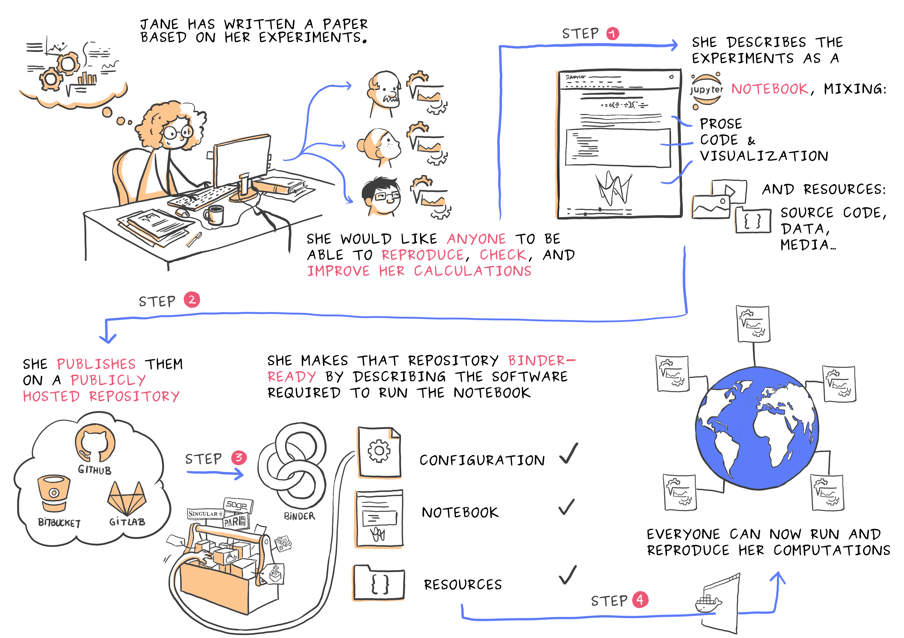

# (PART) Packaging Research Projects {#additional} 

# Managing Dependencies

> One of the most important aspects of reproducible research is managing dependencies.

For your analysis to run, it interacts with:

- **Operating system:** The operating system of your computer.

- **System configurations**: such as locations of libraries and the search path your computer uses to find files and libraries

- **System Level libraries**. These are non-R libraries that R or packages in R you might be using depend on. (for example libraries such as `GEOS`, `GDAL` and `PROJ4` that geospatial R packages like `sf` and `rgeos` depend on). Such external dependencies to R are listed as `System Requirements` in R package `DESCRIPTION` files (e.g have a look at the [relevant line](https://github.com/r-spatial/sf/blob/adf7410a5c55695b4c8db97a5258ec87c931320a/DESCRIPTION#L110) in the `sf` package `DESCRIPTION`.


- **R and the R packages your analysis depends on**. For example, the version of R we've been using as well as packages `ggplot2` and `dplyr`.


When someone else tries to reproduce your analysis on a different computer, if any of these elements differ from what existed on your own system when you last ran your analysis, e.g some of the dependencies are missing, different versions are available or code behaves differently on a different operating system, they may not be able to reproduce your work.

## Managing R dependencies.

Your first consideration should be to ensure you retain information and ideally a way of automatically installing any R package dependencies your code depends on.

As there is no way to automatically install external system dependencies, you should highlight any such dependencies in your README and ideally provide installation instructions (or links to them). Have a look at the [installation section](https://r-spatial.github.io/sf/#installing) of the  documentation for package `sf`.


```{r, echo = FALSE}
knitr::include_url("https://r-spatial.github.io/sf/#installing")
```


### Minimal approach


#### Including Session Information

At the very minimum you could list the packages used in an analysis using `sessionInfo()` at the bottom of an `.Rmd` file. This however is not so useful for `.R` scripts (unless you save the output of the function to a separate file). It also doesn't provide executable code for someone else to install the requirements.

#### Including an `install.R` script

A more convenient but still not very robust method of managing R dependencies would be to include an executable `install.R` script (like the one I've included for setting up the projects in this course on your local machine) which contains the commands to install all the required dependencies.

Here's the example of `install.R` used to set up the `wood-survey` project


```{r, eval=FALSE, code=readLines("setup/install.R")}

```

The problem with this is that the versions of packages are not fixed. Instead, each  time the script is run, the most up to date versions of packages are installed, and R also prompts you to update any packages already installed. Changes in packages and a general mismatch of versions compared to those used to develop the original code, could cause problems in code execution. 

In the case of  this book, I want the materials to work with up to date versions of packages. If there are problems with  newer versions, I can correct the materials before I run the course. However, for a published analysis, using code you don't plan to further develop (and therefore do not require that it tracks the evolution of packages in the  R ecosystem), it would be better to be able to pin exact versions of packages. That way you can ensure another user will be working with the exact same versions of your dependencies.

### Robust approach

#### Managing R dependencies with `renv`

The `renv` package is a new effort to bring project-local R dependency
management to your projects.

Underlying the philosophy of `renv` is that any of your existing workflows
should just work as they did before -- `renv` helps manage library paths (and
other project-specific state) to help isolate your project's R dependencies.

##### `renv` Workflow

The general workflow when working with `renv` is:

1. Call `renv::init()` to initialize a new project-local environment with a
   **private R library**,

2. Work in the project as normal, installing and removing new R packages as
   they are needed in the project,

3. Call `renv::snapshot()` to save the state of the project library to the
   lockfile (called `renv.lock`),

4. Continue working on your project, installing and updating R packages as
   needed.

5. Call `renv::snapshot()` again to save the state of your project library if
   your attempts to update R packages were successful, or call `renv::restore()`
   to revert to the previous state as encoded in the lockfile if your attempts
   to update packages introduced some new problems.

The `renv::init()` function attempts to ensure the newly-created project
library includes all R packages currently used by the project. It does this
by crawling R files within the project for dependencies with the
`renv::dependencies()` function. The discovered packages are then installed
into the project library with the `renv::hydrate()` function, which will also
attempt to save time by copying packages from your user library (rather than
re-installing from CRAN) as appropriate.

Calling `renv::init()` will also write out the infrastructure necessary to
automatically load and use the private library for new R sessions launched
from the project root directory. This is accomplished by creating (or amending)
a project-local `.Rprofile` with the necessary code to load the project when
the R session is started.

The following files are written to and used by projects using `renv`:

| **File**          | **Usage**                                                                           |
| ----------------- | ----------------------------------------------------------------------------------- |
| `.Rprofile`       | Used to activate `renv` for new R sessions launched in the project.                 |
| `renv.lock`       | The lockfile, describing the state of your project's library at some point in time. |
| `renv/activate.R` | The activation script run by the project `.Rprofile`.                               |
| `renv/library`    | The private project library.                                                        |


##### Reproducibility with `renv`

Using `renv`, it's possible to "save" and "load" the state of your project
library. More specifically, you can use:

- `renv::snapshot()` to save the state of your project to `renv.lock`; and
  
- `renv::restore()` to restore the state of your project from `renv.lock`.

For each package used in your project, `renv` will record the package version,
and (if known) the external source from which that package can be retrieved.
`renv::restore()` uses that information to retrieve and re-install those
packages in your project.


#### Using `renv` in our `wood-survey` project

Let's go back into our `wood-survey` project and capture our dependencies into a project level R package library. We do this by first initialising `renv`

```{r, eval = FALSE}
renv::init()
```


```
* Initializing project ...
* Discovering package dependencies ... Done!
* Copying packages into the cache ... [99/99] Done!
The following package(s) will be updated in the lockfile:

# CRAN ===============================
- MASS            [* -> 7.3-53]
- Matrix          [* -> 1.2-18]
- lattice         [* -> 0.20-41]
- mgcv            [* -> 1.8-33]
- nlme            [* -> 3.1-149]

# RSPM ===============================
- BH              [* -> 1.75.0-0]
- DT              [* -> 0.18]
- EML             [* -> 2.0.5]
- R6              [* -> 2.5.0]
- RColorBrewer    [* -> 1.1-2]
- Rcpp            [* -> 1.0.6]
- V8              [* -> 3.4.1]
- assertr         [* -> 2.8]
- backports       [* -> 1.2.1]
- base64enc       [* -> 0.1-3]
- broom           [* -> 0.7.6]
- bslib           [* -> 0.2.4]
- cachem          [* -> 1.0.4]
- checkmate       [* -> 2.0.0]
- cli             [* -> 2.5.0]
- clipr           [* -> 0.7.1]
- colorspace      [* -> 2.0-0]
- commonmark      [* -> 1.7]
- cpp11           [* -> 0.2.7]
- crayon          [* -> 1.4.1]
- crosstalk       [* -> 1.1.1]
- curl            [* -> 4.3]
- dataspice       [* -> 1.0.0]
- digest          [* -> 0.6.27]
- dplyr           [* -> 1.0.5]
- ellipsis        [* -> 0.3.1]
- emld            [* -> 0.5.1]
- evaluate        [* -> 0.14]
- fansi           [* -> 0.4.2]
- farver          [* -> 2.1.0]
- fastmap         [* -> 1.1.0]
- fs              [* -> 1.5.0]
- generics        [* -> 0.1.0]
- geosphere       [* -> 1.5-10]
- ggplot2         [* -> 3.3.3]
- glue            [* -> 1.4.2]
- gtable          [* -> 0.3.0]
- here            [* -> 1.0.1]
- highr           [* -> 0.9]
- hms             [* -> 1.0.0]
- htmltools       [* -> 0.5.1.1]
- htmlwidgets     [* -> 1.5.3]
- httpuv          [* -> 1.6.0]
- isoband         [* -> 0.2.4]
- janitor         [* -> 2.1.0]
- jqr             [* -> 1.2.0]
- jquerylib       [* -> 0.1.4]
- jsonld          [* -> 2.2]
- jsonlite        [* -> 1.7.2]
- knitr           [* -> 1.33]
- labeling        [* -> 0.4.2]
- later           [* -> 1.2.0]
- lazyeval        [* -> 0.2.2]
- lifecycle       [* -> 1.0.0]
- listviewer      [* -> 3.0.0]
- lubridate       [* -> 1.7.10]
- magrittr        [* -> 2.0.1]
- markdown        [* -> 1.1]
- mime            [* -> 0.10]
- munsell         [* -> 0.5.0]
- pillar          [* -> 1.6.0]
- pkgconfig       [* -> 2.0.3]
- promises        [* -> 1.2.0.1]
- purrr           [* -> 0.3.4]
- rappdirs        [* -> 0.3.3]
- readr           [* -> 1.4.0]
- renv            [* -> 0.13.2]
- repr            [* -> 1.1.3]
- rhandsontable   [* -> 0.3.7]
- rlang           [* -> 0.4.10]
- rmarkdown       [* -> 2.7]
- rprojroot       [* -> 2.0.2]
- sass            [* -> 0.3.1]
- scales          [* -> 1.1.1]
- shiny           [* -> 1.6.0]
- skimr           [* -> 2.1.3]
- snakecase       [* -> 0.11.0]
- sourcetools     [* -> 0.1.7]
- sp              [* -> 1.4-5]
- stringi         [* -> 1.5.3]
- stringr         [* -> 1.4.0]
- tibble          [* -> 3.1.1]
- tidyr           [* -> 1.1.3]
- tidyselect      [* -> 1.1.0]
- tinytex         [* -> 0.31]
- utf8            [* -> 1.2.1]
- uuid            [* -> 0.1-4]
- vctrs           [* -> 0.3.7]
- viridisLite     [* -> 0.4.0]
- whisker         [* -> 0.4]
- withr           [* -> 2.4.2]
- xfun            [* -> 0.22]
- xml2            [* -> 1.3.2]
- xtable          [* -> 1.8-4]
- yaml            [* -> 2.2.1]

* Lockfile written to '/cloud/project/renv.lock'.

Restarting R session...

* Project '/cloud/project' loaded. [renv 0.13.2]
```

Our project now also contains the infrastructure that powers `renv` dependency management:
```
.
├── .Rprofile
├── renv
│   ├── .gitignore
│   ├── activate.R
│   ├── library
│   │   └── R-4.0
│   ├── local
│   └── settings.dcf
└── renv.lock
```

The `renv.lock` contains a list of names and versions of packages used in our project. 

The folder `renv/library/R-4.0` contains the project specific library of installed packages for the R version the analysis is currently being performed on. This is never committed to git (it is by default ignored). Rather, we commit the rest of the files (`renv.lock` file, the `.Rprofile` file and the `renv/activate.R`). Making these available means others users of your code will have the appropriate packages installed in their own local library when the download and use your code.

**So let's commit all the files `renv::init()` created**

Finally, if you carry on working on your analysis and install new packages, call `renv::snapshot()` to save the state of the project library.


## Advanced - Capturing computational environments

What we've discussed above only relates to managing R package dependencies. As mentioned though, problems can also arise form differences in the wider computational environment (operating system, system libraries, system configurations, version of R).

More robust ways of capturing computational environments can be achieved through using technologies like **Docker containers** or services like **Binder**.

### Docker

> #### standardized units of software that **package up everything needed to run an application:** _code, runtime, system tools, system libraries_ and settings in a lightweight, standalone, executable package 

Docker containers allow a researcher to package up a project with all of the parts it needs - such as libraries, dependencies, and system settings - and ship it all out as one package.

```{r, echo=FALSE}
knitr::include_graphics("assets/docker_workflow.png")
```


- #### **Dockerfile**: Text file containing recipe for setting up computation environment.

- #### **Docker Image**: Executable **built** from the **Dockerfile** with all required dependencies installed. Can have many images from the same `Dockerfile`.

- #### **Docker Container**: **Docker Images** become containers at **runtime**

For a detailed discussion of the elements of a reproducible analysis and a more advanced example of how to use docker to capture them, have a look at the [dependency chapter](https://rr-mrc-bsu.github.io/reproducible-research/dependency-management.html) in the [A Reproducible Research Compendium ebook](https://rr-mrc-bsu.github.io/reproducible-research/) or the [Containers](https://the-turing-way.netlify.app/reproducible-research/renv/renv-containers.html) chapter in the Turing Way. There's also a paper on [Using Docker Containers to Improve Reproducibility in Software Engineering Research](https://ieeexplore.ieee.org/document/7883438)

#### package `containerit`

Also, check out package `containerit` which relies on Docker and automatically generates a container Dockerfile, or “recipe”, with setup instructions to recreate a runtime environment based on a given R session, R script, R Markdown file or workspace directory. 

```{r echo=FALSE}
knitr::include_url("https://o2r.info/containerit/articles/containerit.html")
```


### Binder

The [mybinder](https://mybinder.org/) service turn a Git repo into a collection of interactive notebooks or can even launch Rstudio in the cloud! Check out this [video](https://www.youtube.com/watch?v=a5i42lSj-L4) to find out more about how it works.

```{r, echo=FALSE, fig.cap="**Fig. 23** Figure credit: [Juliette Taka, Logilab and the OpenDreamKit project](https://opendreamkit.org/2017/11/02/use-case-publishing-reproducible-notebooks/)"}

```


To learn more about binder and how to prepare projects to run on the service, have a look at the Turing Way [chapter on Binder](https://the-turing-way.netlify.app/reproducible-research/renv/renv-binder.html) and the [From Zero to Binder in R!](https://github.com/alan-turing-institute/the-turing-way/blob/master/workshops/boost-research-reproducibility-binder/workshop-presentations/zero-to-binder-r.md) tutorial.

ALso, check out package [`holepunch` on GitHub](https://github.com/karthik/holepunch) for making your projects Binder ready.