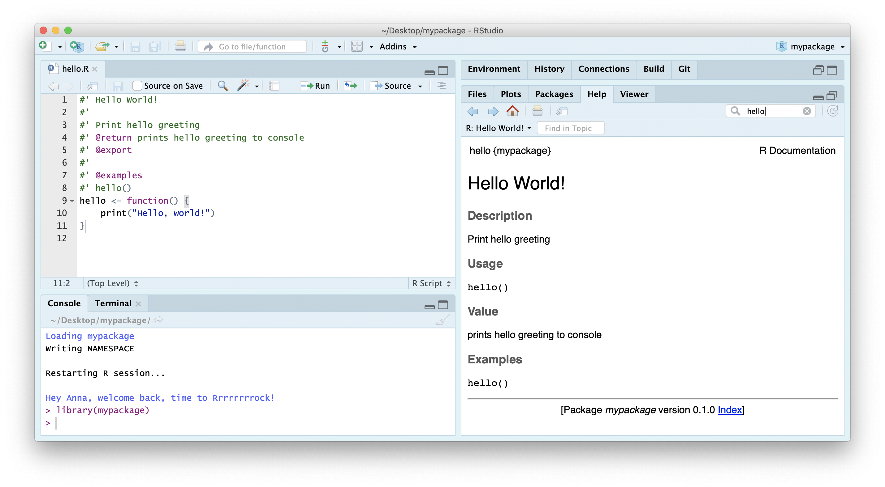
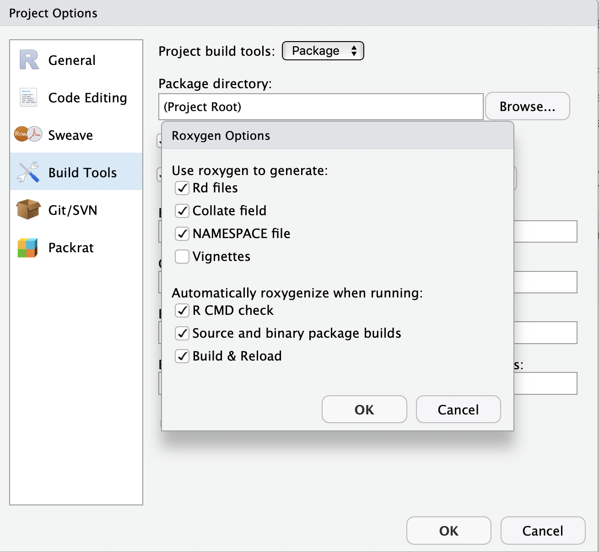
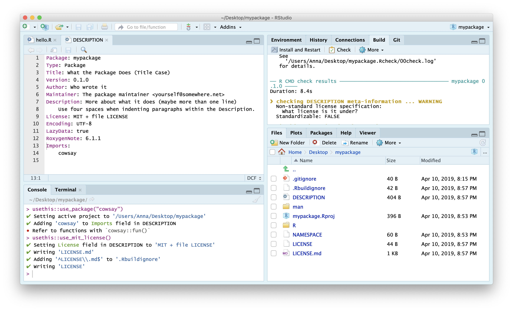

# (PART) Additonal materials {#additional} 

# Packaging functionality

## R Package Structure

Used to share functionality with the R community

- Useful **conventions**

- Useful **software development tools**

- Easy **publishing** through GitHub


## R Package conventions:

- **metadata**: in the **`DESCRIPTION` file**

- **functions** in **`.R` scripts** in the **`R/` folder**

- **tests** in the **`tests/` folder**

- **Documentation:**
    - _functions_ using **Roxygen notation**
    - _workflows_ using **`.Rmd` documents** in the **`vignettes/`** folder


## Software Engineering approach

Following conventions allows us to **make use of automated tools** for:

- **Checking** and **testing code**

- **Producing documentation** for code and workflows

- **Publishing, distributing** and **citing** code


## Anatomy of an R package

Let's use [`pkgreviewr`](https://github.com/ropenscilabs/pkgreviewr), a package I authored to help automate some aspects of the rOpenSci review process, as an example to examine some elements of what makes a package:

## `DESCRIPTION` file

Capture metadata around the package
- Functionality description
- Creators
- License


```
Package: pkgreviewr
Type: Package
Title: rOpenSci package review project template
Version: 0.1.1
Authors@R: c(person("Anna", "Krystalli", email = "annakrystalli@googlemail.com",
                  role = c("aut", "cre")),
             person("Maëlle", "Salmon", email = "maelle.salmon@yahoo.se", role = "aut"))
Description: Creates files and collects materials necessary to complete an rOpenSci package review. 
    Review files are prepopulated with review package specific metadata. Review package source code is
    also cloned for local testing and inspection.
License: GPL-3 + file LICENSE
URL: https://github.com/ropenscilabs/pkgreviewr
BugReports: https://github.com/ropenscilabs/pkgreviewr/issues
Encoding: UTF-8
LazyData: true
Imports:
    devtools,
    git2r (>= 0.23.0),
    usethis (>= 1.2.0),
    here,
    reprex,
    gh,
    base64enc,
    whoami,
    magrittr,
    covr,
    goodpractice,
    assertthat,
    httr,
    rstudioapi,
    clipr,
    clisymbols,
    crayon,
    dplyr,
    glue,
    fs,
    urltools,
    shiny
Suggests: 
    testthat,
    mockery,
    knitr,
    rmarkdown
RoxygenNote: 6.1.1
Remotes: 
    ropensci/git2r
VignetteBuilder: knitr
Roxygen: list(markdown = TRUE)

```


### citation

```{r}
citation("geosphere")
```


## Dependency management


It’s the job of the DESCRIPTION to **list the packages that your package needs to work**.

```
Imports:
    devtools,
    git2r (>= 0.23.0),
    usethis (>= 1.2.0),
    here,
    reprex,
    gh,
    base64enc,
    whoami,
    magrittr,
    covr,
    goodpractice,
    assertthat,
    httr,
    rstudioapi,
    clipr,
    clisymbols,
    crayon,
    dplyr,
    glue,
    fs,
    urltools,
    shiny
```
Imports are necessary dependencies for the functions in your package to work
```
Suggests: 
    testthat,
    mockery,
    knitr,
    rmarkdown
```
Suggests are dependencies that are not necessary for the functions in your package but might be neccessary to run all the vignettes or tests in your package


## `R/`

- Keep all functions in R scripts in `R/` folder

```
.
├── github.R
├── pkgreview.R
├── pkgreviewr-package.R
├── render-templates.R
├── rmd-utils.R
├── style.R
└── utils.R

0 directories, 7 files
```


### example function script

Create a new function `.R` file in the `R/` folder
```{r, eval=FALSE}
library(usethis)
use_r("add")
```

```
R
└── add.R

0 directories, 1 files
```


## Document functions with `Roxygen`

- Document functions with **Roxygen** notation
- Automatically create help files on build

```{r}
#' Add together two numbers.
#' 
#' @param x A number.
#' @param y A number.
#' @return The sum of x and y.
#' @examples
#' add(1, 1)
#' add(10, 1)
add <- function(x, y) {
  x + y
}
```


## `tests/`

Tests provide confidence in what the code is doing.

_Contents of `pkgreviewr` test folder_

```
.
├── testthat
│   ├── setup.R
│   ├── test-create-pkgreview.R
│   ├── test-gh-calls.R
│   ├── test-render-templates.R
│   └── test-setup.R
└── testthat.R

1 directory, 6 files
```


### Example test


 
```{r, eval=FALSE}
use_test("add")
```


```
tests
├── testthat
│   ├── test-add.R
└── testthat.R
```

```{r, eval=FALSE}
context("test-add")

test_that("add works", {
  expect_equal(add(2, 2), 4)
})
```


The **R package structure** can help with providing a logical organisation of files, by **providing a set of standard locations for certain types of files**.

To work with packages in RStudio we use the **Build pane**, which includes a variety of tools for **building, documenting and testing packages**. This will appear if Rstudio recognises the project as an R package.


## `r emo::ji("computer")`Create your first package

Let's go ahead and create our first package! We do that as we would any project, but this time we select **`R package`** instead of `New Project`. Call your package `mypackage`.

<div class="alert alert-info"><strong>File > New Project... > New Directory > R package > mypackage </strong></div>

Your new project should have the following structure. The build pane should also be visible.

```
.
├── DESCRIPTION
├── NAMESPACE
├── R
│   └── hello.R
├── man
│   └── hello.Rd
└── mypackage.Rproj

2 directories, 5 files
```


## `r emo::ji("vertical_traffic_light")` Functions in the **`R/`** dir

Let's inspect **`hello.R`**

it contains a function that takes now arguments and prints `hello world` to the console when called. The comments above are just that, comments and don't serve any functional purpose.

```{r}
# Hello, world!
#
# This is an example function named 'hello' 
# which prints 'Hello, world!'.
#
# You can learn more about package authoring with RStudio at:
#
#   http://r-pkgs.had.co.nz/
#
# Some useful keyboard shortcuts for package authoring:
#
#   Build and Reload Package:  'Cmd + Shift + B'
#   Check Package:             'Cmd + Shift + E'
#   Test Package:              'Cmd + Shift + T'

hello <- function() {
  print("Hello, world!")
}

```


### Install package.

You can install a package locally from it's source code with function `install()`

```{r, eval=FALSE}
library(devtools)
install(".")
```

You can now load it like any other package...

```{r, eval=FALSE}
library("mypackage")
```

And use your function!

```{r}
hello()
```


```{r, echo=FALSE}
rm(hello)
```


***

## `r emo::ji("vertical_traffic_light")` Roxygen documentation


[`Roxygen2`](http://r-pkgs.had.co.nz/man.html) allows you to write specially-structured comments preceeding each function definition to document:

- the inputs and outputs
- a description of what it does
- an example of how to use it

These are processed automatically to produce `.Rd` help files for your functions and control which functions are exported to the package `NAMESPACE`.

Let's document our example function. First, clear the demo comments above the function and all contents of the example`NAMESPACE`. Also delete the file in the `man` folder.

### Insert Roxygen skeleton

You can insert a Roxygen skeleton by placing the curson with a function and clicking:

> **Code > Insert Roxygen Skeleton**

```{r, eval=FALSE}
#' Title
#'
#' @return
#' @export
#'
#' @examples
hello <- function() {
  print("Hello, world!")
}

```

#### Roxygen basics

- `roxygen` notation indicated by **beginning line with `#'`**.

- **First line** will be the **title** for the function.

-  After title, include a blank `#'` line and then write a **longer description.**

- `@param argument_name` **description of the argument.**

- `@return` description of **what the function returns.**

- `@export` tells `Roxygen2` to **add this function to the `NAMESPACE`** file, so that it will be **accessible to users.** 
- `@examples` allows to include example of how to use a function


### Complete Roxygen documentation

```{r}
#' Hello World! 
#'
#' Print hello greeting
#' @return prints hello greeting to console
#' @export
#'
#' @examples
#' hello()
hello <- function() {
  print("Hello, world!")
}

```

### Autogenerate documentation

Use function `devtools::document()` to create documentation. This re-creates a `hello.Rd` helpfile in the `man/` folder and populates the `NAMESPACE` with our functions

```{r, eval=FALSE}
devtools::document()
```

Click **Install and Restart** to re-install the package and make the documentation available.



You can configure your build tools in the **Global Options** to automatically build documentation every time you **Install & Rebuild**



## `r emo::ji("vertical_traffic_light")` Personalise function

Let's go a step further and customise our function so that the greeting is from ourselves!

```{r, tidy="styler"}
#' Hello World!
#'
#' Print hello greeting
#' @return prints hello greeting to console from me
#' @export
#'
#' @examples
#' hello()
hello <- function() {
  print("Hello, world from Anna")
}
```


## Add some fun!

Programming is most useful for having fun. So let's make our function extra fun!

We'll use package `cowsay`

```{r, eval=FALSE}
install.packages("cowsay")
```

which has a single function `say`, which does this...

```{r}
cowsay::say("Say whaaaaaat?", by = "shark")
```

`r emo::ji("stuck_out_tongue_winking_eye")`

So let's create a function that randomly chooses one of the animals available in `cowsay` to deliver the greeting, and also allow the user to customise who the recipient of the greeting is

```{r}
#' Hello World!
#'
#' Print personalised hello greeting from me.
#'
#' @param name character string. Your name!
#'
#' @return prints hello greeting to console
#' @export
#'
#' @examples
#' hello()
#' hello("Lucy Elen")
hello <- function(name = NULL) {
    
    # create greeting
    if(is.null(name)){name <- "world"}
    greeting <- paste("Hello", name, "from Anna!")

    # randomly sample an animal
    animal_names <- names(cowsay::animals)
    i <- sample(1:length(animal_names), 1)

    cowsay::say(greeting, animal_names[i])
}
```

Document, Install and restart to load our changes

```{r}
hello("y'all")
```


## `r emo::ji("vertical_traffic_light")` Check package integrity

An **important part of the package development process is `R CMD check`**. `R CMD check` automatically **checks your code** and can **automatically detects many common problems** that we'd otherwise discover the hard way.

To check our package, we can:

- use `devtools::check()` 

- press Ctrl/Cmd + Shift + E

- click on the `r emo::ji("check")`**Check** tab in the **Build** panel. 

This:

* **Ensures that the documentation is up-to-date** by running 
  `devtools::document()`.

* **Bundles the package** before checking it. 

More info on [checks](http://r-pkgs.had.co.nz/check.html) here.

<br>

Both these run `R CMD check` which **return three types of messages**:

- **ERRORs**: Severe problems that you should fix regardless of whether or not you’re submitting to CRAN.

- **WARNINGs**: Likely problems that you must fix if you’re planning to submit to CRAN (and a good idea to look into even if you’re not).

- **NOTEs**: Mild problems. If you are submitting to CRAN, you should strive to eliminate all NOTEs, even if they are false positives.


Let's **Check** our package:


Click on the **Check** button (`r emo::ji("clipboard")` `r emo::ji("white_check_mark")`)

```
   
── R CMD check results ──────────────────────────────────── mypackage 0.1.0 ────
Duration: 8.4s

❯ checking DESCRIPTION meta-information ... WARNING
  Non-standard license specification:
    What license is it under?
  Standardizable: FALSE

❯ checking dependencies in R code ... WARNING
  '::' or ':::' import not declared from: ‘cowsay’

0 errors ✔ | 2 warnings ✖ | 0 notes ✔
Error: R CMD check found WARNINGs
Execution halted

Exited with status 1.
```

Aha, so our checks have thrown up some warnings! First, it's telling us we haven't added a `LICENSE`. It's also telling us that we have a dependency (import) from package `cowsay` which we haven't documented in the `DESCRIPTION` file. `usethis` to the rescue!

## `r emo::ji("vertical_traffic_light")` Add dependencies

Add `cowsay` as a dependency.

```{r, eval=FALSE}
usethis::use_package("cowsay")
```

```
✔ Setting active project to '/Users/Anna/Desktop/mypackage'
✔ Adding 'cowsay' to Imports field in DESCRIPTION
● Refer to functions with `cowsay::fun()`
```

## Add License

```{r, eval = FALSE}
usethis::use_mit_license()
```




Check again...All should be good!

```
── R CMD check results ──────────────────────────────────── mypackage 0.1.0 ────
Duration: 9.3s

0 errors ✔ | 0 warnings ✔ | 0 notes ✔

R CMD check succeeded
```

***

## `r emo::ji("vertical_traffic_light")` Add Test

**Testing is a vital part of package development**. It ensures that our code does what you want it to do. 

Once you're set up with a testing framework, the workflow is simple:

1.  Modify your code or tests.

2.  Test your package with Ctrl/Cmd + Shift + T or `devtools::test()`.

3.  Repeat until all tests pass.

## create test file

To create a new test file (and the testing framework if required), use function
`usethis::use_test()`. It's good practice to name the test files after the `.R` files containing the functions being tested.

```{r, eval=FALSE}
use_test("hello")
```

```r
✔ Setting active project to '/Users/Anna/Documents/workflows/workshops/materials/mypackage'
✔ Adding 'testthat' to Suggests field in DESCRIPTION
✔ Creating 'tests/testthat/'
✔ Writing 'tests/testthat.R'
✔ Writing 'tests/testthat/test-hello.R'
● Modify 'tests/testthat/test-hello.R'
```

This just created the following folders and files
```
tests
├── testthat
│   └── test-hello.R
└── testthat.R

1 directory, 2 files
```
It also added `testthat` to the suggested packages in the `DESCRIPTION` file. 

```
Suggests: 
    testthat
```
That's because you don't need test that to run the functions in `mypackage`, but you do 
if you want to run the tests.

When the tests are run (either through running `devtools::test()`, clicking on **More > Test Package** in the Build panel or `Cmd/Ctrl + Shift + T`), the code in each test script in directory `testthat` is run.

**`test-hello.R`**

Let's load the library so we can explore the `testthat` testing framework

```{r, message=FALSE}
library(testthat)
```


```{r}
context("test-hello")

test_that("multiplication works", {
  expect_equal(2 * 2, 4)
})

```


If the test doesn't pass it throws an error

```{r, error=TRUE}
context("test-hello")

test_that("multiplication works", {
  expect_equal(2 * 2, 5)
})

```

## Write test

Let's write a simple test to check that we are getting an expected output type. The first thing to note, looking at the `say()` documentation is that it takes an argument `type` which allows us to specify the output we want. It defaults `message` which means the output of the function is returned as a message.

We can therefore use `testthat::expect_message()`

```{r, error=TRUE}
context("test-hello")

test_that("hello works", {
  expect_message(hello())
})

```

Now let's test our package

```{r, eval=FALSE}
devtools::test()
```

Success!

```
==> devtools::test()

Loading mypackage
Testing mypackage
✔ | OK F W S | Context
✔ |  1       | test-hello

══ Results ════════════════════════════════════════════════════════
OK:       1
Failed:   0
Warnings: 0
Skipped:  0
```
## `r emo::ji("vertical_traffic_light")` Complete package metadata


Let's head to the `DESCRIPTION` file and complete the details.

## Authors


First let's complete the authors. Remove the current author and maintainer lines and replace it with the following line:

```
Authors@R: person("First", "Last", email = "first.last@example.com", role = c("aut", "cre"))
```
completed with your own details

## Add a title and description

Complete the title and description fields with appropriate details. If you want to form a paragraph of text, make sure do indent the hanging lines by 4 spaces (one tab). And make sure that your Description field **ends in a full-stop**.

## Add a date

Use today's date in ISO format, ie `2019-04-10`. This will populate a citation entry for us.

### Completed `DESCRIPTION`

The complete `DESCRIPTION` file should look something like this:

```
Package: mypackage
Type: Package
Title: Customised greetings from me!
Version: 0.1.0
Authors@R: person("Anna", "Krystalli", 
  email = "annakrystalli@googlemail.com", 
  role = c("aut", "cre"))
Description: Prints a customised greeting from myself, 
    delivered by a friend.
License: MIT + file LICENSE
Encoding: UTF-8
LazyData: true
RoxygenNote: 6.1.1
Imports: 
    cowsay
Suggests: 
    testthat
Date: 2019-04-10
```

Check your package. If all is good, document, install and restart!

Now, check you're package's citation:

```{r}
citation("mypackage")
```

## `r emo::ji("vertical_traffic_light")` Create README

The final document you will need for your package is a `README`.

```{r, eval=FALSE}
usethis::use_readme_rmd()
```

```
✔ Writing 'README.Rmd'
✔ Adding '^README\\.Rmd$' to '.Rbuildignore'
● Modify 'README.Rmd'
✔ Writing '.git/hooks/pre-commit'
```

Because it's an `.Rmd` but GitHub can only display an `md` document as it's landing page, this is a special `.Rmd` that renders to a markdown document rather than `html`.  The function adds a check to `.git` to ensure you commit an up to date version on the `md` when you commit changes to the `.Rmd`.

Complete the README, including an example.

## Commit and push to GitHub

Now you have everything you need to share your package on GitHub so commit and push it up.

Anyone will be able to install it using, eg:

```{r, eval=FALSE}
devtools::install_github("annakrystalli/mypackage")
```

## `r emo::ji("vertical_traffic_light")` Create documentation site

You can use package `pkgdown` to create an online site for your documentation:

```{r, eval=FALSE}
install.packages("pkgdown")
pkgdown::build_site()
```

```
══ Building pkgdown site ════════════════════════════════════════════
Reading from: '/Users/Anna/Documents/workflows/dummy/mypackage'
Writing to:   '/Users/Anna/Documents/workflows/dummy/mypackage/docs'
── Initialising site ────────────────────────────────────────────────
Copying '../../../../../../Library/Frameworks/R.framework/Versions/3.5/Resources/library/pkgdown/assets/docsearch.css' to 'docsearch.css'
Copying '../../../../../../Library/Frameworks/R.framework/Versions/3.5/Resources/library/pkgdown/assets/docsearch.js' to 'docsearch.js'
Copying '../../../../../../Library/Frameworks/R.framework/Versions/3.5/Resources/library/pkgdown/assets/link.svg' to 'link.svg'
Copying '../../../../../../Library/Frameworks/R.framework/Versions/3.5/Resources/library/pkgdown/assets/pkgdown.css' to 'pkgdown.css'
Copying '../../../../../../Library/Frameworks/R.framework/Versions/3.5/Resources/library/pkgdown/assets/pkgdown.js' to 'pkgdown.js'
── Building home ────────────────────────────────────────────────────
Writing 'authors.html'
Reading 'LICENSE.md'
Writing 'LICENSE.html'
Writing 'LICENSE-text.html'
Reading 'README.Rmd'
Writing 'index.html'
── Building function reference ──────────────────────────────────────
Updating mypackage documentation
Writing NAMESPACE
Loading mypackage
Writing NAMESPACE
Writing 'reference/index.html'
Loading mypackage
Reading 'man/hello.Rd'
Writing 'reference/hello.html'
══ DONE ═════════════════════════════════════════════════════════════
── Previewing site ──────────────────────────────────────────────────
```

This creates html documentation for our package in the `docs/` folder. 

- Commit and push the `docs/` folder to GitHub
- Make the site live by enabling gh-pages. Set it to serve content from the `docs` folder.


Your package is now installable from GitHub, has online documentation and should have this final structure:

```
.
├── DESCRIPTION
├── LICENSE
├── LICENSE.md
├── NAMESPACE
├── R
│   └── hello.R
├── README.Rmd
├── README.md
├── docs
│   ├── LICENSE-text.html
│   ├── LICENSE.html
│   ├── authors.html
│   ├── docsearch.css
│   ├── docsearch.js
│   ├── index.html
│   ├── link.svg
│   ├── pkgdown.css
│   ├── pkgdown.js
│   ├── pkgdown.yml
│   └── reference
│       ├── hello.html
│       └── index.html
├── man
│   └── hello.Rd
├── mypackage.Rproj
└── tests
    ├── testthat
    │   └── test-hello.R
    └── testthat.R

6 directories, 23 files
```
Check out my complete example [here](https://github.com/annakrystalli/mypackage-demo)
