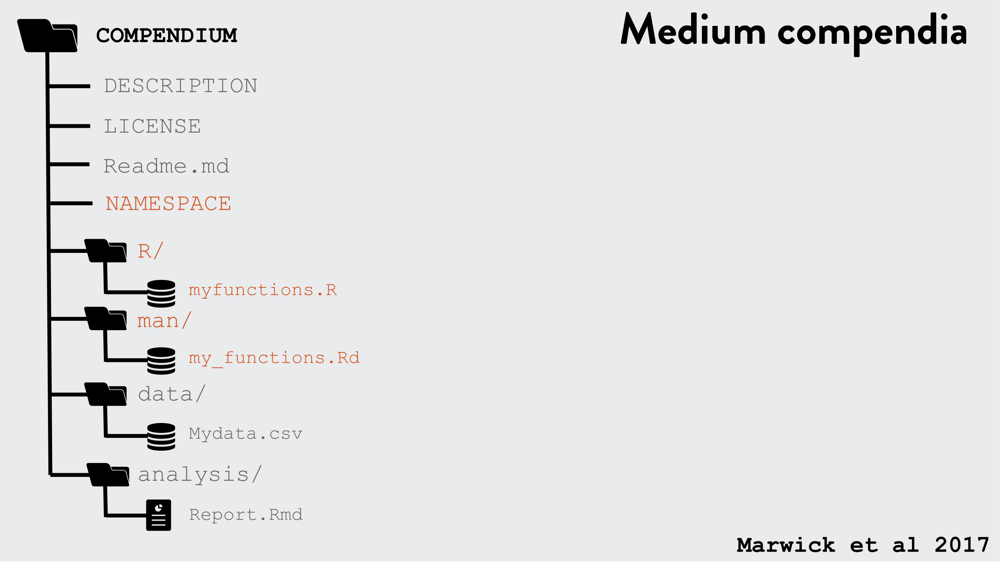
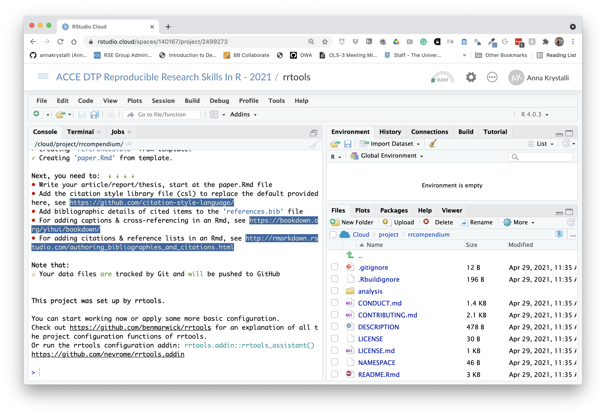
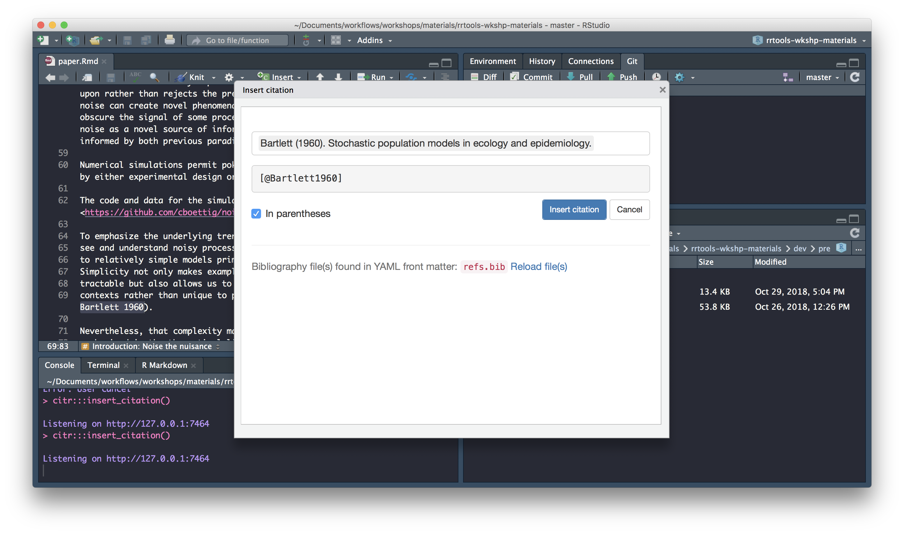
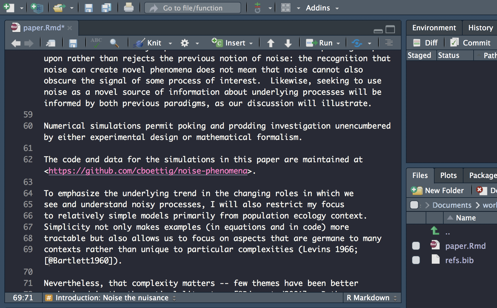

#  Creating a research compendium with rrtools


## Background

- **Research is increasingly computational**

- **Code and data are important research outputs**
    + yet, we still focus mainly on curating papers.

- **Calls for openness**
    + stick: reproducibility crisis
    + carrot: huge rewards from working open


Yet we lag in conventions and technical infrastructure for such openness.

<br>

## Enter the Research Compendium


> The goal of a research compendium is to provide a **standard** and easily recognizable way for **organizing the digital materials** of a project to enable others to **inspect, reproduce, and extend the research**.


### Three Generic Principles

1. **Organize its files according to prevailing conventions**: 
    + help other people recognize the structure of the project, 
    + supports tool building which takes advantage of the shared structure.
    
1. **Separate of data, method, and output**, while making the relationship between them clear.

1. **Specify the computational environment** that was used for the original analysis.


<br>

##  R community response

> R packages can be used as a research compendium for organising and sharing files!


### R package file system structure for reproducible research

- Take advantage of the power of convention.

 - Make use of great package development tools.

See Ben Marwick, Carl Boettiger & Lincoln Mullen (2018) [_Packaging Data Analytical Work Reproducibly Using R (and Friends)_](https://www.tandfonline.com/doi/abs/10.1080/00031305.2017.1375986?journalCode=utas20), The American Statistician, 72:1, 80-88, DOI: <10.1080/00031305.2017.1375986>


images: [_Kartik Ram: rstudio::conf 2019 talk_](https://github.com/karthik/rstudio2019)

_Example use of the R package structure for a research compendium_ (source Marwick _et al_, 2018)

***

## General Project Organisation

Good project layout helps ensure the

- Integrity of data
- Portability of the project
- Easier to pick the project back up after a break

---

## From raw to analytical data

### [the reproducible pipeline](https://dynamicecology.wordpress.com/2016/08/22/ten-commandments-for-good-data-management/)

- Do not manually edit raw data

- Keep a clean pipeline of data processing from raw to analytical.

- Ideally, incorporate checks to ensure correct processing of data through to analytical.

- Check out rOpenSci package [drake](https://github.com/ropensci/drake), an R-focused pipeline toolkit for reproducibility

---

## Separate function definition and application

- When your project is new and shiny, the script file usually contains many lines of directly executated code. 

- As it matures, **reusable chunks get pulled into their own functions**. 

- The actual analysis scripts then become relatively short, and use the functions defined in separate R scripts. 

---

## Use Rstudio projects

### Keep your work [tidy, portable and self-contained](https://nicercode.github.io/blog/2013-04-05-projects/)

### pkg `here`

Use function `here::here("path", "to", "file")` to create robust paths **relative to the project root**. 

eg

```{r}
here::here("path", "to", "file")
```

---

## Follow convention

> It’s like agreeing that we will all drive on the left or the right. A hallmark of civilization is following conventions that constrain your behavior a little, in the name of public safety.

**Jenny Bryan** on [Project-oriented workflows](https://www.tidyverse.org/articles/2017/12/workflow-vs-script/)


> ### A place for everything, everything in its place.

Benjamin Franklin


### The benefits of following convention:

- You will be able to find your way around any of your projects

- You will be able to find your way around any project by others following same convention

- You will be able to find your way around any r package on GitHub!

---

## R Developer Tools

### Leverage tools and functionality for **R package development**

- manage dependencies
- make functionality available
- document functionality
- validate functionality
- version contol your project


[`devtools`](https://www.tidyverse.org/articles/2017/11/usethis-1.0.0/), [`usethis`](https://www.tidyverse.org/articles/2017/11/usethis-1.0.0/),
[`rrtools`](https://github.com/benmarwick/rrtools),
[Rstudio](https://support.rstudio.com/hc/en-us/articles/200486488-Developing-Packages-with-RStudio)


#### ***minimal analysis project*** 

1. An **`scripts/`** directory that contains R scripts (`.R`), notebooks (`.Rmd`), and intermediate data.

2. A **`DESCRIPTION`** file that provides metadata about the compendium. Most importantly, it would list the packages needed to run the analysis. Would contain field to indicate that this is an analysis, not a package.


#### A ***reproducible*** analysis project would also contain:

1. An **`R/`** directory which contains R files that provide high-stakes functions.

1. A **`data/`** directory which contains high-stakes data.

1. A **`tests/`** directory that contains unit tests for the code and data.

1. A **`vignettes/`** directory that contains high-stakes reports.


#### Autogenerated components:

1. A **`man/`** directory which contains **roxygen2-generated documentation** for the reusable functions and data.

1. Online documentation in a **`docs/`** folder.

#### A ***shareable*** reproducible analysis project would also:

- Use Git + GitHub (or other public Git host)

- Use Travis or other continuous integration service

- Capture the computational environment so it can easily be recreated on a different computer. This involves at a minimum capturing package versions, but might also include capturing R version, and other external dependencies.


### Start small and build as necessary





images: [_Kartik Ram: rstudio::conf 2019 talk_](https://github.com/karthik/rstudio2019)

---


## `rrtools`: Research Compendia in R

> The goal of rrtools is to provide **instructions, templates, and functions** for making a **basic compendium** suitable for writing **reproducible research with R**.


**`rrtools` build on tools & conventions for R package development to**

- organise files
- manage dependencies
- share code
- document code
- check and test code

**`rrtools` extends and works with a number of R packages:**

- [`devtools`](https://cran.r-project.org/package=devtools): functions for package development

- [`usethis`](https://www.tidyverse.org/articles/2017/11/usethis-1.0.0/): automates repetitive tasks that arise during project setup and development

- [`bookdown`](https://bookdown.org/): facilitates writing books and long-form articles/reports with R Markdown

<br>

***

## `r emo::ji("computer")` Workshop materials

## Data

#### On github: <https://github.com/annakrystalli/rrtools-wkshp-materials/>  

+ click on **Clone or download** 

+ click on **Download ZIP** 

+ Unzip the file 

---


## Workshop aims and objectives

In this workshop we'll **use materials associated with a published paper** (text, data and code) to **create a research compendium** around it.

<br>

By the end of the workshop, you should be able to:

- Be able to **Create a Research Compendium** to manage and share resources associated with an academic publication.

- Be able to **produce a reproducible manuscript from a single rmarkdown document**.

- Appreciate the power of convention!

Let's dive in!

## `r emo::ji("computer")`Create your first reproducible research compendium

Let's go ahead and create our first reproducible research compendium! 

To do this in Rstudio Cloud (which is a bit fiddlier) we will create a general project in which we will create our reproducible research compendium project. In general, creating a project within a project is bad practice and you should avoid this when working locally, but given the more restrictive nature of working in Rstudio Cloud, we will break this general best practice rule.


### Copy **rrtools** Project

In our shared space click on the `r icons::fontawesome("plus-square")` copy button next to the **rrtools** Project.

```{r, echo=FALSE}

```

Click on `r icons::fontawesome("plus-square")` **Save a permanent copy**. You now have a personal copy of the project.


### Install packages

In our `rrtools` project, these packages should be pre-installed and be available to the research compendium we'll create inside.

However, if you are working locally, you would need to **install the following packages starting with `rrtools`** (if you haven't got devtools installed, you'll need to before you can install `rrtools` from GitHub). 

```{r, eval=FALSE, code=readLines("install_rrtools.R")}

```

Installing `rrtools` **imports many of the packages we'll need today** (eg, have a look at the imports section of the [`DESCRIPTION`](https://github.com/benmarwick/rrtools/blob/master/DESCRIPTION) file).

```
Imports: devtools, git2r, whisker, rstudioapi, rmarkdown, curl, RCurl, jsonlite, methods, httr,          usethis, clisymbols, crayon, glue, bookdown, here
```

We also **install some additional packages** we'll need for the workshop.

You might also need to install `tinytex` (if you get errors when rendering your Rmd paper).

<br>


## `r emo::ji("vertical_traffic_light")` Create compendium

Now that we've got all the materials we need, let's start by ***creating a blank research compendium** for us to work in.

<br>

### load library

First we need to load `rrtools`
```{r}
library(rrtools) 
```

This performs a quick check to **confirm you have Git installed and configured**

If you do, you should see the following output in the console.

```r
✔ Git is installed on this computer, your username is annakrystalli
```


### create compendium

Now we're ready to **create our compendium**. We use function **`rrtools::create_compendium`** and supply it with a path at which our compendium will be created. The final part of our path becomes the compendium name. Because the function effectively creates a package, only a **single string of lowercase alpha characters is accepted as a name**. so let's go for `rrcompendium` as the final part of our path.

To **create `rrcompendium` in our project, I use:**

```{r, eval=FALSE}
rrtools::create_compendium("rrcompendium")
```

If the call was successfull you should see the following console output:

```
✓ Setting active project to '/cloud/project/rrcompendium'
✓ Writing 'LICENSE'
✓ Writing 'LICENSE.md'
✓ Adding '^LICENSE\\.md$' to '.Rbuildignore'

✓ Creating 'README.Rmd' from template.
✓ Adding 'README.Rmd' to `.Rbuildignore`.
• Modify 
✓ Adding code of conduct.
✓ Creating 'CONDUCT.md' from template.
✓ Adding 'CONDUCT.md' to `.Rbuildignore`.
✓ Adding instructions to contributors.
✓ Creating 'CONTRIBUTING.md' from template.
✓ Adding 'CONTRIBUTING.md' to `.Rbuildignore`.
✓ Adding runtime.txt for Binder

✓ Adding 'bookdown' to Imports
✓ Adding 'here' pkg to Imports
✓ Creating 'analysis' directory and contents
✓ Creating 'analysis'
✓ Creating 'analysis/paper'
✓ Creating 'analysis/figures'
✓ Creating 'analysis/templates'
✓ Creating 'analysis/data'
✓ Creating 'analysis/data/raw_data'
✓ Creating 'analysis/data/derived_data'
✓ Creating 'analysis/supplementary-materials'
✓ Creating 'references.bib' from template.
✓ Creating 'paper.Rmd' from template.

Next, you need to:  ↓ ↓ ↓ ↓ 
• Write your article/report/thesis, start at the paper.Rmd file
• Add the citation style library file (csl) to replace the default provided here, see https://github.com/citation-style-language/
• Add bibliographic details of cited items to the 'references.bib' file
• For adding captions & cross-referencing in an Rmd, see https://bookdown.org/yihui/bookdown/
• For adding citations & reference lists in an Rmd, see http://rmarkdown.rstudio.com/authoring_bibliographies_and_citations.html

Note that:
⚠ Your data files are tracked by Git and will be pushed to GitHub 


This project was set up by rrtools.

You can start working now or apply some more basic configuration.
Check out https://github.com/benmarwick/rrtools for an explanation of all the project configuration functions of rrtools.
Or run the rrtools configuration addin: rrtools.addin::rrtools_assistant() https://github.com/nevrome/rrtools.addin

```

and a new Rstudio session launched for the compendium:


```{r, echo=FALSE}

```


<br>


### Initiate `git`

Let's initialise our compendium with `.git`. We'll need to configure git again as this is a new Rstudio cloud project.

```{r, eval=FALSE}
# configure git
use_git_config(user.name = "Jane",
               user.email = "jane@example.org")
# intialise git and commit
usethis::use_git()
```


**N.B. Beware, if you are working locally, you may have ended up with two Rstudio sessions of `rrcompendium`.** Make sure to only have one session of a single project at one time to avoid problems.

<br>


### Inspect templates

```
.
├── DESCRIPTION <- .............................package metadata
|                                               dependency management
├── NAMESPACE <- ...............................AUTO-GENERATED on build
├── R <- .......................................folder for functions
├── man <- .....................................AUTO-GENERATED on build
└── rrcompendium.Rproj <- ......................rstudio project file
```

`rrtools::create_compendium()` creates the **bare backbone of infrastructure required for a research compendium**. At this point it provides facilities to store general metadata about our compendium (eg bibliographic details to create a citation) and manage dependencies in the `DESCRIPTION` file and store and document functions in the `R/` folder. Together these allow us to **manage, install and share functionality associated with our project**.

<br>

### Get workshop materials

Today we'll be working with **a subset of materials from the published compendium** of code, data, and author's manuscript: 

##### Carl Boettiger. (2018, April 17). *cboettig/noise-phenomena: Supplement to: "From noise to knowledge: how randomness generates novel phenomena and reveals information"* (Version revision-2). *Zenodo*. http://doi.org/10.5281/zenodo.1219780

accompanying the publication:

##### Carl Boettiger [](https://orcid.org/0000-0002-1642-628X). *From noise to knowledge: how randomness generates novel phenomena and reveals information*.  Published in *Ecology Letters*, 22 May 2018 <https://doi.org/10.1111/ele.13085>


Let's first create a folder to dowload the materials into. It's sometimes useful to have a folder to hold materials that are not formally part of the project (i.e. we will not commit these files to git). I like to call such folders `attic`, so let's create such a folder

```{r, eval=FALSE}
dir.create("attic")
```

Let's also add the `attic/` dir to `.gitignore` by adding the following text to it (remember to include a new line at the end of the file)

```
attic/*
```

You can **download the materials using `usethis::use_course()`** and supplying a path to a destination folder to argument `destdir`. Let's download everything into the `attic/` folder.

```{r, eval=FALSE}
usethis::use_course(url = "bit.ly/rrtools_wks", destdir = "attic")
```

This will **download** everything we need from a GitHub repository as a `.zip` file, **unzip** it and launch it in a **new Rstudio session** for us to explore.

<br>

#### Inspect materials

The follwing files should now be contained in your `attic/rrtools-wkshp-materials-master` folder
```
├── README.md <- .......................repo README
├── analysis.R <- ......................analysis underlying paper
├── gillespie.csv <- ...................data
├── paper.pdf <- .......................LaTex pdf of the paper
├── paper.txt <- .......................text body of the paper
└── refs.bib <- ........................bibtex bibliographic file
```

<br>

In this workshop we'll attempt **a partial reproduction of the original paper** using the materials we've just downloaded.

We'll **use this as an opportunity to create a new research compendium using `rrtools` and friends!** `r emo::ji("confetti")`

<br>

---

## `r emo::ji("vertical_traffic_light")` Update `DESCRIPTION` file

Let's **update some basic details in the `DESCRIPTION` file**:

```
Package: rrcompendium
Title: What the Package Does (One Line, Title Case)
Version: 0.0.0.9000
Authors@R:
    person(given = "First",
           family = "Last",
           role = c("aut", "cre"),
           email = "first.last@example.com")
Description: What the package does (one paragraph).
License: MIT + file LICENSE
ByteCompile: true
Encoding: UTF-8
LazyData: true
Roxygen: list(markdown = TRUE)
RoxygenNote: 7.1.1
Imports: bookdown,
    here
Suggests: devtools,
    git2r

```
<br>

### Title

Let's start with **giving our compendium a descriptive title**:

```
Title: Partial Reproduction of Boettiger Ecology Letters 2018;21:1255–1267 
    with rrtools
```
<br>

### Version

We don't need to change the version now but using [semantic versioning](https://semver.org/) for our compendium can be a really useful way to track versions. In general, **versions below `0.0.1` are in development**, hence the `DESCRIPTION` file defaults to `0.0.0.9000`.


<br>

### Authors

Next let's **specify the author of the compendium**. Edit with **your own details**.

```
Authors@R: 
    person(given = "Anna",
           family = "Krystalli",
           role = c("aut", "cre"),
           email = "annakrystalli@googlemail.com")
```
For more details on specifying authors, check documentation for `?person`

<br>


### Description

Let's **add a bit more detail about the contents of the compendium** in the Description.

```
Description: This repository contains the research compendium of the 
    partial reproduction of Boettiger Ecology Letters 2018;21:1255–1267. 
    The compendium contains all data, code, and text associated with this       sub-section of the analysis
```
<br>


### License

Finally, let's **create a new license for the material we create**. We'll use an [**MIT license**](https://opensource.org/licenses/MIT). Note however that **his only covers the code**. We can do this with:

```{r, eval=FALSE}
usethis::use_mit_license("Anna Krystalli")
```

```
✔ Setting License field in DESCRIPTION to 'MIT + file LICENSE'
✔ Writing 'LICENSE.md'
✔ Adding '^LICENSE\\.md$' to '.Rbuildignore'
```
This overwrites the current files `LICENSE` and `LICENSE.md` and updates the `DESCRIPTION` file, embedding our name in the details of the license. 

```
License: MIT + file LICENSE
```

<br>


### Recap

We've finished updating our `DESCRIPTION` file! `r emo::ji("tada")`

It should look a bit like this:

```{r, eval=FALSE, code=readLines("rrcompendium-DESCRIPTION")}

```

and your project folder should contain:

```
├── CONDUCT.md
├── CONTRIBUTING.md
├── DESCRIPTION
├── LICENSE
├── LICENSE.md
├── NAMESPACE
├── README.Rmd
├── analysis
│   ├── data
│   │   ├── DO-NOT-EDIT-ANY-FILES-IN-HERE-BY-HAND
│   │   ├── derived_data
│   │   └── raw_data
│   ├── figures
│   ├── paper
│   │   ├── paper.Rmd
│   │   └── references.bib
│   ├── supplementary-materials
│   └── templates
│       ├── author-info-blocks.lua
│       ├── journal-of-archaeological-science.csl
│       ├── pagebreak.lua
│       ├── scholarly-metadata.lua
│       ├── template.Rmd
│       └── template.docx
├── attic
│   └── rrtools-wkshp-materials-master
│       ├── README.md
│       ├── analysis.R
│       ├── gillespie.csv
│       ├── paper.pdf
│       ├── paper.txt
│       └── refs.bib
├── rrcompendium.Rproj
└── runtime.txt
```

Let's commit our work and move on to preparing our compendium for sharing on GitHub.


<br>

***

## `r emo::ji("vertical_traffic_light")`Sharing a compendium on GitHub

<br>

## Update README

Every GitHub repository needs a `README` landing page.

When we intialised our research compendium, **an `rrtools` `README` template** was created.

You can always re-create one with:

```{r, eval=FALSE}
rrtools::use_readme_rmd()
```

```

✔ Creating 'README.Rmd' from template.
✔ Adding 'README.Rmd' to `.Rbuildignore`.
● Modify 'README.Rmd'
✔ Rendering README.Rmd to README.md for GitHub.
✔ Adding code of conduct.
✔ Creating 'CONDUCT.md' from template.
✔ Adding 'CONDUCT.md' to `.Rbuildignore`.
✔ Adding instructions to contributors.
✔ Creating 'CONTRIBUTING.md' from template.
✔ Adding 'CONTRIBUTING.md' to `.Rbuildignore`.

```

This **generates README.Rmd and renders it to README.md**, ready to display on GitHub. It contains:

+ details of authorship and DOI of the associated paper.
+ details of authorship and DOI of the code and data.
+ a **template citation** to show others how to cite your project.
+ instructions on how to download and install the compendium
+ instructions on how to reproduce the analysis
+ **license information for the text, figures, code and data** in your
        compendium

<br>

       
The call also adds two other markdown files:

+ `CONDUCT.md`: a **code of conduct for users** 
+ `CONTRIBUTING.md`:: basic **instructions for people who want to contribute** to our compendium

<br>

## update `README`

There's **4 main edits** we need to make to the template:

### add title

In the first code chunk, assign the title to the `title` object:

```r
Title <- "Partial Reproduction of Boettiger Ecology Letters 2018;21:1255–1267 with rrtools"
```

### edit author details

Where details of authors are requested, add your own name

We don't have a link to the DOI or details of where our partial reproduction is published so just leave as is. 


### update zip url

This is a link to download a zipped file of the repository. To update the template, just paste the url of your compendium repository like so:

```
[master.zip](https://github.com/annakrystalli/rrcompendium/archive/master.zip)
```

### adjust data LICENSE

Let's **adjust the data LICENSE to match the source compendium license**, which is CC-BY 4.0. Let's also add Carl Boettiger as copyright holder of the data.

```
**Text and figures :**  [CC-BY-4.0](http://creativecommons.org/licenses/by/4.0/), Copyright (c) 2018 Carl Boettiger.

**Code :** See the [DESCRIPTION](DESCRIPTION) file

**Data :** [CC-BY-4.0](http://creativecommons.org/licenses/by/4.0/), Copyright (c) 2018 Carl Boettiger.
```
Remember to knit your `README.Rmd` to it's `.md` version.

<br>

## `r emo::ji("vertical_traffic_light")` Create GitHub repository

Next, we'll **create a GitHub repository to share our compendium**. We'll make use of our `GITHUB_PAT` and go for `https` authentication. We can do this with function:

You will need to set up `gitcreds` again in this new project!

```{r, eval=FALSE}
# configure GitHub PAT credentials
gitcreds::gitcreds_set()

# create GitHub repository and push
usethis::use_github(protocol = "https")
```

```
✔ Setting active project to '/Users/Anna/Documents/workflows/rrcompendium'
● Check title and description
  Name:        rrcompendium
  Description: Partial Reproduction of Boettiger Ecology Letters 2018;21:1255–1267 with rrtools
  
```
The function will prompt you to confirm the name and description for your GitHub repo which it parses from our `DESCRIPTION` file. If everything looks good select the affirmative option.

```
Are title and description ok?
1: Not now
2: Definitely
3: Nope

```
If creation of the repo was successfull you should see the following console output:

```
✔ Creating GitHub repository
✔ Adding GitHub remote
✔ Adding GitHub links to DESCRIPTION
✔ Setting URL field in DESCRIPTION to 'https://github.com/annakrystalli/rrcompendium'
✔ Setting BugReports field in DESCRIPTION to 'https://github.com/annakrystalli/rrcompendium/issues'
✔ Pushing to GitHub and setting remote tracking branch
✔ Opening URL https://github.com/annakrystalli/rrcompendium
```


### Commit and push to GitHub

#### We've now completed our `rrtools` `README.Rmd`! `r emo::ji("tada")`

- Render it to update the `README.md` file which is displayed on GitHub

- Commit and push to GitHub.

You're Github repository README should look like this on the site:


```{r, echo=FALSE}

```


---


<br>

***

## `r emo::ji("vertical_traffic_light")` Setting up the analysis folder

<br>


## Complete `analysis`

We'll now move to working in our **analysis folder which will contain our analysis and paper**. It already exists but you can re-create it by using function `rrtools::use_analysis()`

The function has three `location =` options: 

- `top_level` to create a top-level `analysis/` directory

- `inst` to create an `inst/` directory (so that all the sub-directories are available after the package is installed)

- `vignettes` to create a `vignettes/` directory (and automatically update the `DESCRIPTION`). 

The default is a top-level `analysis/`.

```{r, eval=FALSE}
rrtools::use_analysis()
```


```
✔ Adding bookdown to Imports
✔ Creating 'analysis' directory and contents
✔ Creating 'analysis'
✔ Creating 'analysis/paper'
✔ Creating 'analysis/figures'
✔ Creating 'analysis/templates'
✔ Creating 'analysis/data'
✔ Creating 'analysis/data/raw_data'
✔ Creating 'analysis/data/derived_data'
✔ Creating 'references.bib' from template.
✔ Creating 'paper.Rmd' from template.

Next, you need to:  ↓ ↓ ↓ ↓ 
● Write your article/report/thesis, start at the paper.Rmd file
● Add the citation style library file (csl) to replace the default provided here, see https://github.com/citation-style-language/
● Add bibliographic details of cited items to the 'references.bib' file
● For adding captions & cross-referencing in an Rmd, see https://bookdown.org/yihui/bookdown/
● For adding citations & reference lists in an Rmd, see http://rmarkdown.rstudio.com/authoring_bibliographies_and_citations.html

Note that:
⚠ Your data files are tracked by Git and will be pushed to GitHub
```

Regardless for `location` option, the contents of the created sub-directories are the same:

```
analysis
├── data
│   ├── DO-NOT-EDIT-ANY-FILES-IN-HERE-BY-HAND
│   ├── derived_data
│   └── raw_data
├── figures
├── paper
│   ├── paper.Rmd
│   └── references.bib
├── supplementary-materials
└── templates
    ├── author-info-blocks.lua
    ├── journal-of-archaeological-science.csl
    ├── pagebreak.lua
    ├── scholarly-metadata.lua
    ├── template.Rmd
    └── template.docx
```

Let's inspect

### `paper.Rmd`

`paper.Rmd` is ready to write in and render with bookdown. It includes:

- a YAML header that identifies the `references.bib` file and the supplied `csl` file (Citation Style Language) to style the reference list)

- a **colophon** that **adds some git commit details to the end of the document**. This means that the output file (HTML/PDF/Word) is always traceable to a specific state of the code.
        
### `references.bib`

The `references.bib` file has just one item to demonstrate the format. It is ready to insert more reference details.

We can replace the supplied `csl` file with a different citation style from <https://github.com/citation-style-language/>

<br>

***

## `r emo::ji("vertical_traffic_light")` Reproduce a paper in Rmd

In this section we're going to **create a literate programming document to reproduce the paper** in a format suitable for **journal submission** or as a **pre-print**. We'll do this using the course materials we downloaded. 

In particular, we're going to **combine** the **code in `analysis.R`**, the **`text` in `paper.txt`** and the **references in the `refs.bib`** file in an `.Rmd` document to reproduce [`paper.pdf`](https://github.com/annakrystalli/rrtools-wkshp-materials/blob/master/paper.pdf).

More information on working on [academic journals with Bookdown](https://bookdown.org/yihui/rmarkdown/journals.html)

<br>


## Setup data

<br>

### Copy data to `data/`

To begin, let's **copy `gillespie.csv`** from the course materials you downloaded in `rrtools-wkshp-materials-master/` **to the subfolder `analysis/data/raw_data/`** in `rrcompendium`

We can do this programmatically with:

```{r, eval=FALSE}
fs::file_copy("attic/rrtools-wkshp-materials-master/gillespie.csv", 
              "analysis/data/raw_data/")
```


Your data folder should now look like this:

```
analysis/data
├── DO-NOT-EDIT-ANY-FILES-IN-HERE-BY-HAND
├── derived_data
└── raw_data
    └── gillespie.csv
```


## Inspect analysis.R file

Let's also **open `analysis.R`** in the course materials and run the code. The script has some **initial setup**, then **loads the data**, **recodes one of the columns** for plotting and then **plots the results** of the simulation, which **generates figure 1 in [`paper.pdf`](https://github.com/annakrystalli/rrtools-wkshp-materials/blob/master/paper.pdf)**.

#### `analysis.R`

```{r, eval=TRUE, message=FALSE}
library(dplyr)
library(readr)
library(ggplot2)
library(ggthemes)
theme_set(theme_grey())
```


```{r, eval=FALSE}
# load-data
data <- read_csv(here::here("gillespie.csv"), col_types = "cdiddd")
```


```{r, echo=FALSE, eval=T, message=F}
# load-data
data <- read_csv(here::here("data","gillespie.csv"), 
                 col_types = "cdiddd")
```

```{r, eval = T}
# create colour palette
colours <- ptol_pal()(2)
```

```{r, eval=TRUE, message=FALSE, warning=FALSE}

# recode-data
data <- data %>% 
  mutate(system_size = recode(system_size, 
                              large = "A. 1000 total sites", 
                              small = "B. 100 total sites")) 

# plot-gillespie
data %>%
  ggplot(aes(x = time)) + 
  geom_hline(aes(yintercept = mean), lty=2, col=colours[2]) + 
  geom_hline(aes(yintercept = minus_sd), lty=2, col=colours[2]) + 
  geom_hline(aes(yintercept = plus_sd), lty=2, col=colours[2]) + 
  geom_line(aes(y = n), col=colours[1]) +
  facet_wrap(~system_size, scales = "free_y") 
```

***

## `r emo::ji("vertical_traffic_light")` Create journal article template using `rticles`

The `rticles` package is designed to **simplify the creation of documents that conform to submission standards**. A suite of custom R Markdown templates for popular journals is provided by the package.

<br>

### delete `paper/` subdirectory

First, let's **delete the current `analysis/paper` folder** as we're going to create a new folder and `paper.Rmd` template.

We can do this programmatically with:

```{r, eval=FALSE}
fs::dir_delete("analysis/paper")
```


<br>

### create new paper template

This particular paper was published in Ecology Letters, an Elsevier Journal. We can **create a new paper.Rmd template** from the templates provided by `rticles` package.

We can use the **New R Markdown** dialog

Select:

- **Template:** Elesevier Journal Article
- **Name:** paper
- **Location:** `rrcompendium/analysis`

```{r}
knitr::include_graphics("assets/rticle.png")
```


Or we can use `rmarkdown::draft()` to create articles:

```{r, eval=FALSE}
rmarkdown::draft(here::here("analysis","paper.Rmd"), template = "elsevier", package = "rticles")
```

Both these functions create the following files in a new directory `analysis/paper`. 

```
analysis/paper
├── elsarticle.cls
├── elsevier-harvard-without-titles.csl
├── elsevier-harvard.csl
├── elsevier-vancouver.csl
├── elsevier-with-titles-alphabetical.csl
├── elsevier-with-titles.csl
├── elsevier-without-titles.csl
├── mybibfile.bib
├── numcompress.sty
└── paper.Rmd
```

- The `*.cls` files contain citation language styles for the references. 

- The `mybibfile.bib` contains an example reference list. 

- The new `paper.Rmd` is the file we will be working in.

Let's open it up and start editing it.

***
<br>

## `r emo::ji("vertical_traffic_light")` Update YAML

The **YAML header in `Paper.Rmd`** contains **document wide metadata** and is pre-populated with some fields relevant to an academic publication.

```
---
title: Short Paper
author:
  - name: Alice Anonymous
    email: alice@example.com
    affiliation: Some Institute of Technology
    footnote: 1
  - name: Bob Security
    email: bob@example.com
    affiliation: Another University
  - name: Cat Memes
    email: cat@example.com
    affiliation: Another University
    footnote: 2
  - name: Derek Zoolander
    email: derek@example.com
    affiliation: Some Institute of Technology
    footnote: 2
address:
  - code: Some Institute of Technology
    address: Department, Street, City, State, Zip
  - code: Another University
    address: Department, Street, City, State, Zip
footnote:
  - code: 1
    text: "Corresponding Author"
  - code: 2
    text: "Equal contribution"
abstract: |
  This is the abstract.

  It consists of two paragraphs.

journal: "An awesome journal"
date: "`r Sys.Date()`"
bibliography: mybibfile.bib
#linenumbers: true
#numbersections: true
csl: elsevier-harvard.csl
output: rticles::elsevier_article
---
```

Here we're **going to reproduce `paper.pdf` as is**, so we'll actually be editing the file with **details from the original publication**.

First, let's **clear all text BELOW the YAML header** (which is **delimited by `---`**. DO NOT delete the YAML header).

Next, let's **open `paper.txt`** from the course material which contains all text from the in `paper.pdf`. We can **use it to complete some of the fields in the YAML header**.

<br>

### title

Add the paper title to this field

```
title: "From noise to knowledge: how randomness generates novel phenomena and reveals information"

```
<br>

### author

Here we specify author details.

```
author:
  - name: "Carl Boettiger"
    affiliation: a
    email: "cboettig@berkeley.edu"
```

<br>

### address

Here we **specify the addresses associated with the affiliations** specified in `authors`

```
address:
  - code: a
    address: "Dept of Environmental Science, Policy, and Management, University of California Berkeley, Berkeley CA 94720-3114, USA"
```

Note that the field `code` in `address` cross-references with the affiliations specified in `author`.

<br>

### bibliography

Before specifying the bibliography, we need to **copy the `refs.bib`** file associated with `paper.pdf` from the course materials and **save it in our `analysis/paper`** subdirectory.

We can do this programmatically with:

```{r, eval=FALSE}
fs::file_copy("attic/rrtools-wkshp-materials-master/refs.bib", "analysis/paper/")

```


Next we can set the `refs.bib` as the source for our paper's bibliography:

```
bibliography: refs.bib
```
<br>

### `r emo::ji("vertical_traffic_light")` layout

We can add an additional field called `layout` which specifies the **layout of the output** and takes the following values.

- **review:** doublespace margins
- **3p:** singlespace margins
- **5p:** two-column

Let's **use single space margins**

```
layout:  3p
```
<br>

### preamble

We can add also an additional field called **`preamble`**. This **allows us to include LaTeX packages and functions**. We'll use the following to **add linenumbers and doublespacing**.

```
preamble: |
  \usepackage[nomarkers]{endfloat}
  \linenumbers
  \usepackage{setspace}
  \doublespacing
```
<br>

### `r emo::ji("vertical_traffic_light")` abstract

This field should **contain the abstract**

```
abstract: |

  # Abstract
  
  Noise, as the term itself suggests, is most often seen a nuisance to ecological insight, a inconvenient reality that must be acknowledged, a haystack that must be stripped away to reveal the processes of interest underneath. Yet despite this well-earned reputation, noise is often interesting in its own right: noise can induce novel phenomena that could not be understood from some underlying determinstic model alone.  Nor is all noise the same, and close examination of differences in frequency, color or magnitude can reveal insights that would otherwise be inaccessible.  Yet with each aspect of stochasticity leading to some new or unexpected behavior, the time is right to move beyond the familiar refrain of "everything is important" (Bjørnstad & Grenfell 2001).  Stochastic phenomena can suggest new ways of inferring process from pattern, and thus spark more dialog between theory and empirical perspectives that best advances the field as a whole. I highlight a few compelling examples, while observing that the study of stochastic phenomena are only beginning to make this translation into empirical inference.  There are rich opportunities at this interface in the years ahead.  

```

### output

The **output format**. In this case, the template is correctly pre-populated with `rticles::elsevier_article` so no need to edit.

```
output: rticles::elsevier_article
```

<br>


At this point, your YAML header should look like this:


```{yaml, eval=FALSE, code=readLines("appendices/rrcompendium.yaml")}

```


***

## `r emo::ji("vertical_traffic_light")` Add text

Now let's **add the main body of the paper from `paper.txt`**. 

<br>

### add new page after abstract

First, let's a add a new page after the abstract using:

```
\newpage

```

<br>

### copy and paste text from `paper.txt`

We do not need the details we've just completed the YAML with, so ignore the title, abstract etc and just copy everything in `paper.txt`  **from the Introduction header down to and including the reference section header**.


```
# Introduction: Noise the nuisance

To many, stochasticity, or more simply, noise,
is just that -- something which obscures patterns we are

...
...
...
...
...

# Acknowledgements

The author acknowledges feedback and advice from the editor,
Tim Coulson and two anonymous reviewers. This work was supported in
part by  USDA National Institute of Food and Agriculture, Hatch
project CA-B-INS-0162-H.

# References

```

### Check pdf output

Let's knit our document and have our first look at the resulting pdf by clicking on the **Knit** tab.

<br>

## `r emo::ji("vertical_traffic_light")` Update references

Next we'll replace the flat citations in the text with real linked citation which can be used to **auto-generate formatted inline citations and the references section**.

### Insert formatted citations

We'll use the **`citr` package**, which provides functions and an RStudio addin to search a BibTeX-file to **create and insert formatted Markdown citations** into the current document.

Once `citr` is installed and you have restarted your R session, the addin appears in the addin menu. The **addin will automatically look up the Bib(La)TeX-file(s) specified in the YAML front matter**.

#### To insert a citation

1. **Select text** to replace with a citation

1. **Launch `citr` addin**:
    
    
1. **Search** for citation to insert
    

1. **Select** citation to insert
    

1. **Insert** citation
    

**Carry on updating the rest of the citations**. Don't forget to check the abstract for citations!

<br>

## `r emo::ji("vertical_traffic_light")` Update math

For the sake of time today, and not to open this topic too deeply here, I've included the following **LaTex equation syntax** in the text:

```
\begin{align}
\frac{\mathrm{d} n}{\mathrm{d} t} = \underbrace{c n \left(1 - \frac{n}{N}\right)}_{\textrm{birth}} - \underbrace{e n}_{\textrm{death}}, \label{levins}
\end{align}
```

that **generates equation 1 in the `paper.pdf`**.

\begin{align}
\frac{\mathrm{d} n}{\mathrm{d} t} = \underbrace{c n \left(1 - \frac{n}{N}\right)}_{\textrm{birth}} - \underbrace{e n}_{\textrm{death}}, \label{levins}
\end{align}

So you don't need to edit anything here.

Check [Math expressions](https://bookdown.org/yihui/rmarkdown/markdown-syntax.html#math-expressions) and
[Markdown extensions by bookdown](https://bookdown.org/yihui/bookdown/markdown-extensions-by-bookdown.html) for more information.
<br>


### update inline math

**Inline LaTeX equations and parameters** can be written **between a pair of dollar signs**  using the LaTeX syntax, e.g., `$f(x) = 1/x$` generates $f(x) = 1/x$.

Using `paper.pdf` to identify mathematical expressions in the text (generally they appear in italic), **edit your `paper.Rmd`, enclosing them between dollar signs**.


### Check pdf output

Let's knit our document to **check our references and maths annotations** have been updated correctly by clicking on the **Knit** tab.


<br>

***


## `r emo::ji("vertical_traffic_light")` Add code

Now that we've set up the text for our paper, let's **insert the code to generate figure 1.**

<br>


### Add `libraries` chunk

First let's insert a `libraries` code chunk right at the top of the document to set up our analysis. Because it's a setup chunk we set `include = F` which suppresses all output resulting from chunk evaluation.

    
    `r ''````{r libraries, include=FALSE}
        
     ```


#### set document chunk options 

Now, let's set some `knitr` options for the whole document by adding the following code to our `libraries` chunk:


```{r, eval=FALSE}
knitr::opts_chunk$set(echo = FALSE, message=FALSE, warning=FALSE, 
                      dev="cairo_pdf", fig.width=7, fig.height=3.5)
```

We're setting default chunk options to:

- `echo = FALSE`
- `message = FALSE`
- `warning = FALSE`

to suppress code, warnings and messages in the output, and

- `dev="cairo_pdf"`
- `fig.width=7` 
- `fig.height=3.5`

to specify how figures will appear.

### add libraries

Copy and paste the **code for loading all the libraries from `analysis.R`**. Add library `rrcompendium` so we can access function `recode_system_size`. The `libraries` chunk should now look like so:

```{r, eval=FALSE}
knitr::opts_chunk$set(echo = FALSE, message=FALSE, warning=FALSE, 
                      dev="cairo_pdf", fig.width=7, fig.height=3.5)

library(dplyr)
library(readr)
library(ggplot2)
library(ggthemes)
library(rrcompendium)
```

<br>


### Add `set-theme` chunk

Right below the `libraries` chunk, **insert a new chunk and call it `set-theme`**

Copy the **code to set the plot theme** and pasted into the `set-theme` code:

```{r set-theme, eval=FALSE}
theme_set(theme_grey())
```


<br>

### Add `figure1` chunk

Now **scroll down** towards the bottom of the document and **create a new chunk just above the Conclusions** section. Call it **`figure1`**

#### Add code

Copy and **paste the remaining code into a new chunk which will create figure 1**.

```{r, eval=FALSE}
# create colour palette
colours <- ptol_pal()(2)

# load-data
data <- read_csv(here::here("gillespie.csv"), col_types = "cdiddd")  

# recode-data
data <- data %>% 
  mutate(system_size = recode(system_size, large = "A. 1000 total sites", small= "B. 100 total sites")) 

# plot-gillespie
data %>%
  ggplot(aes(x = time)) + 
  geom_hline(aes(yintercept = mean), lty=2, col=colours[2]) + 
  geom_hline(aes(yintercept = minus_sd), lty=2, col=colours[2]) + 
  geom_hline(aes(yintercept = plus_sd), lty=2, col=colours[2]) + 
  geom_line(aes(y = n), col=colours[1]) +
  facet_wrap(~system_size, scales = "free_y") 
```


#### `r emo::ji("vertical_traffic_light")` Add caption

Finally, let's update chunk `figure1` to **include a figure caption**. The text for the caption is at the bottom of `paper.txt`. We can include it in the chunk header through **chunk option `fig.cap`** like so:

        `r ''````{r figure1, figure1, fig.cap="Population dynamics from a Gillespie simulation of the Levins model with large (N=1000, panel A) and small (N=100, panel B) number of sites (blue) show relatively weaker effects of demographic noise in the bigger system. Models are otherwise identical, with e = 0.2 and c = 1 (code in appendix A). Theoretical predictions for mean and plus/minus one standard deviation shown in horizontal re dashed lines."} ```

<br>

***

## Render final document to pdf

Let's **check our final work by re-knitting to `pdf`**. You should be looking at something that looks a lot like `paper.pdf`

<br>

***

## `r emo::ji("vertical_traffic_light")` Add paper dependencies

Finally, before we're finished, let's ensure the dependencies introduced in the paper are included. We can use `rrtools::add_dependencies_to_description()`

```{r, eval=FALSE}
rrtools::add_dependencies_to_description()
```


This function **scans script files (`.R`, `.Rmd`, `.Rnw`, `.Rpres`, etc.) for external package dependencies** indicated by `library()`, `require()` or `::` and **adds those packages to the `Imports` field in the package `DESCRIPTION`**:

```
Imports: 
    bookdown,
    dplyr,
    ggplot2 (>= 3.0.0),
    ggthemes (>= 3.5.0),
    here (>= 0.1),
    knitr (>= 1.20),
    rticles (>= 0.6)
    
```

#### `r emo::ji("hammer")` **Install and Restart**

#### Commit and push to GitHub!


## Final compendium

You can see the resulting rrcompendium [here](https://github.com/annakrystalli/rrcompendium-complete)

The complete compendium should contain the following files:

```
.
├── CONDUCT.md
├── CONTRIBUTING.md
├── DESCRIPTION
├── LICENSE
├── LICENSE.md
├── NAMESPACE
├── R
│   └── process-data.R
├── README.Rmd
├── README.md
├── analysis
│   ├── data
│   │   ├── DO-NOT-EDIT-ANY-FILES-IN-HERE-BY-HAND
│   │   ├── derived_data
│   │   └── raw_data
│   │       └── gillespie.csv
│   ├── figures
│   ├── paper
│   │   ├── elsarticle.cls
│   │   ├── mybibfile.bib
│   │   ├── numcompress.sty
│   │   ├── paper.Rmd
│   │   ├── paper.fff
│   │   ├── paper.pdf
│   │   ├── paper.spl
│   │   ├── paper.tex
│   │   ├── paper_files
│   │   │   └── figure-latex
│   │   │       └── figure1-1.pdf
│   │   └── refs.bib
│   └── templates
│       ├── journal-of-archaeological-science.csl
│       ├── template.Rmd
│       └── template.docx
├── inst
│   └── testdata
│       └── gillespie.csv
├── man
│   └── recode_system_size.Rd
├── rrcompendium.Rproj
└── tests
    ├── testthat
    │   └── test-process-data.R
    └── testthat.R


```
