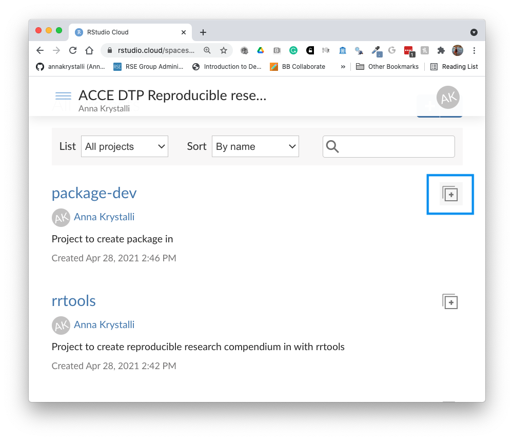
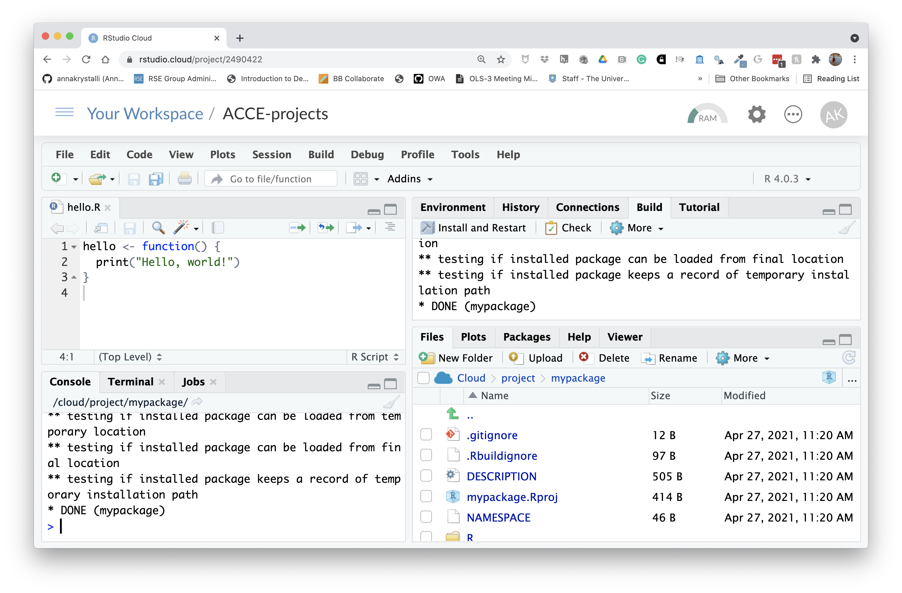
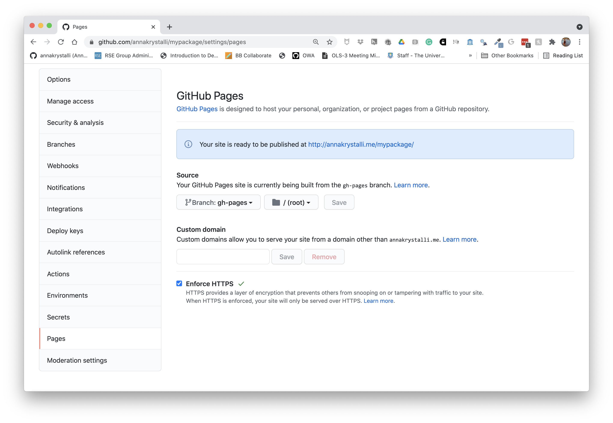
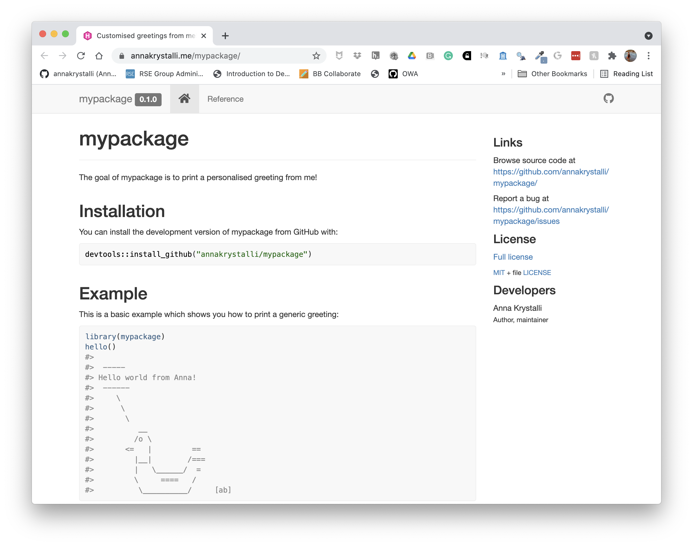
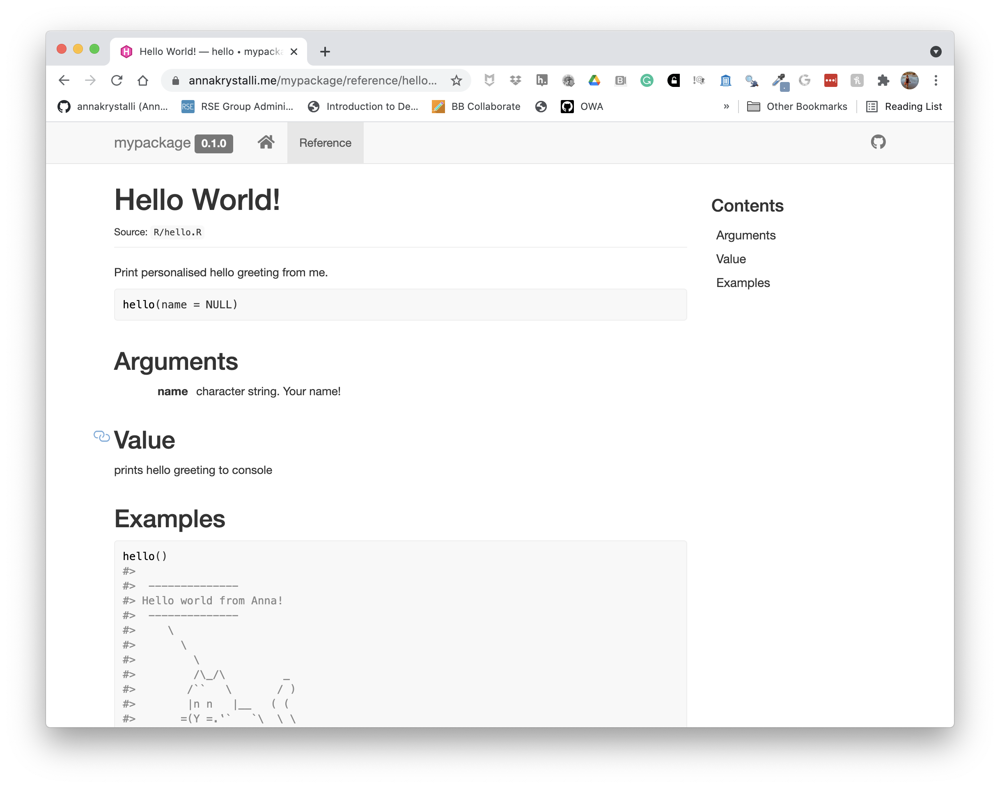

# Packaging functionality

## R Package Structure

Used to share functionality with the R community

- Useful **conventions**

- Useful **software development tools**

- Easy **publishing** through GitHub


## R Package conventions:

- **metadata**: in the **`DESCRIPTION` file**

- **functions** in **`.R` scripts** in the **`R/` folder**

- **tests** in the **`tests/` folder**

- **Documentation:**
    - _functions_ using **Roxygen notation**
    - _workflows_ using **`.Rmd` documents** in the **`vignettes/`** folder


## Software Engineering approach

Following conventions allows us to **make use of automated tools** for:

- **Checking** and **testing code**

- **Producing documentation** for code and workflows

- **Publishing, distributing** and **citing** code


## Anatomy of an R package

Let's use [`pkgreviewr`](https://github.com/ropensci-org/pkgreviewr), a package I authored to help automate some aspects of the rOpenSci review process, as an example to examine some elements of what makes a package:

## `DESCRIPTION` file

Capture metadata around the package
- Functionality description
- Creators
- License


```
Package: pkgreviewr
Type: Package
Title: rOpenSci package review project template
Version: 0.1.1
Authors@R: c(person("Anna", "Krystalli", email = "annakrystalli@googlemail.com",
                  role = c("aut", "cre")),
             person("Maëlle", "Salmon", email = "maelle.salmon@yahoo.se", role = "aut"))
Description: Creates files and collects materials necessary to complete an rOpenSci package review. 
    Review files are prepopulated with review package specific metadata. Review package source code is
    also cloned for local testing and inspection.
License: GPL-3 + file LICENSE
URL: https://github.com/ropenscilabs/pkgreviewr
BugReports: https://github.com/ropenscilabs/pkgreviewr/issues
Encoding: UTF-8
LazyData: true
Imports:
    devtools,
    git2r (>= 0.23.0),
    usethis (>= 1.2.0),
    here,
    reprex,
    gh,
    base64enc,
    whoami,
    magrittr,
    covr,
    goodpractice,
    assertthat,
    httr,
    rstudioapi,
    clipr,
    clisymbols,
    crayon,
    dplyr,
    glue,
    fs,
    urltools,
    shiny
Suggests: 
    testthat,
    mockery,
    knitr,
    rmarkdown
RoxygenNote: 6.1.1
Remotes: 
    ropensci/git2r
VignetteBuilder: knitr
Roxygen: list(markdown = TRUE)

```


### citation

```{r}
citation("pkgreviewr")
```


## Dependency management


It’s the job of the DESCRIPTION to **list the packages that your package needs to work**.

```
Imports:
    devtools,
    git2r (>= 0.23.0),
    usethis (>= 1.2.0),
    here,
    reprex,
    gh,
    base64enc,
    whoami,
    magrittr,
    covr,
    goodpractice,
    assertthat,
    httr,
    rstudioapi,
    clipr,
    clisymbols,
    crayon,
    dplyr,
    glue,
    fs,
    urltools,
    shiny
```
Imports are necessary dependencies for the functions in your package to work
```
Suggests: 
    testthat,
    mockery,
    knitr,
    rmarkdown
```
Suggests are dependencies that are not necessary for the functions in your package but might be neccessary to run all the vignettes or tests in your package


## `R/`

- Keep all functions in R scripts in `R/` folder

```
.
├── github.R
├── pkgreview.R
├── pkgreviewr-package.R
├── render-templates.R
├── rmd-utils.R
├── style.R
└── utils.R

0 directories, 7 files
```


### example function script

Create a new function `.R` file in the `R/` folder
```{r, eval=FALSE}
library(usethis)
use_r("add")
```

```
R
└── add.R

0 directories, 1 files
```


## Document functions with `Roxygen`

- Document functions with **Roxygen** notation
- Automatically create help files on build

```{r}
#' Add together two numbers.
#' 
#' @param x A number.
#' @param y A number.
#' @return The sum of x and y.
#' @examples
#' add(1, 1)
#' add(10, 1)
add <- function(x, y) {
  x + y
}
```


## `tests/`

Tests provide confidence in what the code is doing.

_Contents of `pkgreviewr` test folder_

```
.
├── testthat
│   ├── setup.R
│   ├── test-create-pkgreview.R
│   ├── test-gh-calls.R
│   ├── test-render-templates.R
│   └── test-setup.R
└── testthat.R

1 directory, 6 files
```


### Example test


 
```{r, eval=FALSE}
use_test("add")
```


```
tests
├── testthat
│   ├── test-add.R
└── testthat.R
```

```{r, eval=FALSE}
test_that("add works", {
  expect_equal(add(2, 2), 4)
})
```


The **R package structure** can help with providing a logical organisation of files, by **providing a set of standard locations for certain types of files**.

To work with packages in RStudio we use the **Build pane**, which includes a variety of tools for **building, documenting and testing packages**. This will appear if Rstudio recognises the project as an R package.


## `r emo::ji("computer")`Create your first package

Let's go ahead and create our first package! 

We can do that as we would any project, but this time we would select **`R package`** instead of `New Project` and call our new package `mypackage`.

<div class="alert alert-info"><strong>File > New Project... > New Directory > R package > mypackage </strong></div>

Otherwise, we can **use function `usethis::create_package("mypackage")`** to create a new package. The argument we provide is the path to here we want our new package created, the **last element being the package name**. Note that there are [restrictions on what characters can be used in a package name](https://r-pkgs.org/workflows101.html#naming).

To do this in Rstudio Cloud (which is a bit fiddlier) we will create a general project in which we will create our package project. In general, creating a project within a project is bad practice and you should avoid this when working locally, but given the more restrictive nature of working in Rstudio cloud, we will break this general best practice rule.


### Copy **package-dev** Project

In our shared space click on the `r icons::fontawesome("plus-square")` copy button next to the **package-dev** Project.

```{r, echo=FALSE}

```

Click on `r icons::fontawesome("plus-square")` **Save a permanent copy**. You now have a personal copy of the project.


### Create package

Create your package development project within the **ACCE-projects** project:

```{r, eval=FALSE}
usethis::create_package("mypackage")
```


Your new project should have the following structure. The build pane should also be visible.

```
.
├── DESCRIPTION
├── NAMESPACE
├── R
└── mypackage.Rproj
```
```{r}
knitr::include_graphics("assets/r_package_rstudio-cloud.png")
```

## Initialise git and commit files.

Let's also initialise our project as a git repository and commit our initial files. We'll need to configure git again as this is a new Rstudio cloud project.

```{r, eval=FALSE}
# configure git
use_git_config(user.name = "Jane",
               user.email = "jane@example.org")
# intialise git and commit
usethis::use_git()
```


## `r emo::ji("vertical_traffic_light")` Functions in the **`R/`** dir

### Create function script and first function

Let's create a script and write our first function:

```{r, eval=FALSE}
usethis::use_r("hello")
```

```r
✓ Setting active project to '/cloud/project/mypackage'
• Modify 'R/hello.R'
• Call `use_test()` to create a matching test file
```

```{r, echo=FALSE}
knitr::include_graphics("assets/r_hello.png")
```

In the opened `hello.R` script, let's write our first function:

```{r, eval=TRUE}
hello <- function() {
  print("Hello, world!")
}
```

It's a function that takes no arguments and prints `Hello, world!` to the console when called. 


### Install package.

You can install a package locally from it's source code with function `devtools::install()`

```{r, eval=FALSE}
devtools::install()
```

```
✓  checking for file ‘/cloud/project/mypackage/DESCRIPTION’ ...
─  preparing ‘mypackage’:
✓  checking DESCRIPTION meta-information ...
─  checking for LF line-endings in source and make files and shell scripts
─  checking for empty or unneeded directories
─  building ‘mypackage_0.0.0.9000.tar.gz’
   
Running /opt/R/4.0.3/lib/R/bin/R CMD INSTALL \
  /tmp/RtmpVciSpz/mypackage_0.0.0.9000.tar.gz \
  --install-tests 
* installing to library ‘/home/rstudio-user/R/x86_64-pc-linux-gnu-library/4.0’
* installing *source* package ‘mypackage’ ...
** using staged installation
** R
** byte-compile and prepare package for lazy loading
** help
No man pages found in package  ‘mypackage’ 
*** installing help indices
** building package indices
** testing if installed package can be loaded from temporary location
** testing if installed package can be loaded from final location
** testing if installed package keeps a record of temporary installation path
* DONE (mypackage)
```

You can now load it like any other package...

```{r, eval=FALSE}
library("mypackage")
```

Let's try using our function

```{r, eval=FALSE}
hello()
```

Oooops? Our function doesn't seem to be available! `r emo::ji("thinking")`

Let's try something  else:

```{r, eval=FALSE}
mypackage:::hello()
```

```{r, echo=FALSE}
hello()
```

```{r, echo=FALSE}
rm(hello)
```


So what's happened here? Although the  package contains our function, we have not **exported** to make available to a user. Currently it is contained as an **internal function**. Hence we can access it with the notation for internal functions (`:::`) but not directly when we load the package!

To export the function, we will need to add a tag to tell R to do so using a special documentation notation called **Roxygen**!

***

## `r emo::ji("vertical_traffic_light")` Roxygen documentation


[`Roxygen2`](http://r-pkgs.had.co.nz/man.html) allows you to write specially-structured comments preceeding each function definition to document:

- the inputs and outputs
- a description of what it does
- an example of how to use it
- whether to export the function

These are processed automatically to produce `.Rd` help files for your functions and control which functions are exported to the package `NAMESPACE`.

Let's document our example function.

### Insert Roxygen skeleton

You can insert a Roxygen skeleton by placing the curson with a function and clicking:

> **Code > Insert Roxygen Skeleton**

```{r, eval=FALSE}
#' Title
#'
#' @return
#' @export
#'
#' @examples
hello <- function() {
  print("Hello, world!")
}

```

#### Roxygen basics

- `roxygen` notation indicated by **beginning line with `#'`**.

- **First line** will be the **title** for the function.

-  After title, include a blank `#'` line and then write a **longer description.**

- `@param argument_name` **description of the argument.**

- `@return` description of **what the function returns.**

- `@export` tells `Roxygen2` to **add this function to the `NAMESPACE`** file, so that it will be **accessible to users.** 
- `@examples` allows to include example of how to use a function


### Complete Roxygen documentation

```{r}
#' Hello World! 
#'
#' Print hello greeting
#' @return prints hello greeting to console
#' @export
#'
#' @examples
#' hello()
hello <- function() {
  print("Hello, world!")
}

```

### Autogenerate documentation

Use function `devtools::document()` to create documentation. This re-creates a `hello.Rd` helpfile in the `man/` folder and populates the `NAMESPACE` with our functions

```{r, eval=FALSE}
devtools::document()
```

Click **`r icons::fontawesome("hammer")` Install and Restart** to re-install the package and make the documentation available.


```{r, echo=FALSE}

```


You can configure your build tools in the **Global Options** (accessed through the build panel under **More > Configure Build Tools**) to automatically build documentation every time you click **`r icons::fontawesome("hammer")` Install & Rebuild**


Now clicking **`r icons::fontawesome("hammer")` Install & Restart** will also build your docs in the `man/` folder for you.

## `r emo::ji("vertical_traffic_light")` Personalise function

Let's go a step further and customise our function so that the greeting is from ourselves!

```{r, tidy="styler"}
#' Hello World!
#'
#' Print hello greeting
#' @return prints hello greeting to console from me
#' @export
#'
#' @examples
#' hello()
hello <- function() {
  print("Hello, world from Anna")
}
```


## Add some fun!

Programming is most useful for having fun. So let's make our function extra fun!

We'll use package `cowsay`

```{r, eval=FALSE}
install.packages("cowsay")
```

which has a single function `say`, which does this...

```{r}
cowsay::say("Say whaaaaaat?", by = "shark")
```

`r emo::ji("stuck_out_tongue_winking_eye")`

So let's create a function that randomly chooses one of the animals available in `cowsay` to deliver the greeting, and also allow the user to customise who the recipient of the greeting is

```{r}
#' Hello World!
#'
#' Print personalised hello greeting from me.
#'
#' @param name character string. Your name!
#'
#' @return prints hello greeting to console
#' @export
#'
#' @examples
#' hello()
#' hello("Lucy Elen")
hello <- function(name = NULL) {
    
    # create greeting
    if(is.null(name)){name <- "world"}
    greeting <- paste("Hello", name, "from Anna!")

    # randomly sample an animal
    animal_names <- names(cowsay::animals)
    i <- sample(1:length(animal_names), 1)

    cowsay::say(greeting, animal_names[i])
}
```

Document, Install and restart to load our changes

```{r}
hello("y'all")
```

Let's commit our current files and changes.

## `r emo::ji("vertical_traffic_light")` Check package integrity

An **important part of the package development process is `R CMD check`**. `R CMD check` automatically **checks your code** and can **automatically detects many common problems** that we'd otherwise discover the hard way.

To check our package, we can:

- use `devtools::check()` 

- press Ctrl/Cmd + Shift + E

- click on the `r emo::ji("check")`**Check** tab in the **Build** panel. 

This:

* **Ensures that the documentation is up-to-date** by running 
  `devtools::document()`.

* **Bundles the package** before checking it. 

More info on [checks](http://r-pkgs.had.co.nz/check.html) here.

<br>

Both these run `R CMD check` which **return three types of messages**:

- **ERRORs**: Severe problems that you should fix regardless of whether or not you’re submitting to CRAN.

- **WARNINGs**: Likely problems that you must fix if you’re planning to submit to CRAN (and a good idea to look into even if you’re not).

- **NOTEs**: Mild problems. If you are submitting to CRAN, you should strive to eliminate all NOTEs, even if they are false positives.


Let's **Check** our package:


Click on the **Check** button (`r emo::ji("clipboard")` `r emo::ji("white_check_mark")`)

```
   
── R CMD check results ──────────────────────────────────── mypackage 0.1.0 ────
Duration: 8.4s

❯ checking DESCRIPTION meta-information ... WARNING
  Non-standard license specification:
    What license is it under?
  Standardizable: FALSE

❯ checking dependencies in R code ... WARNING
  '::' or ':::' import not declared from: ‘cowsay’

0 errors ✔ | 2 warnings ✖ | 0 notes ✔
Error: R CMD check found WARNINGs
Execution halted

Exited with status 1.
```

Aha, so our checks have thrown up some warnings! First, it's telling us we haven't added a `LICENSE`. It's also telling us that we have a dependency (import) from package `cowsay` which we haven't documented in the `DESCRIPTION` file. `usethis` to the rescue!

## `r emo::ji("vertical_traffic_light")` Add dependencies

Add `cowsay` as a dependency.

```{r, eval=FALSE}
usethis::use_package("cowsay")
```

```
✔ Setting active project to '/Users/Anna/Desktop/mypackage'
✔ Adding 'cowsay' to Imports field in DESCRIPTION
● Refer to functions with `cowsay::fun()`
```


## Add License

```{r, eval = FALSE}
usethis::use_mit_license("Anna Krystalli")
```


Check again...All should be good!

```
── R CMD check results ──────────────────────────────────── mypackage 0.1.0 ────
Duration: 9.3s

0 errors ✔ | 0 warnings ✔ | 0 notes ✔

R CMD check succeeded
```

Let's commit our current files and changes.

***

## `r emo::ji("vertical_traffic_light")` Add Test

**Testing is a vital part of package development**. It ensures that our code does what you want it to do. 

Once you're set up with a testing framework, the workflow is simple:

1.  Modify your code or tests.

2.  Test your package with Ctrl/Cmd + Shift + T or `devtools::test()`.

3.  Repeat until all tests pass.

## create test file

To create a new test file (and the testing framework if required), use function
`usethis::use_test()`. It's good practice to name the test files after the `.R` files containing the functions being tested.

```{r, eval=FALSE}
use_test("hello")
```

```r
✔ Setting active project to '/Users/Anna/Documents/workflows/workshops/materials/mypackage'
✔ Adding 'testthat' to Suggests field in DESCRIPTION
✔ Creating 'tests/testthat/'
✔ Writing 'tests/testthat.R'
✔ Writing 'tests/testthat/test-hello.R'
● Modify 'tests/testthat/test-hello.R'
```

This just created the following folders and files
```
tests
├── testthat
│   └── test-hello.R
└── testthat.R

1 directory, 2 files
```
It also added `testthat` to the suggested packages in the `DESCRIPTION` file. 

```
Suggests: 
    testthat
```
That's because you don't need test that to run the functions in `mypackage`, but you do 
if you want to run the tests.

When the tests are run (either through running `devtools::test()`, clicking on **More > Test Package** in the Build panel or `Cmd/Ctrl + Shift + T`), the code in each test script in directory `testthat` is run.

**`test-hello.R`**

Let's load the library so we can explore the `testthat` testing framework

```{r, message=FALSE}
library(testthat)
```


```{r}
test_that("multiplication works", {
  expect_equal(2 * 2, 4)
})

```


If the test doesn't pass it throws an error

```{r, error=TRUE}
test_that("multiplication works", {
  expect_equal(2 * 2, 5)
})

```

## Write test

Let's write a simple test to check that we are getting an expected output type. The first thing to note, looking at the `say()` documentation is that it takes an argument `type` which allows us to specify the output we want. It defaults to `NULL` which means the output of the function is just sent to the console without  producing an assignable output.

We can therefore use `testthat::expect_null()`. We'll also suppress the printed output of the function so that we don't pollute our testing logs.

```{r, error=TRUE}
test_that("hello works", {
  expect_null(suppressMessages(hello()))
})

```

Now let's test our package

```{r, eval=FALSE}
devtools::test()
```

Success!

```
==> devtools::test()

Loading mypackage
Testing mypackage
✔ | OK F W S | Context
✔ |  1       | test-hello

══ Results ════════════════════════════════════════════════════════
OK:       1
Failed:   0
Warnings: 0
Skipped:  0
```

Let's commit our current files and changes.

## `r emo::ji("vertical_traffic_light")` Create README

The final document you will need for your package is a `README`.

```{r, eval=FALSE}
usethis::use_readme_rmd()
```

```
✔ Writing 'README.Rmd'
✔ Adding '^README\\.Rmd$' to '.Rbuildignore'
● Modify 'README.Rmd'
✔ Writing '.git/hooks/pre-commit'
```

Because it's an `.Rmd` but GitHub can only display an `md` document as it's landing page, this is a special `.Rmd` that renders to a markdown document rather than `html`.  The function adds a check to `.git` to ensure you commit an up to date version on the `md` when you commit changes to the `.Rmd`.

Complete the README, including an example. Here's what mine looks like:

```{r}
knitr::include_graphics("assets/mypackage-readme.png")
```

Let's commit our current files and changes.

## `r emo::ji("vertical_traffic_light")` Complete package metadata


Let's head to the `DESCRIPTION` file and complete the details.

## Authors


First let's complete the authors. Remove the current author and maintainer lines and replace it with the following line:

```
Authors@R: person("First", "Last", email = "first.last@example.com", role = c("aut", "cre"))
```
completed with your own details

## Add a title and description

Complete the title and description fields with appropriate details. If you want to form a paragraph of text, make sure do indent the hanging lines by 4 spaces (one tab). And make sure that your Description field **ends in a full-stop**.

## Add a date

Use today's date in ISO format, ie **`r config::get('pkgdev_date_iso')`**. This will populate a citation entry for us.

### Completed `DESCRIPTION`

The complete `DESCRIPTION` file should look something like this:

```
Package: mypackage
Title: Customised greetings from me!
Version: 0.1.0
Authors@R: person("Anna", "Krystalli", 
  email = "annakrystalli@googlemail.com", 
  role = c("aut", "cre"))
Description: Prints a customised greeting from myself, 
    delivered by a friend.
License: MIT + file LICENSE
Encoding: UTF-8
LazyData: true
Roxygen: list(markdown = TRUE)
RoxygenNote: 7.1.1
Imports: 
    cowsay
Suggests: 
    testthat (>= 3.0.0)
Config/testthat/edition: 3
URL: https://github.com/annakrystalli/mypackage
BugReports: https://github.com/annakrystalli/mypackage/issues
Date: 2021-05-07
```

Check your package. If all is good, document, install and restart!

Now, check you're package's citation:

```{r, eval=FALSE}
citation("mypackage")
```

```
To cite package ‘mypackage’ in publications use:

  Anna Krystalli (2021). mypackage: Customised greetings from me!. R
  package version 0.1.0.

A BibTeX entry for LaTeX users is

  @Manual{,
    title = {mypackage: Customised greetings from me!},
    author = {Anna Krystalli},
    year = {2021},
    note = {R package version 0.1.0},
  }
```
Let's commit our current files and changes.

## Create GitHub repo and push to GitHub

Now you have everything you need to share your package on GitHub so create a GitHub repository and push our local content up to it. 

You will need to set up `gitcreds` again in this new project!

```{r, eval=FALSE}
# configure GitHub PAT credentials
gitcreds::gitcreds_set()

# create GitHub repository and push
usethis::use_github(protocol = "https")
```
Anyone will be able to install it using, eg:

```{r, eval=FALSE}
devtools::install_github("annakrystalli/mypackage")
```

Add the link to your package repo in the [hackpad](`r config::get("hackpad_url")`). Visit someone else's package repo, follow the instructions to install, load it and receive a personalised greeting from the author!

## Setup Continuous Integration with  GitHub Actions

Continuous integration (CI) is the practice of automating the integration of code changes from multiple contributors into a single software project.  Automated tools are used to assert the new code’s correctness before integration. In our case this is what are tests are for. And GitHub Actions allows us to do this all within GitHub!

Once the appropriate CI workflow is set up, it will automatically run our tests for us every time we push new code to GitHub or when a new pull request is made. This way we can (try to) ensure we don't merge new code into our code base that introduces bugs (cause our tests to fail). Obviously, our ability to screen for breaking changes is only as good as our testing framework! But atleast we can get GitHub to run our tests for us!

To run CI workflows through GitHub Actions, we specify the actions or jobs we want the CI system in a `.yaml` file that lives in `.github/workflows/` folder in the root of our package/project. This can be quite complicated for complex projects as you have to effectively specify instructions for GitHub to recreate a computational environment to run the tests in. The `.yaml` format can also be fiddly, with indents having special meaning. However for a simple projects like ours, there is a `usethis` functions that can create and appropriate `.yaml` for us that works right out of the box!

Let's try it out:

```{r, eval=FALSE}
usethis::use_github_action_check_release()
```

```
✓ Creating '.github/'
✓ Adding '^\\.github$' to '.Rbuildignore'
✓ Adding '*.html' to '.github/.gitignore'
✓ Creating '.github/workflows/'
✓ Writing '.github/workflows/R-CMD-check.yaml'
• Learn more at <https://github.com/r-lib/actions/blob/master/examples/README.md✓ Adding R-CMD-check badge to 'README.Rmd'
• Re-knit 'README.Rmd'
```

This workflow installs the latest release of R on macOS and runs R CMD check via the `rcmdcheck` package.

```{r, eval=FALSE, code=readLines("https://raw.githubusercontent.com/r-lib/actions/master/examples/check-release.yaml"), results="asis"}

```


- Re-knit  `README.Rmd` to include GitHub Actions badge.
- Commit the whole `.github` folder as well as `README.Rmd` & `README.md`
- Push to GitHub

This will activate the `R-CMD-CHECK` GitHub Actions workflow and begin running it. 

To see details and the status of GitHub Actions workflows, click on the **`r icons::fontawesome("play-circle")` Actions** tab and select the workflow to view. If our test passes, the run will show as successful `r emo::ji("white_check_mark")` and so will the badge in our README. If there are any problems, error messages will appear in the logs.

```{r, echo=FALSE}
knitr::include_graphics("assets/ga-r-cmd-check-success.png")
```


## `r emo::ji("vertical_traffic_light")` Create documentation site


While the README is a great first step for documenting your package, there is an easy way to create a full website which makes the documentation of each exported function avaliable online and where you could include additional, more detailed vignettes.

You can use package `pkgdown` to create an online site for your documentation. It effectively recycles the documentation you have already created for your functions, information in your README and DESCRIPTION file and presents it in a standardised website form.

Let's create such a site for our package.


```{r, eval=FALSE}
pkgdown::build_site()
```

```
══ Building pkgdown site ════════════════════════════════════════════
Reading from: '/Users/Anna/Documents/workflows/dummy/mypackage'
Writing to:   '/Users/Anna/Documents/workflows/dummy/mypackage/docs'
── Initialising site ────────────────────────────────────────────────
Copying '../../../../../../Library/Frameworks/R.framework/Versions/3.5/Resources/library/pkgdown/assets/docsearch.css' to 'docsearch.css'
Copying '../../../../../../Library/Frameworks/R.framework/Versions/3.5/Resources/library/pkgdown/assets/docsearch.js' to 'docsearch.js'
Copying '../../../../../../Library/Frameworks/R.framework/Versions/3.5/Resources/library/pkgdown/assets/link.svg' to 'link.svg'
Copying '../../../../../../Library/Frameworks/R.framework/Versions/3.5/Resources/library/pkgdown/assets/pkgdown.css' to 'pkgdown.css'
Copying '../../../../../../Library/Frameworks/R.framework/Versions/3.5/Resources/library/pkgdown/assets/pkgdown.js' to 'pkgdown.js'
── Building home ────────────────────────────────────────────────────
Writing 'authors.html'
Reading 'LICENSE.md'
Writing 'LICENSE.html'
Writing 'LICENSE-text.html'
Reading 'README.Rmd'
Writing 'index.html'
── Building function reference ──────────────────────────────────────
Updating mypackage documentation
Writing NAMESPACE
Loading mypackage
Writing NAMESPACE
Writing 'reference/index.html'
Loading mypackage
Reading 'man/hello.Rd'
Writing 'reference/hello.html'
══ DONE ═════════════════════════════════════════════════════════════
── Previewing site ──────────────────────────────────────────────────
```

This creates html documentation for our package in the `docs/` folder and presents you with a preview to the site. 

Now, you could push this `docs/` folder to GitHub and serve through GitHub Pages, but you would need to rebuild, commit and push these docs anytime there was a change in the package documentation.

Instead what we could do is get our CI system (GitHub Actions) to build our docs for us automatically every time there is a push or pull request to our repository!! So let's try this approach!

First, let's tell git to ignore local copies of the docs in our `docs/` folder by adding `docs/*` to our `.gitignore` file. This way, we can still build and preview our site locally if we want but we won't commit it to our`master` or  `main` branch.

Then, we can deploy another GitHub Actions template, provided by `usethis` that again will work right out the box!

```{r, eval=FALSE}
usethis::use_github_action("pkgdown")
```
```
✓ Setting active project to '/cloud/project/mypackage'
✓ Writing '.github/workflows/pkgdown.yaml'
• Learn more at <https://github.com/r-lib/actions/blob/master/examples/README.md>
```

This creates another file in `.github/workflows/` called `pkgdown.yaml`. The workflow installs the package, building all documentation, installs `pkgdown` and uses it to build the site. It then commits the build site to a separate `gh-pages` site.


```{r, eval=FALSE, code=readLines("https://raw.githubusercontent.com/r-lib/actions/master/examples/pkgdown.yaml"), results="asis"}

```

Coomit the file and push it up to GitHub to activate. Once the workflow completes successfully, you will find the html for your documentation for you site in a new `gh-pages` branch!

### Enable `gh-pages`

To serve our new site, we need to enable GitHub Pages and set the source directory to the root of the `gh-pages` branch. To do so we go to **`r icons::fontawesome("cog")` Settings** and click on **Pages** on the navigation bar on the left. Also remember to click on **Enforce HTTPS**.

```{r, echo=FALSE}

```

Once set, the URL at which your pkdown docs are being served will appear. You can copy that and add it to your repo details. 


```{r, echo=FALSE}

```

```{r, echo=FALSE}

```


Check out my complete example [here](https://github.com/annakrystalli/mypackage-demo)
