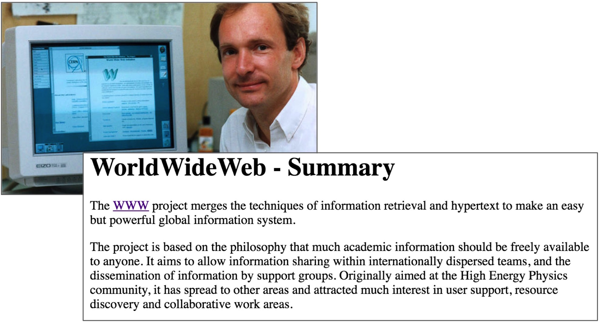

class: inverse

# Welcome

***

## Resources
### Course Materials 

#### [`r stringr::str_remove(params$bitly_url, "https://")`](`r params$bitly_url`)


### Course Collaborative Notepad 
#### [`r stringr::str_remove(params$hackpad_url, "https://")`](`r params$hackpad_url`)

_Please **Sign In** on the Notepad_

---
class: top, left, inverse


## ACCE DTP 

### _`r params$course_title`_

***

.bottom[
# `r params$slide_title`

<br>

**`r glue::glue('{icons::fontawesome("calendar")} {params$date}')`**
<br>

**`r glue::glue('{icons::fontawesome("map-pin")} {params$location}')`** 
]

---

# `r emo::ji("wave")` Hello

### me: Dr Anna Krystalli

- **Research Software Engineer**, _University of Sheffield_
    + twitter **@annakrystalli**
    + github **@annakrystalli**
    + email **a.krystalli[at]sheffield.ac.uk**
    
- **Editor [rOpenSci](http://onboarding.ropensci.org/)**

- **Co-organiser:** [Sheffield R Users group](https://www.meetup.com/SheffieldR-Sheffield-R-Users-Group/)

--
## Course support

Also here: **Bob Turner**, fellow Sheffield RSE

---
class: inverse

# Ice Breaker

<br>

### Split into break out rooms

### Introduce yourselves

### Q: Why did you decide to join this course?


---
class: top, right, inverse

# Why are we here?

***

---

### The paper is the advertisement


> “an article about computational result is advertising, not scholarship. The actual scholarship is the **full software environment, code and data, that produced the result.**”

*John Claerbout paraphrased in [Buckheit and Donoho (1995)](https://statweb.stanford.edu/~wavelab/Wavelab_850/wavelab.pdf)*

--

### [The Scientific Paper Is Obsolete](https://www.theatlantic.com/science/archive/2018/04/the-scientific-paper-is-obsolete/556676/)
Here's what's next

*<small>APR 5, 2018, The Atlantic</small>*


---
### Lessons from the Reproducibility/Replicability crisis

- Many issues statistical and a results of broken Academic incentive systems.

- Much can be tackled by transparency and better computational literacy.


---

### [Reproducible Research in Computational Science](http://science.sciencemag.org/content/334/6060/1226)
ROGER D. PENG, SCIENCE 02 DEC 2011 : 1226-1227

> Reproducibility has the potential to serve as a minimum standard for judging scientific claims when full independent replication of a study is not possible.


---

## Reinventing discovery by open sourcing science

_Nielsen, Michael. Reinventing Discovery: The New Era of Networked Science. Princeton University Press, 2012. JSTOR, www.jstor.org/stable/j.ctt7s4vx._

.pull-left[
- Sharing resources
- Collective intelligence
- Mass collaboration
]

.pull-right[

]
---
## The internet was built for open science

### Key to next generation networked science


```{r, echo=FALSE, out.width="70%"}
knitr:::
```


---
class: top, right, inverse

# **The grand vision**

---

### Hans Rosling on open data (and data science) back in 2006

.center[
<iframe width="470" height="250" src="https://goo.gl/ry6AiG" frameborder="0" allowfullscreen></iframe>
]

> So how far have we come?

---
class: inverse

## gapminder.org: today

#### liberating stories from data

### www.gapminder.org


---

## gapmider at our fingertips

```{r, fig.show = "animate", message=FALSE, warning=FALSE}
library(ggplot2)

p <- ggplot(gapminder::gapminder, 
            aes(gdpPercap, lifeExp, size = pop, 
                color = continent, frame = year)) +
  geom_point() + scale_x_log10() + theme_bw()
```

```{r, message=FALSE, warning=FALSE, fig.height=4}
plotly::ggplotly(p)
```

---
class: top, right, inverse

# How do we get there?

***
---

## **Research meta-responsibilities**

We need better digital curation of the workhorses of modern science: **code** & **data**


> **aim to create secure materials that are [FAIR](https://www.nature.com/articles/sdata201618)**
> *findable, accessible, interoperable, reusable*

```{r, echo=FALSE, out.width="70%"}
knitr::include_graphics("assets/FAIRPrinciples.jpg")
```

---

## **Research meta-responsibilities**

***

.pull-left[

- #### Think about traceablility and provencance.

- #### Follow community conventions.

- #### Prepare it to share it.

]
.pull-right.center[

### We all need to do our bit!

```{r, echo=FALSE}
knitr::include_graphics("assets/CultureShift.jpg")
```

]

---

## **Drivers of better digital management**


- Funders: value for money, impact, reputation

- Publishers: many now require code and data.
    + Specialist journals have emerged for:
      + **software**: [Journal of Open Source Software](http://joss.theoj.org/), [MEE](https://besjournals.onlinelibrary.wiley.com/journal/2041210x) 
      + **data**: [Scientific Data](https://www.nature.com/sdata/))
 
- PIs, Supervisors and immediate research group   

- Your wider scientific community

- The public


---

## **Yourselves!**

**Be your own best friend:**

.center[]


---

### **Ultimately it's about getting a handle on our research materials**

> "Agree on a community convention...then follow it""


.centre[
```{r, echo=FALSE, out.width="70%"}

```

]

---

## The concept of a Research Compendium
.pull-left[

>“
...We introduce the concept of a compendium
as both a container for the different elements
that make up the document and its computations (i.e. text, code, data, ...), and as a means for distributing, managing and updating the
collection."

[_Gentleman and Temple Lang, 2004_](https://biostats.bepress.com/bioconductor/paper2/)
]

.pull-right[

.centre[
```{r, echo=FALSE, out.width="50%"}
knitr::include_graphics("assets/ResearchCompendium.jpg")
```

]

]

---

```{r, echo=FALSE, out.width="90%"}

```


[_Kartik Ram: rstudio::conf 2019 talk_](https://github.com/karthik/rstudio2019)

---

```{r, echo=FALSE, out.width="90%"}
knitr::include_graphics("assets/reproducible-data-analysis-04.png")
```


[_Kartik Ram: rstudio::conf 2019 talk_](https://github.com/karthik/rstudio2019)

---

## R + Rstudio

### Next generation data science powerhouse

--

#### Backed by a diverse and active community of learners, users and developers


---

## Back to "Why are we here?"

- To show you howto use R + Rstudio to perform reproducible data analyses.

--

- To help you make the most of the real workhorses of your work, **YOUR CODE & DATA**!

--

- To help you be empowered by modern tools & technologies rather than be overwhelmed by them

--

- To help you lead the culture change rather than be burdened by increased requirements

--

- Ultimately, to **change how science works for better for everyone**!

---

- We'll do this by introducing you to **useful data and software tools and best practices**.

---

# Course Outline

.pull-left[
- ### Welcome


- ### Basics


- ### Project Management

- ### Data Munging
]

.pull-right[


- ### Metadata


- ### Analysing & presenting data


- ### Version Control

]

***

<br>

#### **We'll take regular breaks and aim to break for lunch between 12:00-13:00 for an hour**

---

# Before we dive in


- We'll exploring best practice in data and workflow management. I've tried to focus on concepts and tools that I wish I knew when I started

--

- We'll explore individual tools and concepts and show how they work nicely together.

--

- We'll be coding together and working in Rstudio Cloud. 


--

- Feedback: After each day, let me know on the notepad:
  - `r emo::ji("green_book")`: somethind you liked
  - `r emo::ji("red_circle")`: somethind that could be improved

--

- Please feel free to ask questions if I use jargon you don't understand or need some clarification.  Questions are helpful for everyone! `r emo::ji("sparkles")`

---


## Working in Blackboard collaborate

```{r, out.width="60%", echo=FALSE}

```


- Have your mic on mute by default

--

- Please enter questions relevant to the course in the Collaborative notepad under **Participant Questions**

--

- Please ask technical questions in the chat

--

- Please try to help each other!

--

- Use status reaction emojis to communicate how it's going

--

- If you need to get my attention while speaking, raise your hand!

---

# Let's go!


## Get back [home](`r params$book_url`)


