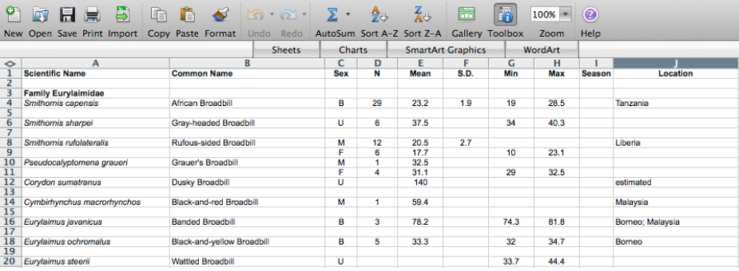
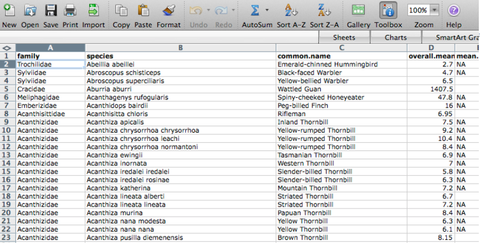
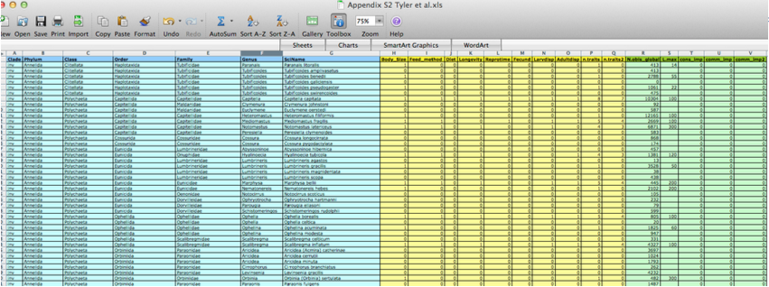
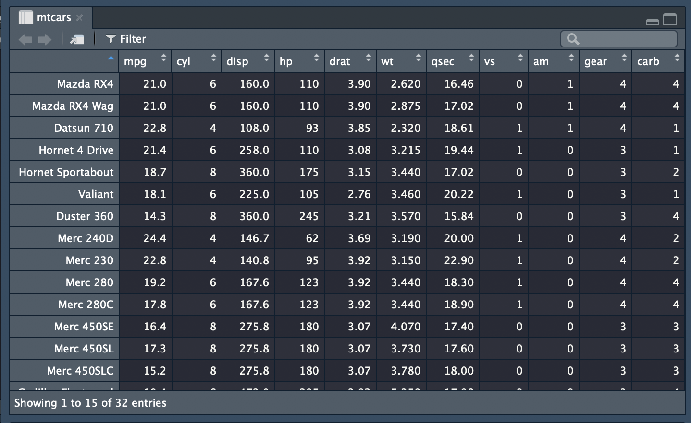
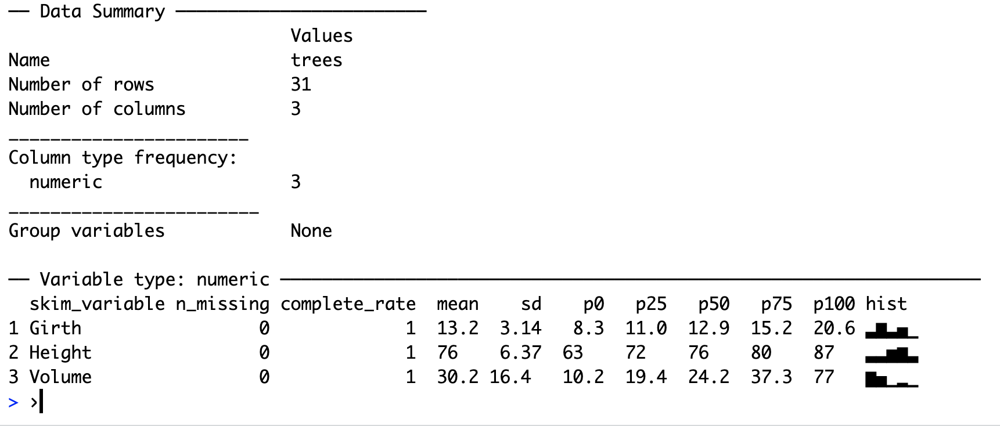

class: top, left, inverse


## ACCE DTP 

### _`r params$course_title`_

***

.bottom[
# `r params$slide_title`

<br>

**`r glue::glue('{icon::fontawesome("calendar")} {params$date}')`**
<br>

**`r glue::glue('{icon::fontawesome("map-pin")} {params$location}')`** 
]

---

# Start at the beginning

### **Plan your Research Data Management**

- **Start early**. Make an RDM plan before collecting data.
    - [**RDM checklist**](http://www.dcc.ac.uk/sites/default/files/documents/resource/DMP/DMP_Checklist_2013.pdf)

- Anticipate **data products** as part of your thesis **outputs**
- Think about what technologies to use

---

# Own your data

### **Take initiative & responsibility. Think long term.**


<blockquote class="twitter-tweet" data-conversation="none" data-lang="en"><p lang="en" dir="ltr">Act as though every short term study will become a long term one <a href="https://twitter.com/tomjwebb?ref_src=twsrc%5Etfw">@tomjwebb</a>. Needs to be reproducible in 3, 20, 100 yrs</p>&mdash; Oceans Initiative (@oceansresearch) <a href="https://twitter.com/oceansresearch/status/556107891610894337?ref_src=twsrc%5Etfw">January 16, 2015</a></blockquote>
<script async src="https://platform.twitter.com/widgets.js" charset="utf-8"></script>


<blockquote class="twitter-tweet" data-conversation="none" data-lang="en"><p lang="en" dir="ltr">Act as though every short term study will become a long term one <a href="https://twitter.com/tomjwebb">@tomjwebb</a>. Needs to be reproducible in 3, 20, 100 yrs</p>&mdash; oceans initiative (@oceansresearch) <a href="https://twitter.com/oceansresearch/status/556107891610894337">January 16, 2015</a></blockquote>
<script async src="//platform.twitter.com/widgets.js" charset="utf-8"></script>


---

class: top, right, inverse

# Data management

***

---
## Spreadsheets

### extreme but in many ways defendable

<blockquote class="twitter-tweet" data-conversation="none" data-lang="en"><p lang="en" dir="ltr"><a href="https://twitter.com/tomjwebb">@tomjwebb</a> stay away from excel at all costs?</p>&mdash; Timothée Poisot (@tpoi) <a href="https://twitter.com/tpoi/status/556107000950829056">January 16, 2015</a></blockquote>
<script async src="//platform.twitter.com/widgets.js" charset="utf-8"></script>

---

## **excel: `read/entry only`**

<blockquote class="twitter-tweet" data-conversation="none" data-cards="hidden" data-lang="en"><p lang="en" dir="ltr"><a href="https://twitter.com/tomjwebb">@tomjwebb</a> <a href="https://twitter.com/tpoi">@tpoi</a> excel is fine for data entry. Just save in plain text format like csv. Some additional tips: <a href="https://t.co/8fUv9PyVjC">pic.twitter.com/8fUv9PyVjC</a></p>&mdash; Jaime Ashander (@jaimedash) <a href="https://twitter.com/jaimedash/status/556113131932381185">January 16, 2015</a></blockquote>
<script async src="//platform.twitter.com/widgets.js" charset="utf-8"></script>

<blockquote class="twitter-tweet" data-conversation="none" data-lang="en"><p lang="en" dir="ltr"><a href="https://twitter.com/jaimedash">@jaimedash</a> just don’t let excel anywhere near dates or times.  <a href="https://twitter.com/tomjwebb">@tomjwebb</a> <a href="https://twitter.com/tpoi">@tpoi</a> <a href="https://twitter.com/larysar">@larysar</a></p>&mdash; Dave Harris (@davidjayharris) <a href="https://twitter.com/davidjayharris/status/556126474550263809">January 16, 2015</a></blockquote>
<script async src="//platform.twitter.com/widgets.js" charset="utf-8"></script>

---

## **Databases: more robust**

Stronger quality control features. Advisable for multiple contributors

<blockquote class="twitter-tweet" data-conversation="none" data-lang="en"><p lang="en" dir="ltr"><a href="https://twitter.com/tomjwebb">@tomjwebb</a> databases? <a href="https://twitter.com/swcarpentry">@swcarpentry</a> has a good course on SQLite</p>&mdash; Timothée Poisot (@tpoi) <a href="https://twitter.com/tpoi/status/556142573308608513">January 16, 2015</a></blockquote>
<script async src="//platform.twitter.com/widgets.js" charset="utf-8"></script>

<blockquote class="twitter-tweet" data-conversation="none" data-lang="en"><p lang="en" dir="ltr"><a href="https://twitter.com/tomjwebb">@tomjwebb</a> <a href="https://twitter.com/tpoi">@tpoi</a> if the data are moderately complex, or involve multiple people, best to set up a database with well designed entry form 1/2</p>&mdash; Luca Borger (@lucaborger) <a href="https://twitter.com/lucaborger/status/556226732496535552">January 16, 2015</a></blockquote>
<script async src="//platform.twitter.com/widgets.js" charset="utf-8"></script>

---

## **Databases: benefits** 

<blockquote class="twitter-tweet" data-conversation="none" data-lang="en"><p lang="en" dir="ltr"><a href="https://twitter.com/tomjwebb">@tomjwebb</a> Entering via a database management system (e.g., Access, Filemaker) can make entry easier &amp; help prevent data entry errors <a href="https://twitter.com/tpoi">@tpoi</a></p>&mdash; Ethan White (@ethanwhite) <a href="https://twitter.com/ethanwhite/status/556119480493813760">January 16, 2015</a></blockquote>
<script async src="//platform.twitter.com/widgets.js" charset="utf-8"></script>

<blockquote class="twitter-tweet" data-conversation="none" data-lang="en"><p lang="en" dir="ltr"><a href="https://twitter.com/ethanwhite">@ethanwhite</a> +1 Enforcing data types, options from selection etc, just some useful things a DB gives you, if you turn them on <a href="https://twitter.com/tomjwebb">@tomjwebb</a> <a href="https://twitter.com/tpoi">@tpoi</a></p>&mdash; Gavin Simpson (@ucfagls) <a href="https://twitter.com/ucfagls/status/556120176748290048">January 16, 2015</a></blockquote>
<script async src="//platform.twitter.com/widgets.js" charset="utf-8"></script>

---

<blockquote class="twitter-tweet" data-conversation="none" data-lang="en"><p lang="en" dir="ltr"><a href="https://twitter.com/tomjwebb">@tomjwebb</a> it also prevents a lot of different bad practices. It is possible to do some of this in Excel. <a href="https://twitter.com/tpoi">@tpoi</a></p>&mdash; Ethan White (@ethanwhite) <a href="https://twitter.com/ethanwhite/status/556119826582605824">January 16, 2015</a></blockquote>
<script async src="//platform.twitter.com/widgets.js" charset="utf-8"></script>


Have a look at the Data Carpentry [**SQL for Ecology** lesson](http://www.datacarpentry.org/sql-ecology-lesson/)

---

class: top, right, inverse

# Data formats

***

---


## **Data formats**

- **`.csv`**: *comma* separated values. 
- **`.tsv`**: *tab* separated values.
- **`.txt`**: no formatting specified.


<blockquote class="twitter-tweet" data-conversation="none" data-lang="en"><p lang="en" dir="ltr"><a href="https://twitter.com/tomjwebb">@tomjwebb</a> It has to be interoperability/openness - can I read your data with whatever I use, without having to convert it?</p>&mdash; Paul Swaddle (@paul_swaddle) <a href="https://twitter.com/paul_swaddle/status/556148166270406656">January 16, 2015</a></blockquote>
<script async src="//platform.twitter.com/widgets.js" charset="utf-8"></script>

#### **more unusual formats will need instructions on use.**

---

## **Ensure data is machine readable**

### bad


---

### bad


---

### good 


---

### ok



- could help data entry
- `.csv` or `.tsv` copy would need to be saved.

---

class: top, right, inverse

# Basic quality control

***

---


## **Use good null values**

### Missing values are a fact of life

- Usually, best solution is to **leave blank**
- **`NA`** or **`NULL`** are also good options
- **NEVER use `0`**. Avoid numbers like **`-999`**
- Don’t make up your own code for missing values


---

## [**`read.csv()`**](http://stat.ethz.ch/R-manual/R-devel/library/utils/html/read.table.html) **utilities**

- **`na.string`:** character vector of values to be coded missing and replaced with `NA` to argument eg
- **`strip.white`:** Logical. if `TRUE` strips leading and trailing white space from unquoted character fields 
- **`blank.lines.skip`:** Logical: if `TRUE` blank lines in the input are ignored.
- **`fileEncoding`:** if you're getting funny characters, you probably need to specify the correct encoding.

```{r, eval=FALSE}
read.csv(file, na.strings = c("NA", "-999"), strip.white = TRUE, 
         blank.lines.skip = TRUE, fileEncoding = "mac")
```

---

## [**`readr::read_csv()`**](https://cran.r-project.org/web/packages/readr/readr.pdf) **utilities**

- **`na`:** character vector of values to be coded missing and replaced with `NA` to argument eg
- **`trim_ws`:** Logical. if `TRUE` strips leading and trailing white space from unquoted character fields 
- **`col_types`:** Allows for column data type specification. ([see more](https://cran.r-project.org/web/packages/readxl/vignettes/cell-and-column-types.html))
- **`locale`:** controls things like the default time zone, encoding, decimal mark, big mark, and day/month names
- **`skip`:** Number of lines to skip before reading data.
- **`n_max`:** Maximum number of records to read.

```{r, eval=FALSE}
read_csv(file, col_names = TRUE, col_types = NULL, locale = default_locale(), 
         na = c("", "NA", "-999"), trim_ws = TRUE, skip = 0, n_max = Inf)
```

---


## Inspect

#### Have a look at your data with `View(df)`

```{r, eval=FALSE}
View(mtcars)
```




- Check **empty cells**

---
### Print

Check your **software interprets your data correctly** 
    - eg see top few rows with `head(df)` 

```{r}
head(mtcars)
```

---
### Structure
see structure of any object with `str()`.

```{r}
str(mtcars)
```


---

### Summarise

- Check the **range of values** (and value types) in each column matches expectation. 
- Check **units of measurement are what you expect**

```{r}
summary(mtcars)
```


---

### pkg [`skimr`](https://github.com/ropenscilabs/skimr)

`skimr` provides a frictionless approach to displaying summary statistics the user can skim quickly to understand their data

```{r, eval=FALSE}
install.packages("skimr")
```

---

```{r, message=FALSE, eval=FALSE}
skimr::skim(trees)
```

```{r, echo=FALSE}

```


---

## Validate

### pkg [`assertr`](https://github.com/ropensci/assertr)


The `assertr` package supplies a suite of functions designed to verify assumptions about data and can be used so detect data errors during analysis.

```{r, eval=FALSE}
install.packages("assertr")
```

e.g confirm that `mtcars`

- has the columns "mpg", "vs", and "am"
- contains more than 10 observations
- column for 'miles per gallon' (mpg) is a positive number
before further analysis:

```{r, eval=FALSE}
library(dplyr)
library(assertr)
mtcars %>%
    verify(has_all_names("mpg", "vs", "am", "wt")) %>%
    verify(nrow(.) > 10) %>%
    verify(mpg > 0)
```

---


class: top, right, inverse

# Data security

***

---

## **Raw data are sacrosanct**

<blockquote class="twitter-tweet" data-conversation="none" data-lang="en"><p lang="en" dir="ltr"><a href="https://twitter.com/tomjwebb">@tomjwebb</a> don&#39;t, not even with a barge pole, not for one second, touch or otherwise edit the raw data files. Do any manipulations in script</p>&mdash; Gavin Simpson (@ucfagls) <a href="https://twitter.com/ucfagls/status/556107371634634755">January 16, 2015</a></blockquote>
<script async src="//platform.twitter.com/widgets.js" charset="utf-8"></script>

<blockquote class="twitter-tweet" data-conversation="none" data-lang="en"><p lang="en" dir="ltr"><a href="https://twitter.com/tomjwebb">@tomjwebb</a> <a href="https://twitter.com/srsupp">@srsupp</a> Keep one or a few good master data files (per data collection of interest), and code your formatting with good annotation.</p>&mdash; Desiree Narango (@DLNarango) <a href="https://twitter.com/DLNarango/status/556128407445323778">January 16, 2015</a></blockquote>
<script async src="//platform.twitter.com/widgets.js" charset="utf-8"></script>

---

### **Give yourself less rope** 

.pull-left[
- It's a good idea to **[revoke your own write permission](https://kb.iu.edu/d/abdb) to the raw data file**.

- Then you **can't accidentally edit it**.

- It also makes it **harder to do manual edits** in a moment of weakness, when you know you should **just add a line to your data cleaning script**.
]

.pull-right[

_Photo by Jon Moore on Unsplash_
]

---

## **Know your masters** 

.pull-left[
- identify the `master` copy of files
- keep it safe and and accessible
- consider version control
- consider centralising
]

.pull-right[

 
_source: Pexels CC0_
]

---

## **Avoid catastrophe**

### **Backup: on disk**


- consider using backup software like [Time Machine](https://support.apple.com/en-gb/HT201250) (mac) or [File History](http://www.thundercloud.net/infoave/new/windows-10-has-a-time-machine/) (Windows 10)


### **Backup: in the cloud**

- dropbox, googledrive etc.
- if [installed](https://tools.google.com/dlpage/drive) on your system, can programmatically access them through `R`
- some version control

<blockquote class="twitter-tweet" data-conversation="none" data-lang="en"><p lang="en" dir="ltr"><a href="https://twitter.com/tomjwebb">@tomjwebb</a> Back it up</p>&mdash; Ben Bond-Lamberty (@BenBondLamberty) <a href="https://twitter.com/BenBondLamberty/status/556120946722222080">January 16, 2015</a></blockquote>
<script async src="//platform.twitter.com/widgets.js" charset="utf-8"></script>

---


## **Backup: the Open Science Framework** [osf.io](https://osf.io/)

- version controlled
- easily shareable
- works with other apps (eg googledrive, github)
- work on an interface with R ([OSFr](https://github.com/chartgerink/osfr)) is in progress. See more [here](https://youtu.be/cnE3AcdeGVY)

---


## **Backup: Github**

- most solid version control.

- keep everything in one project folder.

- Can be problematic with really large files.


---


## Get back [home](`r params$book_url`)

