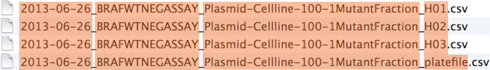
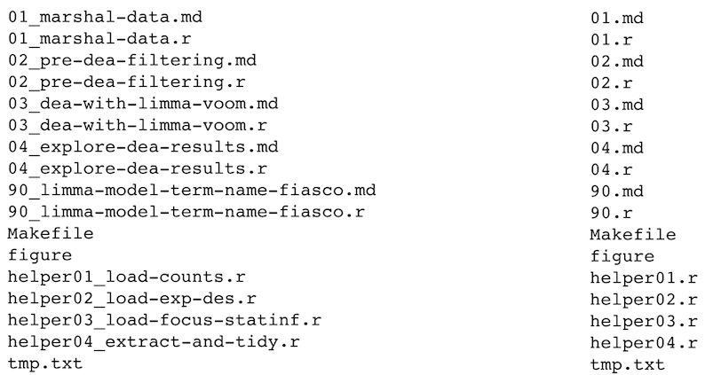

class: top, right, inverse


## ACCE Research Data and Project Management

***

.bottom[
# File naming
#### 10-11 April 2019, University of Sheffield
#### Dr Anna Krystalli @annakrystalli
]

---

# Background

### Let's face it...

- There are going to be files

- **LOTS** of files

- The files will **change over time**

- The files will **have relationships to each other**

### It'll probably get complicated

---


---

## **Strategy against chaos**

### **File organization** and **naming** is a mighty weapon against chaos

- Make a file's **name** and **location** ***VERY INFORMATIVE*** about:
    - what it is, 
    - why it exists, 
    - how it relates to other things

- The more things are **self-explanatory**, the better.

---

## File naming

<br>

### **Names matter**


---

### **What works, what doesn't?**

**NO**

~~~
myabstract.docx
Joe’s Filenames Use Spaces and Punctuation.xlsx
figure 1.png
fig 2.png
JW7d^(2sl@deletethisandyourcareerisoverWx2*.txt
~~~

**YES**

~~~
2014-06-08_abstract-for-sla.docx
joes-filenames-are-getting-better.xlsx
fig01_scatterplot-talk-length-vs-interest.png
fig02_histogram-talk-attendance.png
1986-01-28_raw-data-from-challenger-o-rings.txt
~~~

---

# **Three principles for good (file) names**


1. ### **Machine readable**


1. ### **Human readable**


1. ### **Play well with default ordering**


---

# **Machine readable**

- **Regular expression and globbing friendly**
    + Avoid spaces, punctuation, accented characters, case sensitivity

- **Easy to compute on**
    + Deliberate use of delimiters

---

## Filtering and search through [Globbing](http://searchsecurity.techtarget.com/definition/globbing)

### **Excerpt of complete file listing:**


---

### **Example of globbing to filter file listing:**


---

### **Search using Mac OS Finder search facilities**


---

### **Search using regex in R**


---


## **Delimit information with punctuation** 

**Deliberate use of `"-"` and `"_"` allows recovery of metadata from the filenames:**

- `"_"` underscore used to delimit units of metadata I want to access later
- `"-"` hyphen used to delimit words so our eyes don't bleed




---

### Splitting filenames by delimiters


This happens to be `R` but also possible in the `shell`, `Python`, etc.

---

## **Include important metadata**

e.g. I'm saving a number of files of temperature data extracted at different resolutions (`res`) and for a number of months (`month`). Including these parameters in the filename allows me to use them to target files to read in.


```{r, eval=FALSE}
write.csv(df, paste("variable", res, month, sep ="_"))

df <- read.csv(paste("variable", res, month, sep ="_"))
```

---

## **Recap: machine readable**


- **Easy to search for files later**


- **Easy to filter file lists based on names**


- **Easy to extract info from file names, e.g. by splitting**

**New to regular expressions and globbing? be kind to yourself and avoid**
 + Spaces in file names
 + Punctuation
 + Accented characters


---

# **Human readable**


- **Name contains info on content**

- **Connects to concept of a** [***slug***](https://en.wikipedia.org/wiki/Semantic_URL#Slug) **from semantic URLs**

---

### **Example**

#### **Which set of file(name)s do you want at 3 a.m. before a deadline?**



---

## **Embrace the slug**


---

### Use slugs to link inputs, scripts & outputs

#### **The `R` scripts:**

~~~
01_marshal-data.r
02_pre-dea-filtering.r
03_dea-with-limma-voom.r
04_explore-dea-results.r
90_limma-model-term-name-fiasco.r
~~~

#### **The figures left behind:**

~~~
02_pre-dea-filtering-preDE-filtering.png
03-dea-with-limma-voom-voom-plot.png
04_explore-dea-results-focus-term-adjusted-p-values1.png
04_explore-dea-results-focus-term-adjusted-p-values2.png
...
90_limma-model-term-name-fiasco-first-voom.png
90_limma-model-term-name-fiasco-second-voom.png
~~~

---

## **Recap: Human readable**

- $\rightarrow$ **Easy to figure out what the heck something is, based on its name**


---

# **Play well with default ordering**

- **Put something numeric first**
- **Use the ISO 8601 standard for dates**
- **Left pad other numbers with zeros**

---

### Examples

### **Chronological order:**


---

### Dates

Use the **ISO 8601** standard for dates: `YYYY-MM-DD`


---


---

### **Logical order:** Put something numeric first


---

## Left pad other numbers with zeros


**If you don’t left pad, you get this:**

~~~
10_final-figs-for-publication.R
1_data-cleaning.R
2_fit-model.R
~~~

which is just sad :(

---

## Recap: Play well with default ordering

- Put something numeric first

- Use the ISO 8601 standard for dates

- Left pad other numbers with zeros

---

# **Recap: Three principles for (file) names**

1. Machine readable

2. Human readable

3. Play well with default ordering

## Go forth and use awesome file names :)

---

## Get back [home](index.html)
