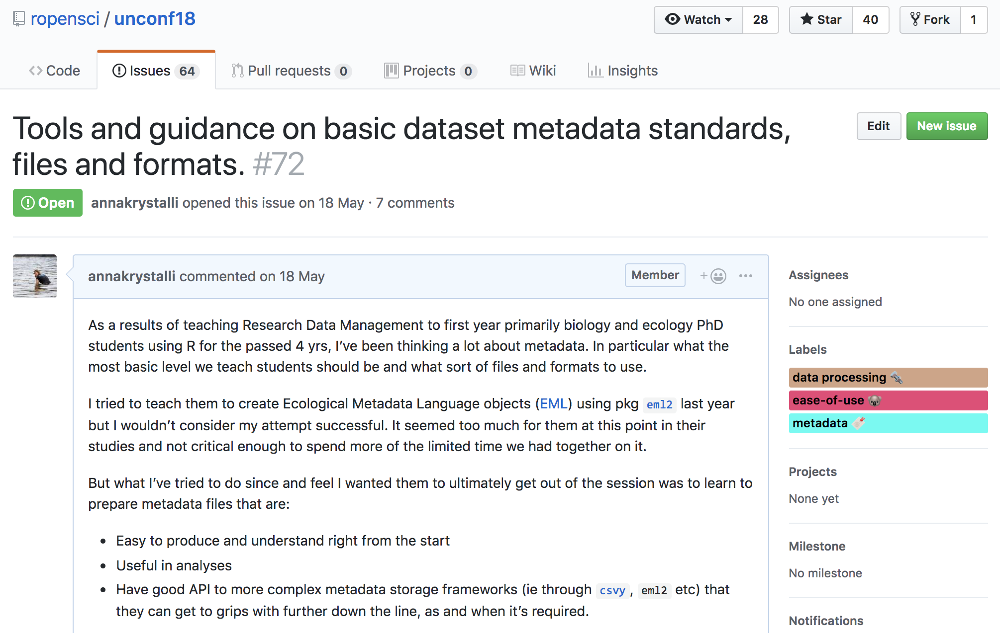

class: top, right, inverse


## ACCE Research Data and Project Management

***

.bottom[
# Metadata
#### 10-11 April 2019, University of Sheffield
#### Dr Anna Krystalli @annakrystalli
]

---
## You got data. Is it enough?

<blockquote class="twitter-tweet" data-conversation="none" data-lang="en"><p lang="en" dir="ltr"><a href="https://twitter.com/tomjwebb">@tomjwebb</a> I see tons of spreadsheets that i don&#39;t understand anything (or the stduent), making it really hard to share.</p>&mdash; Erika Berenguer (@Erika_Berenguer) <a href="https://twitter.com/Erika_Berenguer/status/556111838715580417">January 16, 2015</a></blockquote>
<script async src="//platform.twitter.com/widgets.js" charset="utf-8"></script>


<blockquote class="twitter-tweet" data-conversation="none" data-lang="en"><p lang="en" dir="ltr"><a href="https://twitter.com/tomjwebb">@tomjwebb</a> <a href="https://twitter.com/ScientificData">@ScientificData</a> &quot;Document. Everything.&quot; Data without documentation has no value.</p>&mdash; Sven Kochmann (@indianalytics) <a href="https://twitter.com/indianalytics/status/556120920881115136">January 16, 2015</a></blockquote>
<script async src="//platform.twitter.com/widgets.js" charset="utf-8"></script>

---

<blockquote class="twitter-tweet" data-conversation="none" data-lang="en"><p lang="it" dir="ltr"><a href="https://twitter.com/tomjwebb">@tomjwebb</a> Annotate, annotate, annotate!</p>&mdash; CanJFishAquaticSci (@cjfas) <a href="https://twitter.com/cjfas/status/556109252788379649">January 16, 2015</a></blockquote>
<script async src="//platform.twitter.com/widgets.js" charset="utf-8"></script>

<blockquote class="twitter-tweet" data-conversation="none" data-lang="en"><p lang="und" dir="ltr">Document all the metadata (including protocols).<a href="https://twitter.com/tomjwebb">@tomjwebb</a></p>&mdash; Ward Appeltans (@WrdAppltns) <a href="https://twitter.com/WrdAppltns/status/556108414955560961">January 16, 2015</a></blockquote>
<script async src="//platform.twitter.com/widgets.js" charset="utf-8"></script>

---

<blockquote class="twitter-tweet" data-lang="en"><p lang="en" dir="ltr">You download a zip file of <a href="https://twitter.com/hashtag/OpenData?src=hash">#OpenData</a>. Apart from your data file(s), what else should it contain?</p>&mdash; Leigh Dodds (@ldodds) <a href="https://twitter.com/ldodds/status/828657155863638016">February 6, 2017</a></blockquote>
<script async src="//platform.twitter.com/widgets.js" charset="utf-8"></script>

---

## **#otherpeoplesdata dream match!**

#### **Thought experiment: Imagine a dream open data set**
#### **How would you locate it?**

- what details would you need to know to determine relevance? 
- what information would you need to know to use it?


---

class: top, right, inverse

# metadata = data about data

***


---


> ### _"Information that **describes, explains, locates**, or in some way makes it easier to **find, access**, and **use** a resource (in this case, data)."_" 

.pull-left[

]

.pull-right[
### **Data Reuse Checklist**

<http://mozillascience.github.io/checklist/>
]


> ### **Backbone of digital curation**
>
> **Without it, a digital resource may be irretrievable, unidentifiable or unusable**

---

### **Descriptive**

- enables **identification, location** and **retrieval** of data, often includes use of **controlled vocabularies** for classification and indexing.

### **Technical**

- describes the **technical processes** used to **produce**, or required to **use** a digital data object.

### **Administrative**

- used to manage **administrative aspects** of the digital object e.g. **intellectual property rights and acquisition.**


---

## **Elements of metadata**

- #### **Structured data files:**
    - readable by machines and humans, accessible through the web
- #### **Controlled vocabularies** eg. [NERC Vocabulary server](https://www.bodc.ac.uk/resources/products/web_services/vocab/)
    - allows for connectivity of data
    
### **KEY TO SEARCH FUNCTION**
- By structuring & adhering to controlled vocabularies, data can be **combined, accessed** and **searched!**
- **Different communities** develop **different standards** which define both the structure and content of metadata


---

class: top, right, inverse

# metadata in research

***


---

## Identifying the right metadata standard


- **General:** Dublin Core Metadata Initiative [Specification](http://dublincore.org/specifications/)

- **[NERC Data Centers:](https://nerc.ukri.org/research/sites/data/)** Check with individual data centers for their metadata specification.

- **[Re3data.org](https://www.re3data.org/):** Registry of Research Data Repositories.

---

### **Seek help from support teams**

Most university libraries have assistants dedicated to Research Data Management:

<blockquote class="twitter-tweet" data-conversation="none" data-lang="en"><p lang="en" dir="ltr"><a href="https://twitter.com/tomjwebb">@tomjwebb</a> <a href="https://twitter.com/ScientificData">@ScientificData</a> Talk to their librarian for data management strategies <a href="https://twitter.com/hashtag/datainfolit?src=hash">#datainfolit</a></p>&mdash; Yasmeen Shorish (@yasmeen_azadi) <a href="https://twitter.com/yasmeen_azadi/status/556129700129800192">January 16, 2015</a></blockquote>
<script async src="//platform.twitter.com/widgets.js" charset="utf-8"></script>


---

# Key metadata:

## the bare minimum

### document **data coverage** information

- **taxonomic coverage**: a table containing **taxonomic information on species in data**.
    - also record authority / source
- **temporal coverage**: temporal range and resolution details
- **spatial coverage**: 
    + a human readable geographic description of the study area
    + spatial range and resolution details
    + include depth (marine/freshwater) or altitudinal (terrestrial) information

Make sure to record units!

---

### document protocols in a `methods` document

Keep a dynamic document used to **plan**, **record** and **write up** methods. 

<blockquote class="twitter-tweet" data-conversation="none" data-lang="en"><p lang="en" dir="ltr"><a href="https://twitter.com/tomjwebb">@tomjwebb</a> record every detail about how/where/why it is collected</p>&mdash; Sal Keith (@Sal_Keith) <a href="https://twitter.com/Sal_Keith/status/556110605053349888">January 16, 2015</a></blockquote>
<script async src="//platform.twitter.com/widgets.js" charset="utf-8"></script>

**Any additional information other users would need to combine your data with theirs? Record it**
---

class: inverse, middle, center

# Practical metadata

***

---

# [ACCE DTP RDM](https://acce.shef.ac.uk/event/acce-data-management-workshop/) course

<br>

Teaching this course has always felt challenging in terms of practical exercises

--
- **Defining** Metadata & **explaining importance**: `r emo::ji("white_check_mark")`

--

- Advising on domain specific **Controlled Vocabularies** & **structure** `r emo::ji("x")`

- How can we practice creating metadata?


---

# [rOpenSci Unconf 18](http://unconf18.ropensci.org/)
##### May 21 - 22, 2018. Seattle


---    

# rOpenSci Unconf mission


> bringing together scientists, developers, and open data enthusiasts from academia, industry, government, and non-profits to get together for a few days and hack on various projects.

<br>

#### Ideas for projects submitted through GitHub [**issues**](https://github.com/ropensci/unconf18/issues) in the [**runconf18** repo](https://github.com/ropensci/unconf18)

---

## issue [#72](https://github.com/ropensci/unconf18/issues/72) `r emo::ji("raising_hand_woman")`




---


# Metadata team!
------------

Luckily, a **whole bunch of other awesome folks** were also thinking about these topics and interested in working on them! `r emo::ji("star_struck")`

(in alphabetical order):

-   [Carl Boettiger](https://github.com/cboettig)
-   [Scott Chamberlain](https://github.com/sckott)
-   [Auriel Fournier](https://github.com/aurielfournier): #[41](https://github.com/ropensci/unconf18/issues/41)
-   [Kelly Hondula](https://github.com/khondula)
-   [Anna Krystalli](https://github.com/annakrystalli)
-   [Bryce Mecum](https://github.com/amoeba)
-   [Maëlle Salmon](https://github.com/maelle)
-   [Kate Webbink](https://github.com/magpiedin): #[52](https://github.com/ropensci/unconf18/issues/52)
-   [Kara Woo](https://github.com/karawoo): #[68](https://github.com/ropensci/unconf18/issues/68)


---


# [rOpenSciLabs](https://github.com/ropenscilabs) pkg [**`dataspice`**](https://github.com/ropenscilabs/dataspice) 

> Package [**`dataspice`**](https://github.com/ropenscilabs/dataspice) makes it easier for researchers to **create basic, lightweight and concise metadata files for their datasets**. 

<br>

- Metadata **collected in `csv` files**

--

- Metadata fields are **based on [schema.org](http://schema.org/Dataset)**
    + underlies Google [Datasets](https://developers.google.com/search/docs/data-types/dataset) metadata specification

--

- Helper functions and shinyapps to **extract and edit metadata files**.

--

- Ability to produce:
    + **structured json-ld metadata file**.
    + a helpful dataset **README webpage**.
 
    
<br> 

---

### [Google unveils search engine for open data](https://www.nature.com/articles/d41586-018-06201-x)
#### _The tool, called Google Dataset Search, should help researchers to find the data they need more easily._
##### Nature NEWS - 05 SEPTEMBER 2018


<br>

***

<https://toolbox.google.com/datasetsearch>

---
class: inverse, middle, center

# `dataspice` tutorial

<br>

#### tutorial repo: 
### <https://github.com/annakrystalli/dataspice-tutorial>

#### useful links: 
### <http://annakrystalli.me/dataspice-tutorial/useful_links.html>

---

# `dataspice` tutorial

<br>

The goal of dataspice-tutorial is a **practical exercise in creating metadata** for an **example field collected data product** using package `dataspice`. 

- Understand basic metadata and why it is important

--

- Understand where and how to store them

--

- Understand how they can feed into more complex metadata objects.

---


## `dataspice` workflow


---


# Example dataset

### Data source : 

#### [National Ecological Observatory Network](https://www.neonscience.org/) (NEON) data portal 


### Dataset selected:

#### *Woody plant vegetation structure*

 This data product contains the quality-controlled, native sampling resolution data from **in-situ measurements of live and standing dead woody individuals and shrub groups**, from all **terrestrial NEON sites** with qualifying woody vegetation. 

--
 
- **Structure and mapping data** are reported **per individual per plot**

- **Sampling metadata**, such as per growth form sampling area, are reported **per plot**. 

---

# `dataspice` workshop data


The data are a **trimmed subset** of data downladed from the [**NEON data portal**](http://data.neonscience.org/browse-data) after filtering for:

- time periods between **`2015-06` - `2016-06`**

- locations within NEON Domain area **`D01: Northeast`**

Filter returned data from **2 sites** from **`2015-6`** to **`2015-11`**.

<br>

***

##### Citation:
_National Ecological Observatory Network. 2018. Data Products: DP1.10098.001.  Provisional data downloaded from http://data.neonscience.org on 2018-05-04. Battelle, Boulder, CO, USA_

```{r, echo=FALSE, message=FALSE, warning=FALSE}
library(dplyr)
```

---

## vst_perplotperyear.csv

Plot level data

```{r, echo=FALSE, message=FALSE}
readr::read_csv(here::here("data", "vst_perplotperyear.csv"))
```

---

## vst_mappingandtagging.csv

Individual level data

```{r, echo=FALSE, message=FALSE}
readr::read_csv(here::here("data", "vst_mappingandtagging.csv"))
```


---
class: inverse, right, center

# Practical

***

--

### time for some live coding `r emo::ji("scream")`

<br>
<br>

***

_or head to the [tutorial](http://annakrystalli.me/dataspice-tutorial/) if working through this on your own_

---
class: inverse, right, center

# Outro

***

---

# Additional metadata tips

- ### The approach we went for is very general / minimal

--

- #### You can **make your datasets more discoverable** by developing **richer/more domain specific metadata** files. 

--

- eg. create [Ecological Metadata Language (EML)](https://knb.ecoinformatics.org/#external//emlparser/docs/index.html) metadata using r pkg [`EML`](https://github.com/ropensci/EML). 

--  

- reposit your data at [KNB](https://knb.ecoinformatics.org/#data)

--

- allows richer [search and presentation of metadata](https://knb.ecoinformatics.org/#view/IC.13.1)
    
---
# KNB data portal

## Powerful search


---

# KNB data portal

## Rich interactive metadata


---

# Parting words

--

- #### Any metadata documentation is better than none `r emo::ji("+1")`

--

- #### Start small and build up to more complex standards `r emo::ji("100")`

--

- - #### But make sure to cover bare minimum `r emo::ji("warning")`

--

- #### Reach out for help from your local librarians or try the [rOpenSci discussion board](https://discuss.ropensci.org/) `r emo::ji("raising_hand_woman")`

--

## `r emo::ji("burrito")`


## Get back [home](index.html)
