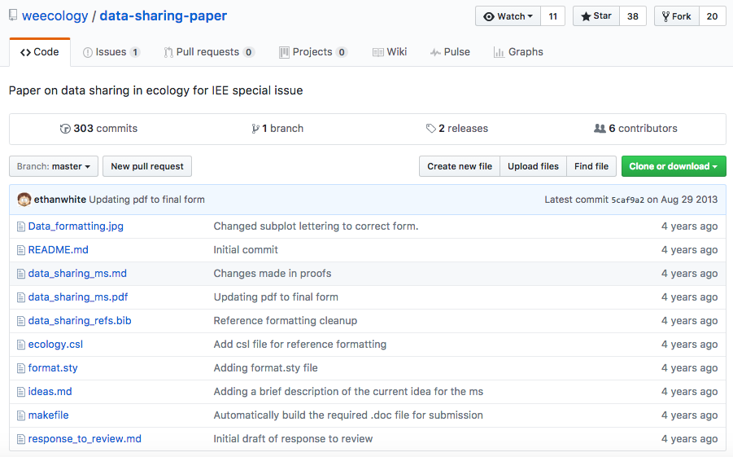
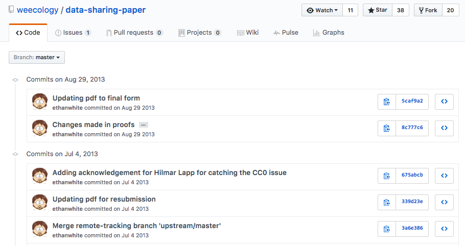
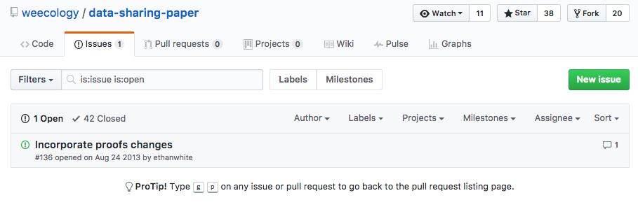
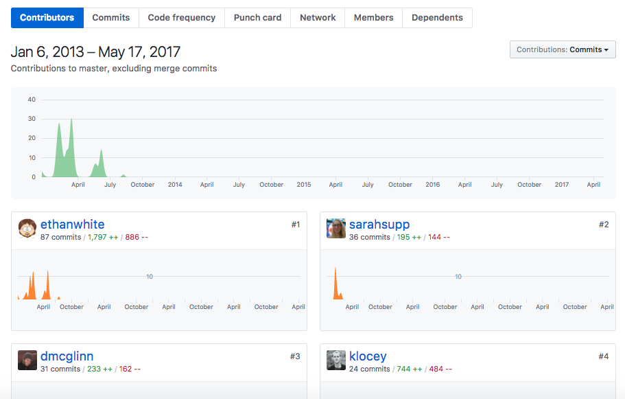

class: top, left, inverse


## ACCE DTP 

### _`r params$course_title`_

***

.bottom[
# `r params$slide_title`

<br>

**`r glue::glue('{icon::fontawesome("calendar")} {params$date}')`**
<br>

**`r glue::glue('{icon::fontawesome("map-pin")} {params$location}')`** 
]

---
 
# Session Roadmap

<br>

### 1 Introductions 


#### - **get to know github** 

  - github as a computational research tool

---

# Session Roadmap

<br>

### 2 Get stuck in


#### - [Collaborative github through rstudio](https://nhm-stars.github.io/materials/day04/evolottery.html) #EvoLottery (40 mins)
  - In this exercise, each participant will fork a github repo, and contribute a file required to simulate the **evolutionary trajectory of an imaginary species' body size**.
  
  - We'll use github to collate all species files and plot them all up together at the end! We'll also **discover the skull and beak shapes** associated with each simulated species size.


---

class: top, right, inverse

# introductions: **get to know github** 

***

## **GitHub features**


---


#### Back up and sync through the cloud

```{r, out.width="90%", echo=FALSE, fig.cap="Image: Jessica Lord, 2013 BSD"}
knitr::include_graphics("assets/remotes.png")
```


---

#### Fork and contribute to other's work 


```{r, out.width="90%", echo=FALSE, fig.cap="Image: Jessica Lord, 2013 BSD"}
knitr::include_graphics("assets/clone.png")
```

---


## **GitHub for science**

***


> - ideal for managing the full suite of research outputs such as datasets, statistical code, figures, lab notes, and manuscripts.

> - supports peer review, commenting, and discussion. 

> - Diverse range of efforts, from individual to large bioinformatics projects, laboratory repositories, as well as global collaborations have found a home on GitHub

<br>


---

### remote repositories

centralising information e.g. [**weecology** / ***"Nine simple ways to make it easier to (re)use your data" paper***](http://ojs.library.queensu.ca/index.php/IEE/article/view/4608/0) | [Repo](https://github.com/weecology/data-sharing-paper)

```{r, out.width="80%", echo=FALSE}

```


---

### commits

traceability

#### [Repo](https://github.com/ropensci/rfishbase/commits/master)

```{r, out.width="90%", echo=FALSE}

```

<br>

---

### issues

project management


#### [Repo](https://github.com/weecology/data-sharing-paper/issues)

```{r, out.width="90%", echo=FALSE}

```

<br>
---

### graphs 

#### project & team tracking: 
Tracking contributors [Repo](https://github.com/weecology/data-sharing-paper/graphs/contributors)

```{r, out.width="80%", echo=FALSE}

```

---
tracking commits

#### [Repo](https://github.com/weecology/data-sharing-paper/network)

```{r, out.width="90%", echo=FALSE}
knitr::include_graphics("assets/track-2.png")
```

<br>
---


class: center, middle, invert

## **entire process of project evolution reproducible**

***

<br>


---

class: top, right, inverse

## **Practical: Github & Rstudio for collaborative coding**

***

---

### **#EvoLottery**

**Beak and skull shapes in birds of prey (“raptors”) are strongly coupled and largely controlled by size.** 


  - In this exercise, each participant will **fork a github repo**, and **contribute a file** required to simulate the *evolutionary trajectory of an imaginary species' body size*.


  - We'll use **github** to **collate all species files** and **plot** them all up together at the end! We'll also **discover the skull and beak shapes** associated with each simulated species size.

### [**Enter Practical**](evolottery.html)

### See [**Collaborative plot**](https://rse.shef.ac.uk/collaborative_github_exercise/plot_trait_evolution.html)


---


## Get back [home](`r params$book_url`)
