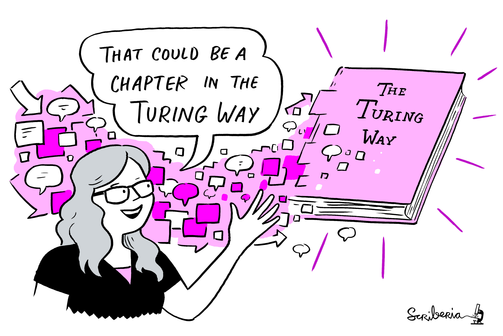

class: top, left, inverse


## ACCE DTP 

### _`r params$course_title`_

***

.bottom[
# `r params$slide_title`

<br>

**`r glue::glue('{icon::fontawesome("calendar")} {params$date}')`**
<br>

**`r glue::glue('{icon::fontawesome("map-pin")} {params$location}')`** 
]

---

# tl;dr

- ### prepare it to share it

- ### human readable code and machine readable data

- ### automated pipeline from raw data to outputs

- ### better in the open
---

## take aways

### take ownership

- #### Try to think ahead about where the pitfalls lie.

- #### Iterate on your process. Every little helps

- #### What works? What makes using data easy, what makes it painful?


> #### make yourself the [most expendable member](http://www.datacarpentry.org/blog/soft-skills/) of you team!


---
class: inverse, center, middle

# Resources

---

## Additional content in materials on:

- ### Creating a package in R

- ### Creating a research compendium with rrtools

---
.pull-left[

### BES guide to data management 

```{r, out.width="50%", echo=FALSE}
knitr::include_graphics("assets/BES.png")
```

This guide for early career researchers explains what data and data management are, and provides advice and examples of best practices in data management, including case studies from researchers currently working in ecology and evolution.


#### [download](http://www.britishecologicalsociety.org/wp-content/uploads/Publ_Data-Management-Booklet.pdf)
]

.pull-right[

### BES guide to reproducible code 


```{r, out.width="50%", echo=FALSE}
knitr::include_graphics("https://methodsblog.files.wordpress.com/2017/12/code-cover.jpg?w=424&h=600")
```


A Guide to Reproducible Code covers all the basic tools and information you will
need to start making your code more reproducible. We focus on R and Python, but
many of the tips apply to any programming language.

#### [download](https://www.britishecologicalsociety.org/wp-content/uploads/2017/12/guide-to-reproducible-code.pdf)
]

---
# The Turing Way

.pull-left[

### Book
#### a lightly opinionated guide to reproducible data science
<https://the-turing-way.netlify.com> 


```{r, out.width="50%", echo=FALSE}

```

]

.pull-right[

### Workshops

- **Boost Your Research Reproducibility with Binder** [materials](https://github.com/alan-turing-institute/the-turing-way/tree/master/workshops/boost-research-reproducibility-binder)

- **Build a binderhub** [materials](https://github.com/alan-turing-institute/the-turing-way/tree/master/workshops/build-a-binderhub)

]

### <https://github.com/alan-turing-institute/the-turing-way>

---

## Resources in R

#### R 4 Data Science
- [R for Data Science](https://r4ds.had.co.nz/)

#### Version Control
- [Happy Git and GitHub for the useR](https://happygitwithr.com/)

#### RMarkdown

- [R Markdown: The Definitive guide](https://bookdown.org/yihui/rmarkdown/)
- [RMarkdown Driven Development (RmdDD)](https://emilyriederer.netlify.com/post/rmarkdown-driven-development/): Blog post by Emily Riederer

#### Advanced R

- [R packages](https://r-pkgs.org/) by Hadley Wickham and Jenny Bryan


---
class: inverse, center, middle

# Support

---
## Institutional


- Your supervisor / research group /ACCE peers
- Institutional Research Data Management Teams
    - http://www.york.ac.uk/rdm
    - https://www.sheffield.ac.uk/library/rdm
    - http://www.liv.ac.uk/research-data-management/
- NERC data centres (BODC Liverpool, EIDC CEH)


---
## Communities

.pull-left[
### Local

- [Sheffield R Users Group](https://www.meetup.com/SheffieldR-Sheffield-R-Users-Group/)
- [Manchester R Users Group](https://www.rmanchester.org/)
- [Manchester R Ladies](https://www.meetup.com/rladies-manchester/)
- [Lancaster R Ladies](https://www.meetup.com/rladies-lancaster/)
- [Leeds R Users Group](https://r-users-leeds.netlify.app/)
]

.pull-right[
### Remote

- [rOpenSci](https://ropensci.org/)
- [Rstudio forum](https://community.rstudio.com/)
- [Rladies Remote & slack](https://www.meetup.com/rladies-remote/)
- [R4DS Learning community](https://www.rfordatasci.com/)
- [The Carpentries](https://carpentries.org/)
]
---


## Publish your work on GitHub!

Use **Git** and **GitHub** to manage, publish and collaborate on your work


---

## Share your work

- Start a blog!

  <blockquote class="twitter-tweet" data-lang="en"><p lang="en" dir="ltr">Ready to start your data science blog? Check out <a href="https://twitter.com/ma_salmon?ref_src=twsrc%5Etfw">@ma_salmon</a>&#39;s excellent slides to help you figure out:<br><br>💭what you can write about, w/ examples. Hint: it&#39;s not just <a href="https://twitter.com/hashtag/rstats?src=hash&amp;ref_src=twsrc%5Etfw">#rstats</a> code!<br>📝 how to get it done.<br>🗣️ where/how to share it.<a href="https://t.co/RpMOzU0Ntc">https://t.co/RpMOzU0Ntc</a></p>&mdash; Emily Robinson (@robinson_es) <a href="https://twitter.com/robinson_es/status/977941365119176704?ref_src=twsrc%5Etfw">March 25, 2018</a></blockquote>
<script async src="https://platform.twitter.com/widgets.js" charset="utf-8"></script>

- Work openly


---
class: invert, middle, center

# Have fun!