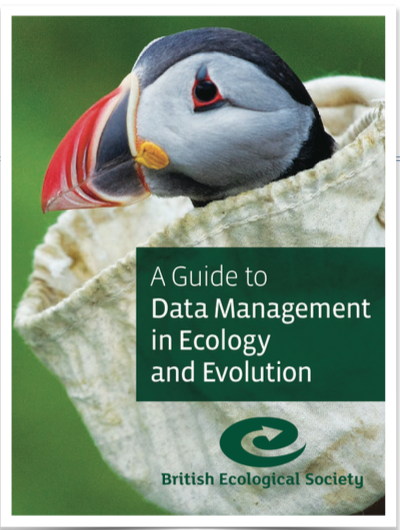

class: top, right, inverse

## ACCE Research Data and Project Management

***

.bottom[
# Closing Remarks
#### 10-11 April 2019, University of Sheffield
#### Dr Anna Krystalli @annakrystalli
]

---

## take ownership

- #### Try to think ahead about where the pitfalls lie.

- #### Iterate on your process. Every little helps

- #### What works? What makes using data easy, what makes it painful?

---

## take aways

- #### prepare it to share it
- #### human readable code and machine readable data
- #### automated pipeline from raw data to outputs
- #### better in the open

> #### make yourself the [most expendable member](http://www.datacarpentry.org/blog/soft-skills/) of you team!

---

# Resources

---

## BES guide to data management 

 

This guide for early career researchers explains what data and data management are, and provides advice and examples of best practices in data management, including case studies from researchers currently working in ecology and evolution.

 

#### [download](http://www.britishecologicalsociety.org/wp-content/uploads/Publ_Data-Management-Booklet.pdf)

---

## BES guide to reproducible code 

A Guide to Reproducible Code covers all the basic tools and information you will
need to start making your code more reproducible. We focus on R and Python, but
many of the tips apply to any programming language.

#### [download](https://www.britishecologicalsociety.org/wp-content/uploads/2017/12/guide-to-reproducible-code.pdf)

---

### Further reading

- [**Blog post**](https://dynamicecology.wordpress.com/2016/08/22/ten-commandments-for-good-data-management/) **by Dynamic ecology** [\@DynamicEcology](https://twitter.com/DynamicEcology)
- [**rOpenSci Reproducibility in Science:** 
A Guide to enhancing reproducibility in scientific results and writing](http://ropensci.github.io/reproducibility-guide/)
- [**Nine simple ways to make it easier to (re)use your data**](http://ojs.library.queensu.ca/index.php/IEE/article/view/4608/4898)

---

## Training materials

**The Carpentries**

- **Domain specific lessons in Software & Data available** [**free online**](https://carpentries.org/)
    + Ecology materials
    + Genomics materials
    + Geospatial data materials
    + Biology semester long materials

---

## go further

## coding

<blockquote class="twitter-tweet" data-conversation="none" data-lang="en">
<a href="https://twitter.com/tomjwebb">@tomjwebb</a> agree very much with <a href="https://twitter.com/ucfagls">@ucfagls</a>. Early investment in programming skills pays off in the future in terms of speed &amp; reproducibility.
&mdash; Susan Johnston (@SuseJohnston) <a href="https://twitter.com/SuseJohnston/status/556110171483947008">January 16, 2015</a></blockquote>

---

- #### [software carpentry: R for Reproducible Scientific Analysis](http://swcarpentry.github.io/r-novice-gapminder/)

- #### [An Introduction to Reproducible Research in R and R Studio.](https://susanejohnston.wordpress.com/category/reproducible-research/)

- #### Research data management (RDM) open training materials on [Zenodo](https://zenodo.org/communities/dcc-rdm-training-materials/?page=1&size=20)

- #### Coursera Reproducible Research [MOOC](https://www.coursera.org/learn/reproducible-research)

---

## seek support

 

- #### Your supervisor / research group /ACCE peers
- #### Institutional Research Data Management Teams
    - http://www.york.ac.uk/rdm
    - https://www.sheffield.ac.uk/library/rdm
    - http://www.liv.ac.uk/research-data-management/
- #### NERC data centres (BODC Liverpool, EIDC CEH)
- #### ROpenSci, Rladies, R4DS Learning community, theh Carpentries

---

## Publish your markdown work on GitHub!

Use **Git** and **GitHub** to manage, publish and collaborate on your work

---

## Share your work

- Start a blog!

  <blockquote class="twitter-tweet" data-lang="en">
Ready to start your data science blog? Check out <a href="https://twitter.com/ma_salmon?ref_src=twsrc%5Etfw">@ma_salmon</a>&#39;s excellent slides to help you figure out:  💭what you can write about, w/ examples. Hint: it&#39;s not just <a href="https://twitter.com/hashtag/rstats?src=hash&amp;ref_src=twsrc%5Etfw">#rstats</a> code! 📝 how to get it done. 🗣️ where/how to share it.<a href="https://t.co/RpMOzU0Ntc">https://t.co/RpMOzU0Ntc</a>
&mdash; Emily Robinson (@robinson_es) <a href="https://twitter.com/robinson_es/status/977941365119176704?ref_src=twsrc%5Etfw">March 25, 2018</a></blockquote>

- Work openly

---

## Keep learning with others

- **#R4DS slack [learning community](https://medium.com/@kierisi/r4ds-the-next-iteration-d51e0a1b0b82)**. Sign up [**here**](https://docs.google.com/forms/d/e/1FAIpQLSeT3zfzjWxoaQ6RmUEdT9n0xtvkuSaMeBetDQLpzNJvGUB6IQ/viewform)
- [Sheffield R Users group](https://www.meetup.com/SheffieldR-Sheffield-R-Users-Group/events/)

